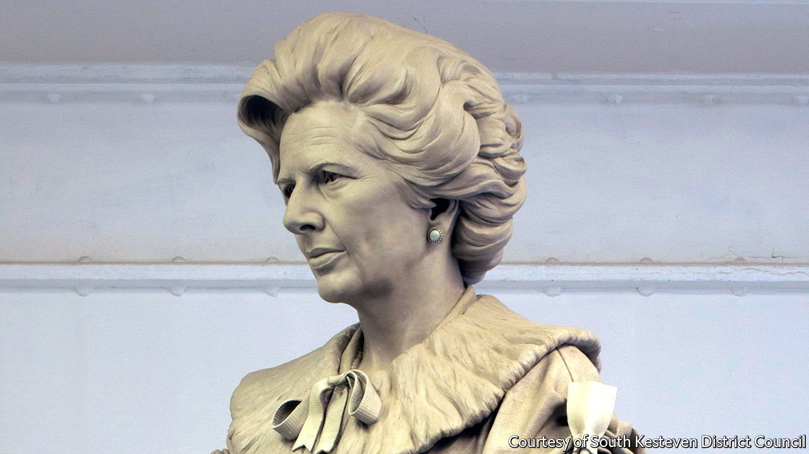

###### Public art in Britain

# The sorry tale of Margaret Thatcher’s statue 

##### Iconoclasm makes it hard to put up new images 

 

> Jan 8th 2022 

ONE CONSEQUENCE of increasing attacks on existing images is to make putting up new ones more fraught. That is true even when the statue in question portrays Britain’s longest-serving prime minister since the 19th century, and is enormous.

The campaign to erect a bronze statue of Margaret Thatcher began within months of her death in 2013. But in 2018 Westminster Council rejected an application to put one (pictured as a clay sculpture) by Douglas Jennings, who specialises in public art, in Parliament Square, in the heart of London. The site was already crowded with monuments, it ruled, and Thatcher had been depicted in formal robes that she rarely wore.


Moreover, the council fretted, it was likely to become a target. Though its plinth would be 4m high and contain sockets to allow protective scaffolding to be erected in a hurry, police worried that it would draw vandals. They recommended security lighting and cameras.

One year later Grantham, the town where Thatcher grew up, announced that it would take the statue, which is almost twice life-size. The council reasoned that it would draw the right sort of visitors—the far-left activists who might be tempted to attack it being thin on the ground in Lincolnshire. A plinth was duly constructed. But other problems emerged.

A plan to spend public money on an unveiling ceremony drew opposition and was nixed; covid-19 prevented public gatherings; protected trees needed trimming so security cameras could overlook the statue. Six years after it was cast, it remains in hiding.

