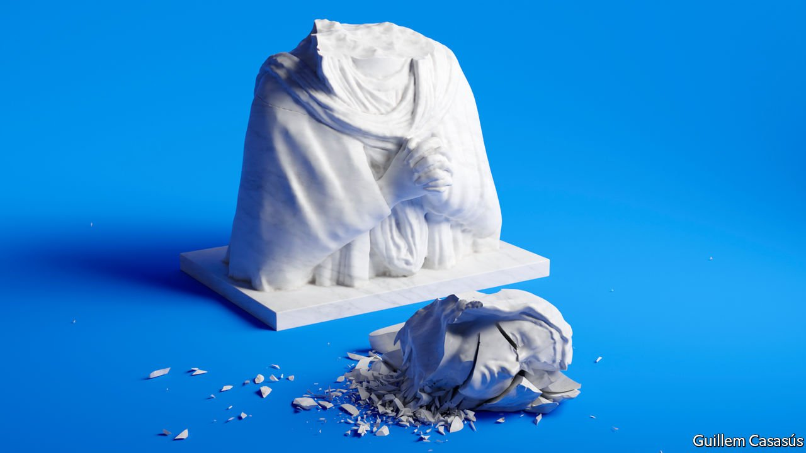
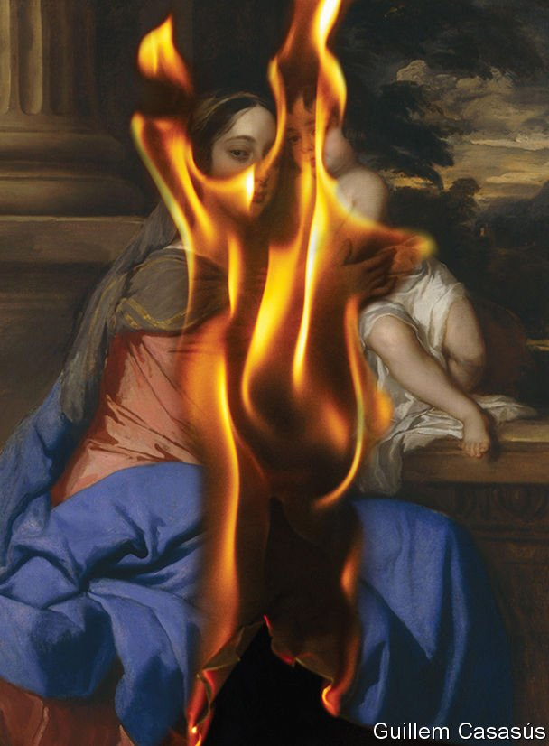

###### Iconoclasm past and present

# What a previous iconoclastic period reveals about the present one 

##### History suggests the opponents of images will prevail 

 

> Jan 8th 2022 

THEY STRUCK at night, but many people must have seen them. First a group of young men stretched ropes across Cheapside, an east-west thoroughfare in the City of London, to block traffic. Then they attacked one of the largest, most famous images in Britain.

Cheapside Cross was a stone monument to Eleanor of Castile, queen consort of Edward I, which had stood in the capital since the 1290s. It was a tiered structure, rather like the candle-powered Erzgebirge pyramids that some put on their Christmas tables. It contained statues of God, Mary, a dove representing the Holy Ghost and other things offensive to contemporary eyes.


The iconoclasts probably could not reach the crucifix on top of the monument, which was as much as ten metres from the ground. They tried toppling lower statues by yanking on ropes, but failed. So they plucked the infant Christ from Mary’s lap, defaced her and smashed the arms off other images. Then they vanished. A reward was offered for information on the attackers, but there were no takers.

That attack took place in June 1581. It was just one of many on images in Britain between the 1530s and the 1640s. Indeed, it was only one of those on Cheapside Cross. The monument was assaulted again in 1601—when Mary lost her child for a second time and was stabbed in the breast—and was finally demolished in 1643, on the orders of the Parliamentary Committee for the Demolition of Monuments of Superstition and Idolatry. Change a few details, though, and it could have been in 2021.

Britain is in the midst of an image controversy, centred on the many public statues erected by the Victorians. In June 2020 a crowd inspired by the Black Lives Matter movement used ropes to pull a 125-year-old statue of Edward Colston, a slave trader and local benefactor, from its plinth and dumped it into Bristol harbour. Other statues were sprayed with paint. Local governments hurriedly removed some objects before crowds could get to them. A statue of Thomas Picton, a particularly violent governor of colonial Trinidad, was boxed up in Cardiff City Hall; Robert Milligan, a slave owner, was hauled out of West India Quay in east London on a flatbed lorry.

Local authorities and other organisations have launched inquiries into statues, monuments, murals and street names. Some of these have already begun to report. An impressively detailed one for the Welsh government found 13 items commemorating slave traders, as well as 56 memorials to people who owned plantations or benefited directly from slave labour, 120 to people who opposed the abolition of slavery and still others to colonialists. Officials have not yet decided what to do about many of them. Other investigations, including one commissioned by the mayor of London, continue.

The reaction to this assault on historical images has been just as fervent. Vigilantes, most of them polite, have formed protective cordons around statues, including those of Mahatma Gandhi and Lord Baden-Powell. Newspapers and politicians rail against vandals both unofficial and official. In his speech to the Conservative Party conference in October 2021, Boris Johnson condemned “know-nothing cancel-culture iconoclasm”. His government has written to museums, threatening to cut their funding if they remove images.

Large differences exist between the iconoclasm of the 16th and 17th centuries and today’s rows. The earlier iconoclasts had different motivations and different ideas about how images worked on the mind. They were far more destructive than modern iconoclasts. Medieval churches were filled with murals and painted statues of saints, almost all of which have been destroyed. Not one English parish church retains all its pre-Reformation stained glass; St Mary’s Church in Fairford, in the Cotswolds, comes closest.

But there are similarities between the iconoclastic waves, too, which ought to discomfort conservatives. Those who oppose removing or destroying images today often argue that people should learn about history, not try to eradicate it. They mean that historical figures should be studied in the round and placed in the context of their times, rather than judged solely by modern criteria. But iconoclasm also has a history, which in Britain is long and largely triumphant: the hammers tend to prevail.

Although Renaissance iconoclasts sometimes erased political symbols, most of their targets were religious. They were following divine law, as they interpreted it. British Protestants argued that the words of the law given to Moses on Mount Sinai, “Thou shalt not make unto thee any graven image,” began a separate commandment—the second—which specifically proscribed idolatry. They also cited examples from the Old Testament of believers destroying images. Moses burned the golden calf and ground it into powder. A statue of Dagon, a Philistine god, was magically destroyed when the Ark of the Covenant was placed in its temple, losing its head and its hands.

The reformers believed that images were actively dangerous. Objects were thought to interact with the people who gazed upon them, including by staring back. To look at an image was almost to embrace it or consume it. As Margaret Aston, the leading historian of English iconoclasm, pointed out, medieval churchgoers usually experienced the Eucharist only by looking at it. They believed it had a powerful effect on them nonetheless. Iconoclasts believed that images worked on people through their eyes, tugging them back into idolatry. Those images had to go.

Better angels of our nature

This is far removed from the modern understanding of images. Those who argue for the removal of statues today claim not that images are harmful in themselves, but that their presence in public places signals institutional reluctance to root out racism and other enormities. Students at Oriel College in Oxford who want a statue of the colonialist Cecil Rhodes to be taken down from its perch above the High Street argue that it “can be symbolically communicative of a subtler and insipid prejudice in Oriel and the university”.

Modern iconoclasts are also far more restrained than their predecessors. Topple the Racists, a website that lists images and memorials deemed offensive (some of which have already been removed) contains 151 items. In 1643, during the English civil war, the zealous iconoclast William Dowsing eradicated at least 120 images in Jesus College, Cambridge in a single day. Attacks were often violent. In 1559 a congregation in Perth, in Scotland, smashed a tabernacle above the altar by flinging stones at it during the service.

But today’s iconoclasts are also reminiscent of those in the 16th and 17th centuries in some ways, beginning with their unpopularity. A YouGov poll after Colston’s statue was torn down found that only 13% of Britons approved, although a further 40% thought the statue ought to have been removed in some other way. A later poll for Policy Exchange, a conservative think-tank, found that three-quarters of Britons believe the police should defend statues.

Protestant iconoclasm was no more popular. One Elizabethan writer noted the “weeping and bewailing of the simple sort, and especially of women” when they saw the whitewashed walls and empty plinths in their purified churches. Many images were taken down reluctantly and hidden. In 1571 commissioners in Yorkshire discovered that a giant stone cross had been carefully buried. Local people assured them that they intended to desecrate the cross by turning it into a bridge, but had not yet got round to it. The history of iconoclasm shows how much a small number of fervent people can achieve.

In the 16th and 17th centuries there were two kinds of iconoclasm. One was violent, public and ritualistic; the other, which was mostly carried out by churchwardens and Parliamentary commissioners, was orderly and quiet. These danced together. Many images were removed or even smashed because the authorities feared that worse would happen if the mob got to them. The same explanation was given for the abrupt removal of the bronze statue of Robert Milligan in East London in 2020. That statue, which protesters had already decorated with a blanket and a placard, was taken to a car pound for its own protection.

Violent iconoclasm was, and is, widely condemned. It was, and is, almost invariably blamed on ignorant, thoughtless young men. This characterisation was, and is, nonsense. Consider this description by Nehemiah Wallington, a puritan artisan, of an attack on religious images by a group of soldiers in 1640:


This was not mere vandalism. The soldiers began by subjecting the images to a punishment used against early Protestants (at least according to legend). Then they moved the images to a town, Saffron Walden in Essex, so that others could witness their destruction by the Old Testament-approved method of burning. “Roasted the roast”, a reference to the Book of Isaiah, may be their joke or Wallington’s. Then comes the sardonic challenge, which proves that the images are impotent idols: if you are gods, save yourselves.

A subtle knife

Modern assaults on images are just as sophisticated. The iconoclastic wave that reached Britain in 2020 came partly from America, where Confederate statues had been attacked and taken down, but also from South Africa. In 2015 Chumani Maxwele flung a tub of human excrement at a statue of Cecil Rhodes at the University of Cape Town, where he had studied. Mr Maxwele planned his disgusting act carefully. “Poo protests” over poor sanitation had occurred in Cape Town before; by subjecting a statue of Rhodes to the same treatment, he was linking conditions in South African slums to its colonial history and associating the university with both. Like them or not, iconoclasts know what they are doing.

 


Religious reformers argued that images fomented disorder. Rebels against the Tudor monarchy had sometimes carried crosses or banners representing Christ’s wounds. A pamphlet about the destruction of Cheapside Cross in 1643, “The Downe-fall of Dagon”, argued that the monument had encouraged offensive superstitions such as the doffing of hats, and even drawn Londoners to popery. In a sense, its lovers and defenders had caused its destruction: “because divers people had given out they would rather lose their lives then [ie, than] it should down, down it must.” Similar arguments are made today, particularly in America, where Confederate statues are held to encourage racist violence.

Despite the saying, history seldom repeats itself exactly. But it suggests possibilities. The history of iconoclasm shows that it can be spectacularly successful. The iconoclasts of the 16th and 17th centuries transformed art and architecture, and changed assumptions about what religious buildings, streets and homes should look like. Once they had finished their work there was no going back.

They aimed at a sensory revolution—a dethroning of the eye in favour of the ear. Religion was henceforth to be experienced through speaking, reading and especially through hearing, not through what the reformers scornfully called “gazing”. To a large extent they succeeded. By the 18th century Britons had become so used to whitewashed walls that continental European churches, even Lutheran ones, came as a sensory shock. British Protestants did not cancel art itself. Some iconoclasts, including Thomas Cromwell, Henry VIII’s adviser, even amassed private art collections that included religious works. But they severed art from faith.

Purity, cleanliness and openness became prized in religious buildings. They still are, particularly among the clergy. One of the best places to see the work of 16th-century iconoclasts is the Lady Chapel of Ely Cathedral, with its plain glass windows and rows of decapitated statues. Some visitors find it tragic. But Jessica Martin, a cathedral canon, is more ambivalent. On the one hand, she abhors the violence that was meted out to the images. On the other hand, she admires the open, modernist space that resulted: “I suspect I find this more beautiful than I would have found the original Lady Chapel.”

In the 19th century serious attempts were made to recover Britain’s artistic heritage. In 1841 John Neale, an influential antiquarian, advised churchwardens to conserve any old murals they might discover: “They are so curious that they ought to be looked to with great care.” Other images were imported. The French Revolution had set off a wave of iconoclasm and thrown much medieval art onto the international market. Some of the oldest and finest stained glass in Britain is in the east window of St James’s church in Twycross, Leicestershire. Installed in the 1840s, it comes from French churches including Le Mans cathedral and Ste-Chapelle in Paris.

Many English churches were transformed. Gothic revivalists replaced round arches with perpendicular ones and covered ceilings with religious imagery. New memorials resembling the long-demolished Cheapside Cross went up, including the Martyrs’ Memorial in Oxford—a monument in medieval Catholic style for the men who had ushered in the Reformation. The Great Exhibition of 1851 featured a “medieval court” by A.W.N. Pugin, who also gave the Palace of Westminster its neo-Gothic facade. His display of stained glass, clerical vestments, wall hangings, pianos and at least one crucifix outraged some (one angry letter-writer called it “superstitious rubbish” and suggested burning the lot). But others found it beautiful.

In working-class districts of London, where Anglo-Catholicism was strong, some churchmen attempted to restore many of the trappings of late-medieval religion. The Biblical injunctions against idolatry were not aimed at images as such, they explained soothingly, but at all forms of idolatry, including the worship of money and power. To those who fretted that the statues, incense and fancy clerical garb favoured by the Anglo-Catholics seemed suspiciously Roman, they retorted that it was traditional. George Gilbert Scott, who renovated many churches, drew a distinction between medieval English art and architecture, which he called “Christian”, and decadent Roman Catholic baroque art.

Try as they might, though, the Gothic revivalists could not recover the lost medieval world. Their eyes had changed. Medieval churches contain many empty niches because the statues that once stood in them were demolished in the 16th and 17th centuries. Victorian architects duly created buildings with empty niches, or windows that looked like niches, as seen on the west front of Bristol Cathedral. Painters went big on foliage and twirling vines, perhaps because the iconoclasts often allowed such harmless decorations to remain. The Victorians claimed to be inspired by pre-Reformation art. In fact they were inspired by what the iconoclasts had left.

Even their most exuberant creations are more sedate than a medieval church would have been. Compare a Victorian neo-Gothic church such as All Saints Margaret Street in London with an actual survivor such as the 15th-century doom painting in St Thomas’s Church in Salisbury. Although the Victorian church is colourful, its images are decorous and unchallenging. By contrast, the souls in the medieval painting are naked, the demons are horned and grinning, and the jaws of hell (into which a bishop and two kings are being led) are wide. The doom painting was discovered beneath layers of whitewash in the 19th century. The Victorians quietly slapped another coat of whitewash over it.

In December four people were tried in Bristol Crown Court for criminal damage to the statue of Edward Colston. As video of the attack was played in court, spectators whooped. After they were ordered to keep quiet, they enthusiastically waved their hands. During one night someone wrapped red-and-white “fragile” packing tape around a nearby statue of William III, perhaps hinting at a future target.

The case turned on history and how it should be weighed. The defence emphasised the horrors of slavery and reminded jurors about the British tradition of direct action. The prosecution tried to separate past from present. Colston and his ilk were not on trial, it argued: “However strongly you may feel about something, however much you hate it, you cannot just tear it down.” On January 5th all four were found not guilty. The tradition endures. ■

