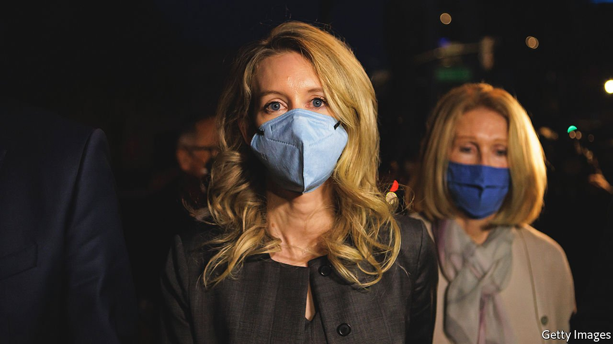

###### Blood will have blood

# A jury finds Elizabeth Holmes guilty of fraud 

##### Theranos’s founder captured the imagination of investors, political bigwigs and Hollywood alike 

 

> Jan 8th 2022 

ON JANUARY 3RD, after seven days of deliberation, a 12-member jury in Silicon Valley found Elizabeth Holmes, the entrepreneur behind a blood-testing startup, guilty of four counts of fraudulently deceiving investors. Each count carries a prison term of up to 20 years; no date has been set for her sentencing. She was acquitted of four charges of deceiving patients and doctors; on three others the jury were deadlocked. The verdict, against which Ms Holmes’s lawyers are expected to appeal, marks the collapse of a career that beguiled the media, politicians and investors.

After dropping out of Stanford University in 2003 at the age of 19, Ms Holmes founded Theranos to develop a radical advance in blood-testing technology that she hoped would allow hundreds of tests to be performed using a single tiny drop of blood rather than a full vial. The tantalising vision promised to make health care more effective and efficient.


Unfortunately, Ms Holmes could not bring it to fruition. In voting to convict on four counts, the jury concluded that, aware of her company’s failures, Ms Holmes intentionally lied about its prospects and capabilities, and so crossed the fine line from promotion to deliberate fraud—a step she explicitly denied in her own testimony.

In many ways Theranos differed little from many hot startups. It raised more than $1bn, reached an extravagant theoretical valuation (in its case $9bn)  and disintegrating into a vast graveyard of unfeasible ideas. Typically, executives behind such ventures are quickly forgotten. But Ms Holmes’s path differed at least in part because even though her company’s products failed, her presence and broader story proved unusually compelling.

In building Theranos, Ms Holmes assembled a remarkable collection of acolytes. Her board was filled with several former secretaries of state and defence. Joe Biden, while vice-president, called Theranos “the laboratory of the future” and Ms Holmes “an inspiration”. The company’s  suggested her famous followers had fed merely on hype. The fashion press was besotted by Ms Holmes’s . The Steve Jobs-inspired black turtlenecks she wore at work were seen as reflecting authority. The open-necked shirts and blouses she donned during the trial were a sign of appealing vulnerability, augmented by the nappy bag she carried to court, which signalled to the jury the costs of a potential prison term to a young mother and her infant child (who was born in July). Reporters and other onlookers waited for hours to nab a seat in the packed courtroom.

Ms Holmes’s defence followed two distinct lines. The most obvious hinged on naivety. She may have been wrong about Theranos’s prospects, the argument went, but that is not a crime. Startup investors are supposed to be a sophisticated lot, willing to wager based on deep insights in the hope of a big return, while understanding that long shots can fail. The prosecutors’ counterargument rested primarily on the presentations which Ms Holmes made to investors. These appeared to exaggerate potential sales and trumpet non-existent endorsements from the armed forces and big pharmaceutical companies. The single substantive request made by the jurors during their deliberation was to rehear a presentation that had been recorded, suggesting they were parsing what precisely she had been telling her backers.

Ms Holmes’s second line of argument, the so-called Svengali defence, was particularly appealing to Hollywood, but its impact on the jury was unclear. She claimed at the trial to have been sexually and emotionally abused and manipulated by Ramesh “Sunny” Balwani, her ex-partner and Theranos’s former chief operating officer. As such, her lawyers posited, she could not be held responsible for her actions.

Mr Balwani has strongly denied all allegations. His own trial for fraud charges will begin next month, ensuring the Theranos saga will not end soon. And even after the last gavel is pounded, there will be more to come. In the lead-up to the verdict Hulu, a cable network, released photos from an upcoming mini-series on Ms Holmes’s story, starring Amanda Seyfried. Ms Holmes may end up going to prison, but she will not be going away. ■

For more expert analysis of the biggest stories in economics, business and markets, , our weekly newsletter.

