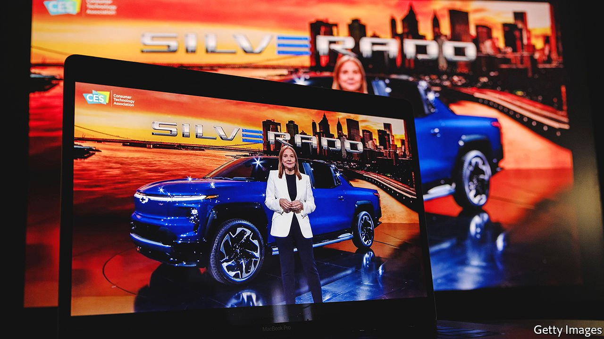

###### Cars of tomorrow

# Cars meet chips in Sin City 

##### A tech show in Las Vegas shows off the bright and shiny future of vehicle technology 

 

> Jan 8th 2022 

SINCE 2008, when General Motors’ then boss delivered a keynote speech at the Consumer Electronics Show (CES), an annual technology jamboree, Las Vegas has offered a glimpse of carmaking’s digital future. This year nearly 200 automotive firms signed up for the event, which got cracking on January 5th. That day GM’s current chief, Mary Barra (pictured), addressed a mostly online, Omicron-avoiding crowd. Like other big carmakers, GM did not show up in person. But Ms Barra’s virtual CES outing signalled how rapidly cars are evolving from oil-filled lumps of metal into devices stuffed with silicon.

Ms Barra talked about GM’s transformation from “automaker to platform innovator”, extolled its advances in commercial electric vehicles (EVs) and autonomous driving, and unveiled a battery-powered version of the Chevrolet Silverado pickup. Rival firms raced to appear even more innovative. BMW demonstrated a system that changes a car’s paint colour at the press of a button. Mercedes-Benz went so far as to claim that its Vision EQXX concept, with interior materials fashioned from bamboo, cactus and mushroom, and a battery-powered range of 1,000km, was “reinventing the car”. Not to be outdone, consumer-electronics giants strutted their automotive stuff. Sony, a Japanese one, surprised many attendees when it announced a possible foray into carmaking (though it may merely use the experience to develop EV and self-driving tech to sell to others).


Other announcements were less flashy but more telling when it comes to the digitisation of carmaking. Mobileye, the self-driving arm of Intel, which supplies chips to many big car firms, announced expanded deals with Ford, Geely and Volkswagen. Qualcomm, another chipmaker, inked new ones with Volvo, Honda and Renault.

The courtship between carmakers and chip firms will only intensify. The worldwide chip shortage that knocked nearly 8m units off global car output is thankfully easing and annualised global car production could return to pre-pandemic levels by the second half of 2022, according to Evercore ISI, an investment bank. Still, car bosses are desperate to avoid a repeat. Many look enviously at Tesla, whose own intimate rapport with semiconductor suppliers buoyed its full-year output for 2021 to a total of 930,000 vehicles. ■

For more expert analysis of the biggest stories in economics, business and markets, , our weekly newsletter.

