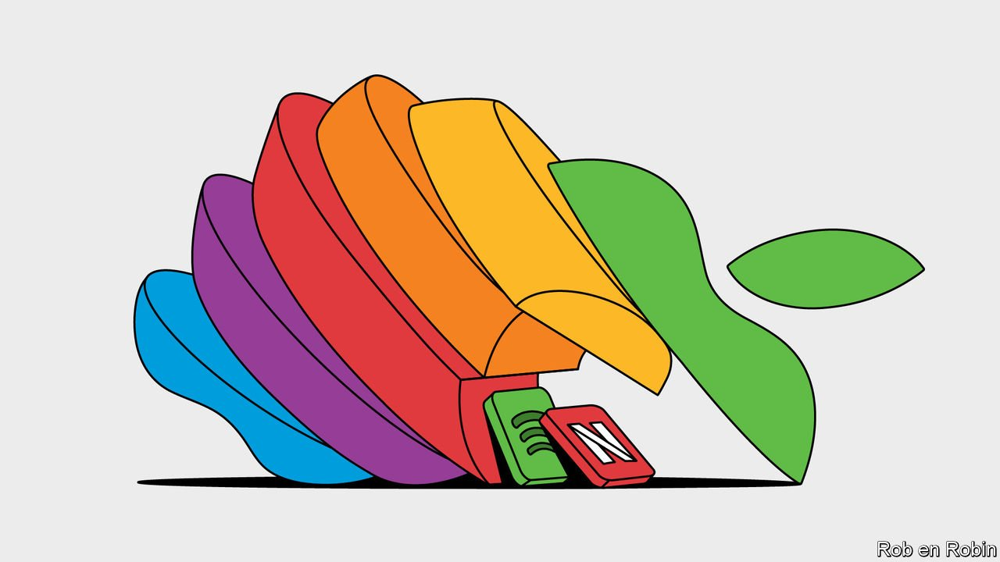
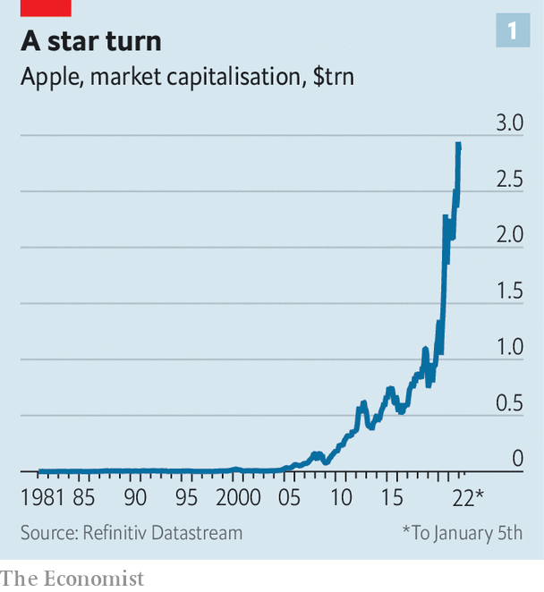
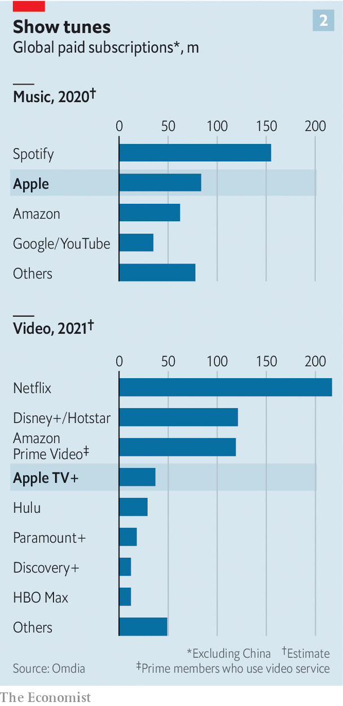

###### The accidental mogul

# Just how big in media does Apple want to be? 

##### The $3trn tech firm is not playing the same game as its rivals 

 

> Jan 8th 2022 

AS VIOLINS PLAY mournfully, Jon Stewart, an American comic, makes a mock-emotional appeal to viewers. “Every year thousands of hours of high-quality content go unwatched,” he says seriously. “Because good, hard-working people… don’t know how to find Apple TV+.”

 


The world’s  can afford a few jokes at its own expense. In the past year the tech colossus has raked in $366bn in revenue, a third more than in 2020. On January 3rd its market capitalisation briefly exceeded $3trn (see chart 1). The mere billions that it is investing in media, including a new television show hosted by Mr Stewart, represent pocket change to the Silicon Valley giant.

Yet some 300 miles (480km) down the coast in Hollywood, where executives used to snigger about the dilettantes from big-tech land up north, Apple’s dabbling in media is no joke. Though it lags well behind  and the like, Apple has enough money to ride out the increasingly expensive , which threaten to bankrupt other players. One question keeps its rivals awake at night: What does Apple want out of show business?


Apple became a big noise in music when it launched iTunes 21 years ago this week. It took a cut of songs’ sales, and shifted hundreds of millions of iPods for people to play them. Later iTunes sold movies, too, and the firm hoped to make the same model work in television, where the market is an order of magnitude larger than music. But paying for downloads was superseded by all-you-can-eat subscriptions, pioneered by Spotify in music and Netflix in TV. Unlike downloaded music or films, subscriptions could be easily moved between platforms. So Apple, seeing little opportunity to lock consumers into its devices, sat out the streaming revolution.

 


Today it is back in the media game, and a bigger force than Mr Stewart’s joke implies (see chart 2). Apple Music, launched in 2015, is the second-largest streamer after Spotify. Apple TV+, now two years old, is the fourth-largest video service outside China by the number of subscribers, according to Omdia, a data company. In the past couple of years Apple has made smaller media bets including Arcade, a subscription gaming package, News+, a publishing bundle, and Fitness+, which offers video aerobics classes. There is talk of an audiobooks service later this year.

Like Amazon, another tech giant with a sideline in media, Apple has been able to roll out its offerings more quickly in more countries than most of its Hollywood rivals, which have had to build direct-to-consumer businesses from scratch. And it can afford to be generous with free trials: less than a third of Apple TV+ subscribers pay for the service, Omdia believes. It has had some hits, notably “Ted Lasso”, which won a string of Emmy awards in September. But it lacks a back-catalogue, leading to high rates of customer churn. Smaller competitors like Paramount+ (part of Viacom CBS) and Peacock (from NBCUniversal) have limited new offerings but decades-old libraries.

Old-media firms have been puzzled by Apple’s on-off sorties into their territory, which sometimes seem half-hearted. Winning at streaming depends mainly on splurging on content. But deep-pocketed Apple spent just over $2bn on film and TV in 2021, against Amazon’s $9bn and Netflix’s $14bn, estimates Ampere Analysis, a research company. It doesn’t bother to market its efforts much. And although medialand has cooed at the executives that Apple has poached, such as Jamie Erlicht and Zack Van Amburg from Sony and Richard Plepler from HBO, Silicon Valley insiders say that Apple keeps its own top tech people on other projects.

Indeed, while Hollywood frets about Apple’s next move, many in Silicon Valley wonder why it is in media at all. None of the markets is a big prize for the world’s most valuable firm. The entire global recorded music industry had sales of $22bn in 2020, less than Apple made just from selling iPads. In about a month Apple generates as much revenue as Netflix makes in a year. Apple’s TV business depends on buying shows, rather than extracting rents from others’ creations as it did in the iTunes days (and as it still does in its app store). And the “lock-in” effect on consumers is weak, since Apple’s main media services are available on all platforms.

Apple’s renewed interest in media is best explained by the transformation in the company’s scale, which radically changes the calculation of which side-projects are worthwhile. Fifteen years ago, when Netflix started streaming, the billions involved in running a film studio would have represented close to a double-digit chunk of Apple’s annual revenues. Back then, Silicon Valley executives would fly down to Los Angeles, thinking “We’ve got a big chequebook, we could go and buy a bunch of content,” says Benedict Evans, a tech analyst and former venture capitalist. “And they would go and have their first meeting in LA. And the LA people would tell them the price”—at which point the tech people would go home. In 2021 Apple TV+’s estimated content budget represented 0.6% of company revenues: “play money”, as Mr Evans puts it.

The cost of running a studio can therefore be justified by what are only modest benefits to Apple. Streaming subscriptions may not lock people in as strongly as iTunes purchases did, but Apple’s various services still sink “meat hooks” into customers, making them spend more time with their devices and making it a bit more inconvenient to leave Apple’s ecosystem, says Nick Lightle, a former Spotify executive. The iPhone itself, which generated $192bn in sales in the past year, more than half of Apple’s total revenues, is sold as a sort of subscription, points out Mr Evans. Anything that cuts churn among iPhone subscribers by even a small amount is likely to pay for itself.

Media also makes good marketing. Producing films with Steven Spielberg and Tom Hanks reinforces Apple’s premium brand. Partnerships with pop stars keep it cool. And at a time when Silicon Valley is under attack for monopolistic practices, invasion of privacy, subversion of democracy and more, Apple is churning out worthy podcasts by Malala Yousafzai, a Nobel laureate, and teaching fitness routines to children. Not many companies can think of a film studio as a public-relations arm. A $3trn company can.

“Apple is not playing the same game as many of its other [media] competitors,” says Julia Alexander of Parrot Analytics, another data firm. For one-trick rivals like Netflix, it is an uncomfortably asymmetric competition. Yet Apple’s broader priorities can also hamstring its media ambitions. Apple TV+’s lack of a library could be solved by buying someone else’s; the firm has been touted as a potential buyer of small studios like Lionsgate as well as giant ones like . But Apple may be wary of provoking America’s Federal Trade Commission (FTC), which has its sights on Silicon Valley. “If you’re Apple and the FTC is looking at big tech, the last thing you want to do is make a huge acquisition,” notes Ms Alexander. Lina Khan, the FTC’s tech-bashing head, is examining Amazon’s recent $8.5bn purchase of MGM Studios; never mind that the target is a relative tiddler in a fragmented market. As firms vie for control of tech’s next commanding heights, from decentralised Web3 to virtual reality, drawing regulators’ attention by buying old TV episodes could be a strategic error.

For as long as they continue to help sell its devices and burnish its brand, Apple will keep dripping investment into its media services. Doing so will get more expensive: global spending on video content will exceed $230bn in 2022, according to Ampere, nearly double what it was a decade ago. As smaller competitors are outspent and give up, Apple’s position could even strengthen. But given its bigger ambitions in other industries, in media Apple is likely to be satisfied to stick to its role as a supporting actor. ■

For more expert analysis of the biggest stories in economics, business and markets, , our weekly newsletter.

