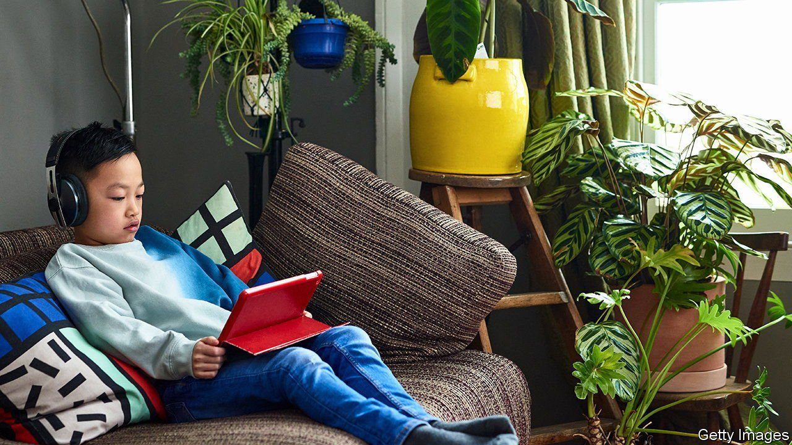
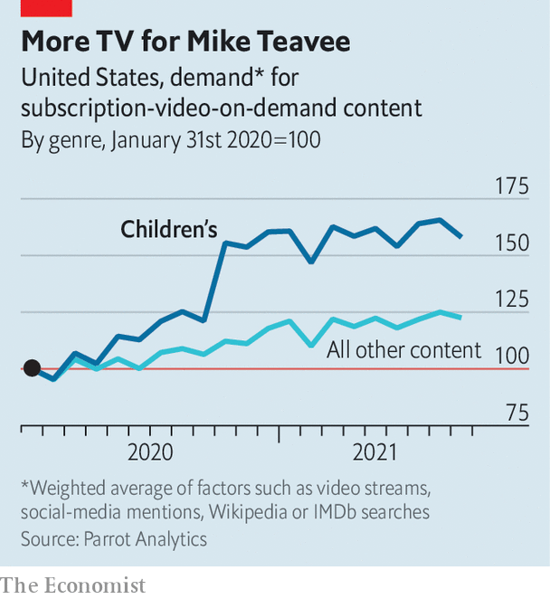

###### No child’s play

# Streaming giants get more serious about children’s shows 

##### A cost-effective way to expand your subscriber base 

 

> Jan 8th 2022 

THE PANDEMIC has been tough for parents of young children. With schools shut, many had to keep an eye on their offspring while juggling chores and remote work. Succour came courtesy of Hollywood. A study by Parrot Analytics, a data firm, found that demand for children’s shows in America—measured by video views, social-media mentions, searches on IMDB, a platform for film buffs, and the like—grew by nearly 60% from the start of 2020, before covid-19 hit, to last September (see chart). Demand for other genres rose by 23% in that period.

 


At the same time, parental concerns about their progeny’s media diets have grown. A recent Pew survey found nearly half of parents saying that YouTube, the most popular destination for young audiences, exposed their children to inappropriate content. Many are chary of social-media apps such as TikTok, one-third of whose users may be under the age of 14, according to internal data seen by the New York Times.


Fortunately, help is at hand. Disney, arguably the child-friendliest brand of all, has created a new role tasked with seeking out external children’s programming—part of a reorganisation to separate content creation from merchandising. Paramount+ is promoting its Nickelodeon trove to parents. Its own parent, Viacom CBS, is reportedly in talks to buy the “Alvin and the Chipmunks” franchise from its creators for as much as $300m.

In September Netflix paid more than $700m for the Roald Dahl Story Company, which owns the rights to the eponymous author’s beloved tales such as “Charlie and the Chocolate Factory”. In November it announced the launch of Kids Clips, which offers curated short videos from its expanding slate of children’s programmes. Last autumn HBO Max, best-known for edgy grown-up fare, launched Cartoonito, a portal dedicated to pre-school shows.

Upstarts are getting in on the action, too. Kidoodle. TV, an ad-supported app that specialises in children’s shows, has seen its downloads balloon during the pandemic. In November two former Disney executives agreed to pay $3bn for Moonbug Entertainment, the company behind hit programmes like “Cocomelon” and “Blippi”.

Youth programming is attractive to streaming services for several reasons. Children’s television shows, especially animated ones, often cost less to produce than entertainment for adults, observes Erin Meyers of Oakland University. They tend to have a longer shelf life, too, since young children are less fussy than older viewers about what is hip at any given moment. And children’s programming offers vast merchandising opportunities in the form of toys. Most important, if you get it right you may be rewarded twice over: with current custom from grateful parents and, if their offspring like what they see, a guaranteed stream of future viewers. ■

