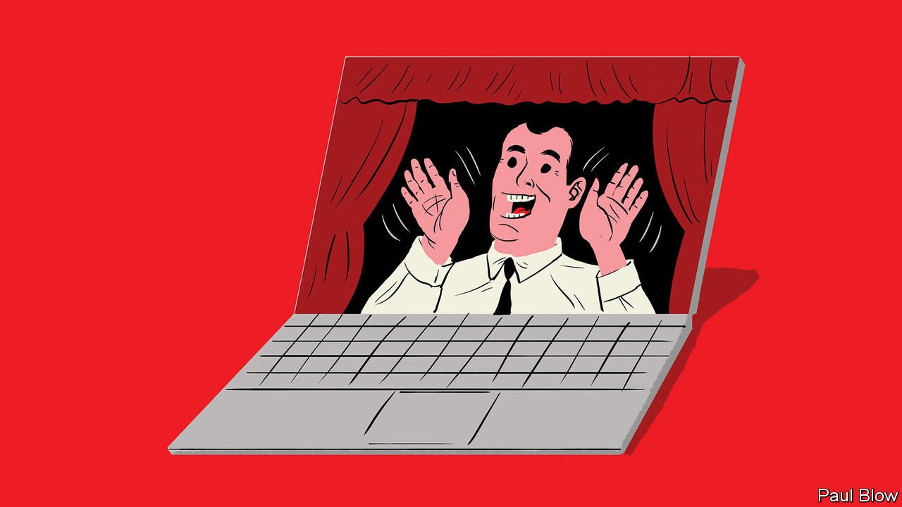

###### Bartleby

# The rise of performative work 

##### It’s not what you do. It’s how ostentatiously you do it 

 

> Jan 8th 2022 

IN AN EPISODE of “Seinfeld”, a vintage TV sitcom, the character of George Costanza reveals the secret of pretending to work: act irritated. He shakes his head, frowns and sighs to demonstrate the technique. “When you look annoyed all the time, people think that you’re busy.” In comments posted below this clip on YouTube, visitors report with delight that the tactic really does work and offer a few tips of their own: walk around the office carrying manila envelopes, advises one.

Before the pandemic turned everyone into remote employees, managers worried that working from home would be a paradise for slackers like George. People would be out of sight and out of mind: starting late, clocking off early and doing nothing in between. The reality of remote working has turned out to be different. Days have become longer and employees are demonstratively visible. Work has become more performative.


The simple act of logging on is now public. Green dots by your name on messaging channels are the virtual equivalents of jackets left on chairs and monitors turned on. Calendars are now frequently shared: empty ones look lazy; full ones appear virtuous.

Communication is more likely to happen on open messaging channels, where everyone can see who is contributing and who is not. Emails can be performative, too—scheduled for the early morning or the weekend, or the early morning on the weekend, to convey Stakhanovite effort. Repeated noises like Slack’s knock-brush provide a soundtrack of busyness.

Meetings, the office’s answer to the theatre, have proliferated. They are harder to avoid now that invitations must be responded to and diaries are public. Even if you don’t say anything, cameras make meetings into a miming performance: an attentive expression and occasional nodding now count as a form of work. The chat function is a new way to project yourself. Satya Nadella, the boss of Microsoft, says that comments in chat help him to meet colleagues he would not otherwise hear from. Maybe so, but that is an irresistible incentive to pose questions that do not need answering and offer observations that are not worth making.

Shared documents and messaging channels are also playgrounds of performativity. Colleagues can leave public comments in documents, and in the process notify their authors that something approximating work has been done. They can start new channels and invite anyone in; when no one uses them, they can archive them again and appear efficient. By assigning tasks to people or tagging them in a conversation, they can cast long shadows of faux-industriousness. It is telling that one recent research study found that members of high-performing teams are more likely to speak to each other on the phone, the very opposite of public communication.

Performative celebration is another hallmark of the pandemic. Once one person has reacted to a message with a clapping emoji, others are likely to join in until a virtual ovation is under way. At least emojis are fun. The arrival of a round-robin email announcing a promotion is as welcome as a rifle shot in an avalanche zone. Someone responds with congratulations, and then another recipient adds their own well wishes. As more people pile in, pressure builds on the non-responders to reply as well. Within minutes colleagues are telling someone they have never met in person how richly they deserve their new job.

Theatre has always been an important part of the workplace. Open communication is a prerequisite of successful remote working. But the prevalence of performative work is bad news—not just for the George Costanzas of the world, who can no longer truly tune out, but also for employees who have to catch up on actual tasks once the show is over. By extension it is also bad for productivity. Why, then, does it persist?

One answer lies in the natural desire of employees to demonstrate how hard they are working, like bowerbirds with a keyboard. Another lies in managers’ need to see what everyone is up to. And a third is hinted at in recent research, from academics at two French business schools, which found that white-collar professionals are drawn to a level of “optimal busyness”, which neither overwhelms them nor leaves them with much time to think. Rushing from meeting to meeting, triaging emails and hitting a succession of small deadlines can deliver a buzz, even if nothing much is actually being achieved. The performance is what counts.

Read more from Bartleby, our columnist on management and work:

 (Jan 1st) (Dec 18th) (Dec 11th)

