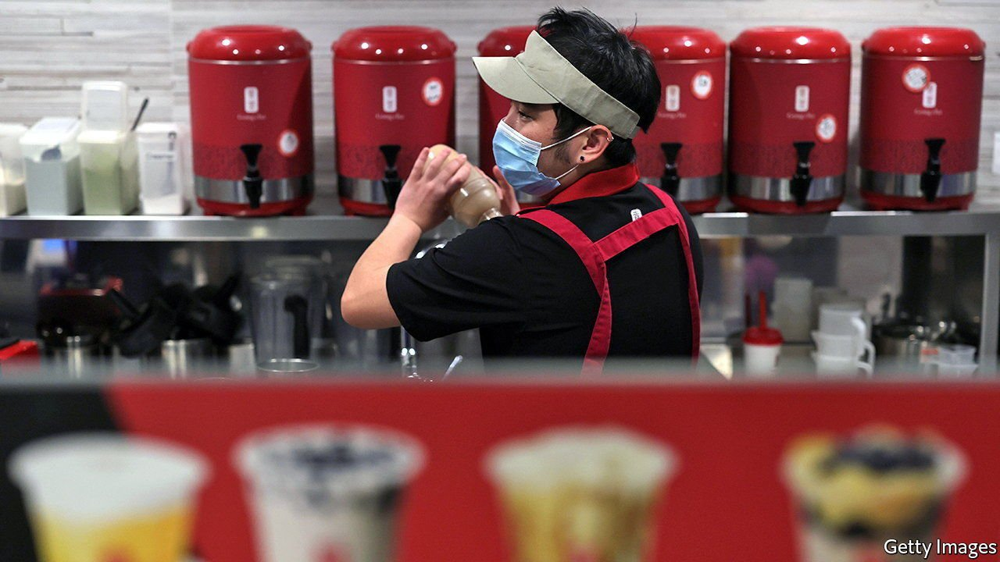

###### Blue-collar burnout

# Why workers are fleeing the hospitality sector 

##### Stress and exhaustion are big factors 

 

> Jan 8th 2022 

RESTAURANT AND hotel bosses have had a tough year. Some 700,000 hospitality workers threw in the towel on average each month in the past year. Bars, cafés and eateries are 1.3m workers short relative to the 16.9m employed before covid-19. On January 4th the Bureau of Labour Statistics reported that a record 4.5m Americans quit their jobs in November, 9% up on a month earlier. The quit rate in leisure and hospitality jumped by a percentage point, to 6.4%. Uncertainty from the Omicron variant may make matters worse: as cases surged in December, restaurant footfall fell sharply, according to OpenTable, an online booking website.

As in other industries, workers in hospitality are leaving for various reasons, from fear of infection to better opportunities elsewhere. But one big motive is burnout. Psychological exhaustion is more often associated with hard-charging investment bankers and other professionals. Amid the pandemic it has afflicted many blue-collar workers, too.


Surveys find that chronic stress is a growing concern across the labour market, but dissatisfaction is especially high in service roles, where hybrid work is not possible. Data collected by Glassdoor, an employment portal, found that employees rate the hospitality sector as one of the worst for work-life balance. Mentions of “burnout” in reviews of employers on the site have doubled during the pandemic. Workers report that new tasks such as dealing with angry customers and enforcing health mandates have added to the burden.

Work in restaurants and hotels can be physically taxing, poorly paid and unpredictable. Unlike white-collar workers, who suffer from needing to be constantly available, service workers burn out as a result of uncertain schedules and a lack of control over time, says Ashley Whillans of Harvard Business School. Ian Cook of Visier, a human-resources-analytics firm, says that time off during lockdowns gave employees an opportunity to reflect on their relationship with “fragile and meagrely paid work”.

Firms have scrambled to respond. Many food and accommodation businesses have raised wages—by an average of 8.1% year on year in the third quarter, the highest increase on record. That may not be enough. In one poll of hospitality workers, over half said higher pay will not lure them back by itself. Large retailers such as Amazon and Target, which require many of the similar skills, are poaching hospitality staff by offering non-cash perks like subsidised college education, parental leave and career advancement. Most restaurants cannot afford to match such offers.

Daniel Zhao, an economist at Glassdoor, foresees a permanent reduction to the hospitality workforce. “High turnover tends to be contagious,” he says, and early resignations can start a vicious cycle. As some workers quit, those who remain must pick up the slack, leading to more stress. This in turn provokes more exits, and so on. Add an ageing population, with dwindling numbers of young people prepared to toil in kitchens or sweep hotel corridors, and hospitality businesses may be contending with blue-collar burnout for years to come. ■

For more expert analysis of the biggest stories in economics, business and markets, , our weekly newsletter.

