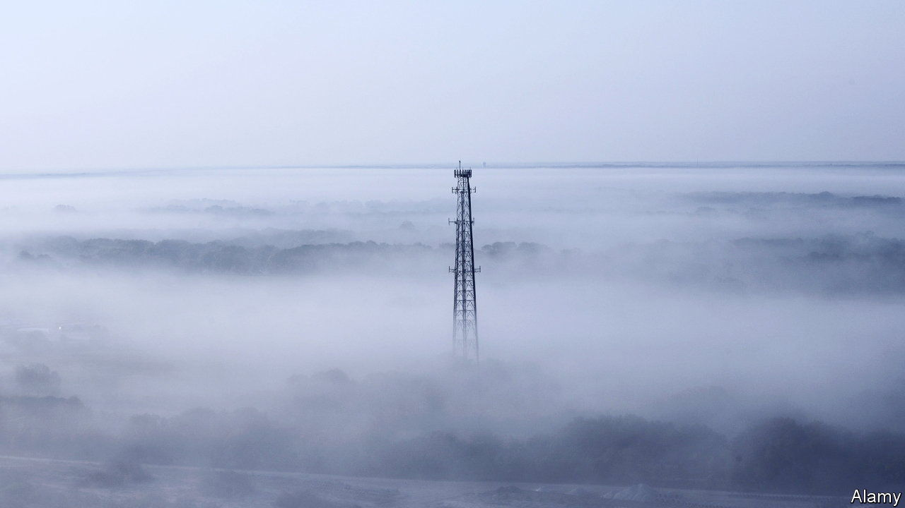

###### Cloud v ether

# Will the cloud business eat the 5G telecoms industry? 

##### As AT&T and Verizon launch 5G this month, two huge industries collide 

 

> Jan 8th 2022 

SMARTPHONES ABLE to take advantage of zippy fifth-generation (5G) mobile telephony have graced American pockets since 2019. Samsung launched its first 5G-enabled device in April that year. Apple followed suit in late 2020 with its long-awaited 5G iPhone. Until now, however, actual 5G coverage in America has been limited. Only one of the country’s three biggest carriers, , has offered broad 5G connectivity.  and Verizon, its two bigger rivals, had to delay their large-scale roll-outs in December after the Federal Aviation Administration aired concerns that their 5G radio spectrum interferes with avionics on some ageing aircraft. On January 3rd both firms, which insist that the technology is safe (and can be turned off around airports, just in case), said they would again postpone switching on their 5G networks by two weeks.

Yet it is the imminent arrival of another player in the 5G contest that is the talk of the industry. In the next few months Dish Networks, a company best known for its satellite-television service, is expected to launch America’s fourth big carrier. The firm’s promise to inject more competition into a concentrated and ossified sector was what helped persuade regulators to approve a merger between T-Mobile and Sprint, a smaller incumbent, in 2020.


More important, Dish’s network is to be the first in America that would live almost entirely in a computing cloud. Except for antennas and cables, it is mostly a cluster of code that runs on Amazon Web Services (AWS), the e-commerce giant’s cloud-computing arm. As such, the roll-out is a test of the extent to which computing clouds will “eat” the telecoms industry, as software has eaten everything from taxis to Tinseltown. If the launch is a success and other carriers follow suit, it could reconfigure not just America’s wireless industry but the global mobile-telecoms market with annual revenues of around $1trn, according to Dell’Oro Group, a research firm. And it would entangle telecoms intimately with the cloud business, whose revenues could be half as large this year and are growing at double digits.

Dish best served cold

Dish’s network is the culmination of a process that started in the early 1980s. Back then antitrust regulators allowed AT&amp;T, the world’s largest network operator, and IBM, its biggest computer firm, to enter each others’ markets. AT&amp;T started selling personal computers and IBM bought ROLM, which sold telecoms equipment. Pundits predicted an epic battle between the two giants—and a rapid convergence of the telecoms and computer industries into one.

Neither the battle nor the convergence materialised. Forty years ago the two markets proved too distinct and the technology was not up to snuff. Now things look different. Computing clouds such as AWS and Microsoft’s Azure are maturing fast, and finally becoming able to deal with the demanding task of powering a mobile network. The latest iteration of mobile technology, 5G, was conceived from the start not as a collection of switches and other hardware, but as a set of services that can be turned into software, or “virtualised”. And the telecoms industry is becoming less proprietary, embracing “open radio access network” (O-RAN) standards that make it possible to virtualise ever more functions previously performed by hardware. As a result, networks can turn into platforms for software add-ons, just as mobiles turned into smartphones which could run apps.

All this will be on full display in Dish’s network. Instead of bulky base stations used in conventional mobile networks, its technology is housed in slender boxes attached to antenna posts. These are connected directly to the AWS cloud, which hosts the virtual part of the network, including all of Dish’s other software (for example that used to manage subscribers and billing). The only thing Dish is buying from established makers of telecoms gear is software, says Marc Rouanne, its chief network officer (who used to work for one such vendor, Finland’s Nokia).

As a result, Dish’s network will be cheaper to set up and to run. It will also be fully automated, down to the virtual “labs” where new services are tested. This should allow the company quickly to spin up special-purpose networks, for instance connecting equipment in mine shafts, or enabling drones to talk to each other and their controllers. Dish also wants to use artificial intelligence to optimise the use of radio spectrum, including by training algorithms which are able to adapt parts of the network to specific conditions such as a storm or a mass concert.

Although Dish is pushing this “cloudification” furthest, other carriers around the world are not far behind. In June AT&amp;T, still America’s largest mobile operator, sold the technology that powers the core of its 5G network to Microsoft, which will run it for AT&amp;T on its Azure cloud. Reliance Jio, India’s technology titan, has ambitious plans to build a cloud-based 5G network.

These developments are also bringing the big cloud providers into the telecoms world. Last year Microsoft bought Affirmed Networks and Metaswitch, the main software suppliers for the core of AT&amp;T’s 5G network. They now form a new business unit called “Azure for Operators”. Google has a similar effort and recently forged a partnership with Telenor, a Norwegian telecoms company. In November AWS announced a new offering that lets customers quickly set up private 5G networks on their premises.

Newcomers are also elbowing their way into the business. Rakuten, a Japanese online giant, has already built a Dish-like network at home. Rather than outsourcing its cloud operation to big tech, Rakuten has built its own, and launched a subsidiary, called Rakuten Symphony, to offer the system to other operators. It is helping 1&amp;1, a German web-hosting company, to build a network. “We don’t want to be a telco cloud, but enable operators to make their own,” explains Tareq Amin, who heads Rakuten Symphony.

Existing mobile networks will not be replaced overnight. Rakuten’s faced delays and Dish’s was originally scheduled for launch late last year. Some technical barriers remain. Despite being seen as a welcome alternative to gear from Huawei, a controversial Chinese giant, especially in Europe, gear based on O-RAN specifications is not mature. Its European adopters have therefore yet to install it in the most vital parts of their networks. “It’s in an extended beta test,” sums up Dean Bubley of Disruptive Analysis, a consultancy.

Another question is whether the cloud can completely gobble up telecoms networks, notes Stéphane Téral of LightCounting, another consultancy. Controlling a 5G base station is hugely complex and involves keeping tabs on hundreds of para meters. The more flexible a carrier wants to be, the more complicated things get. At least for some time, the necessary control software may need to run on specialised gear near the antenna rather than on generalist servers in faraway data centres.

Then there are the political and financial barriers. European governments fret that America’s spooks will have even more access to their country’s networks if these run in American clouds (Europe has none of its own and is understandably even warier of Chinese ones). Carriers, in Europe and elsewhere, fear losing business to the tech giants like Amazon, Google or Microsoft, which have already skimmed most of the value generated by 4G mobile technology. “If all this is not financially interesting for [telecoms firms], they will try something else,” says Michael Trabbia, chief technology officer of Orange, a French mobile operator.

However this plays out, the telecoms business will look very different a few years from now. The contest for control of the telecoms cloud, and particularly its “edge” (tech speak for what remains of the base station) will only heat up. Whoever is in charge of these digital gates will have the fastest access to consumers and their data, the main currency in a world of new wireless services, from self-driving cars to virtual-reality metaverses.

The cloud businesses have the technological edge for now, and will try to eat as much of wireless networks as possible. The operators have relationships with customers, know how to manage networks and own the radio spectrum. Eventually, cloud providers and network operators will probably come to some kind of agreement. In the new world of mobile telecoms, neither can do without the other. ■

 this article has been updated to take in the decision by AT&amp;T and Verizon to delay switching on their 5G networks.

For more expert analysis of the biggest stories in economics, business and markets, , our weekly newsletter.

