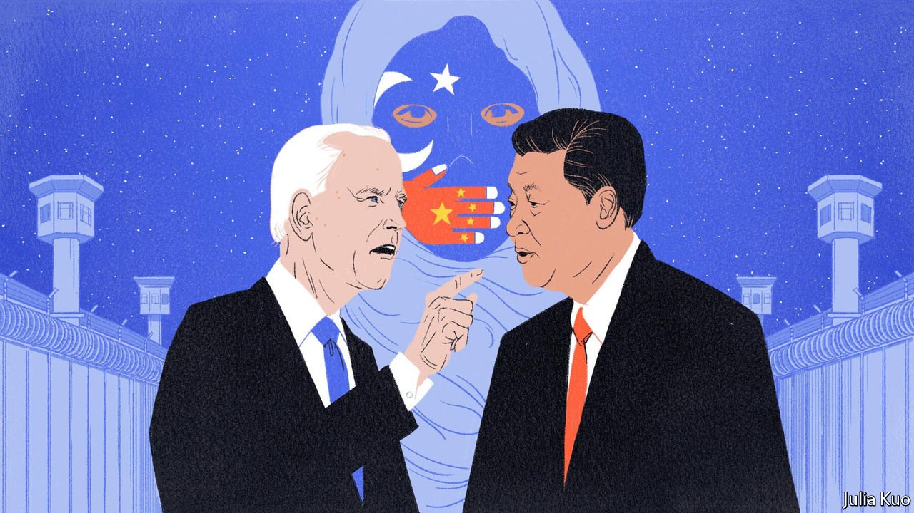

###### Geneva discords

# China and America prepare for a human-rights showdown at the UN 

##### It is not clear which side will win 

 

> Jan 8th 2022 

LAST YEAR the Human Rights Council in Geneva passed resolutions condemning abuses in Afghanistan, Burundi, Eritrea, Ethiopia, Myanmar, Sudan and Syria. But as in every other year since its creation in 2006, the United Nations body was silent on China. Fearful of reprisal, and uncertain of victory, member governments have been reluctant even to propose resolutions condemning, say, the erosion of civil liberties in Hong Kong or the harsh repression of Uyghurs in Xinjiang.

With the new year comes the possibility of change. On January 1st America took a seat on the council for the first time since 2018, when Donald Trump left it in a huff over its repeated criticisms of Israel. Human-rights activists hope that under President Joe Biden, America will at last press the UN to shine a light on China. They may be disappointed yet again. China also has a seat on the council, and has a solid record of staving off rebukes from the world body. A great-power showdown may be in the offing in Geneva, but it is far from clear that America will win.


China’s Communist rulers have long made stifling criticism of themselves a central goal of foreign policy. That has become harder in recent years. The regime’s horrific treatment of Uyghurs and the crackdown in Hong Kong have prompted condemnation and sanctions from rich democracies (and retaliatory sanctions from China). America went as far as to label China’s actions in Xinjiang “genocide”, though China’s government is brutally persecuting the Uyghurs, not slaughtering them. Like a number of other countries, America will not send an official delegation to the Winter Olympics in Beijing in February.

At the UN dozens of governments—including America’s, Germany’s and Britain’s—have made annual joint statements decrying China’s behaviour, and calling for free access to Xinjiang for Michelle Bachelet, the UN’s high commissioner for human rights. (She has had to investigate without going there.) Independent human-rights experts appointed by the UN have also issued a rare statement deploring China’s abuses in Hong Kong, Tibet and Xinjiang.

But UN institutions have said and done nothing about China. There has never been any chance of action against China in the Security Council, where China holds a veto. Under Xi Jinping, China has become active and influential in the organisation, placing diplomats in senior and junior jobs throughout the entire UN system. And China is now the second-largest contributor, after America, to the UN’s general budget.

The 47-member Human Rights Council, in theory, is free to speak up. It has rotating temporary members and no vetoes. But several egregious abusers sit on the council, as do many countries with strong economic ties with China. Diplomats say China often threatens retaliation against countries that criticise it, and offers rewards for taking its side—typically aid, loans or investment. In June Ukraine backed out of a joint statement criticising China, organised in Geneva by council members, after Chinese diplomats reportedly threatened to withhold coronavirus vaccines from the country. John Fisher, the head of the Geneva office of Human Rights Watch, an NGO, says some countries that publicly back China are “quite frank with us in the corridors, that they can’t afford to be seen to cross China”.

America’s return should help matters. Under Mr Biden American diplomats again took an active role in Geneva in 2021, and won a seat on the council for a three-year term from 2022. (Michèle Taylor, appointed ambassador by Mr Biden to fill it, is still awaiting Senate confirmation.) In 2021 America’s friends in Geneva won some minor symbolic victories. In October Britain managed to amend a Chinese resolution about colonialism, which was intended as a poke in the eye to Western powers, so that it could be read also as implicit criticism of China’s treatment of Uyghurs. America and its allies are also busily urging Ms Bachelet to produce her long-awaited report on Xinjiang, which would be useful fodder for the council.

But it remains unclear if the Biden administration will press ahead with a resolution against China in its first year back. Some governments inclined to support America worry that a confrontation with China would polarise members and jeopardise the council’s other work. And a resolution might be defeated, which might embolden China. “I know the US diplomats here are constantly thinking about numbers, about would they get something through,” says Marc Limon of Universal Rights Group, a think-tank in Geneva.

They are right to worry. For years after the massacre in Beijing in 1989, America and its allies tried to get a resolution on China through the UN Commission on Human Rights, the council’s predecessor. Only once, in 1995, did one get as far as a vote of the full commission; it failed by a margin of one. And these days China has much more weight to throw around. “Nobody likes a bully,” Mr Fisher says. True enough; but bullies still often get their way. ■

