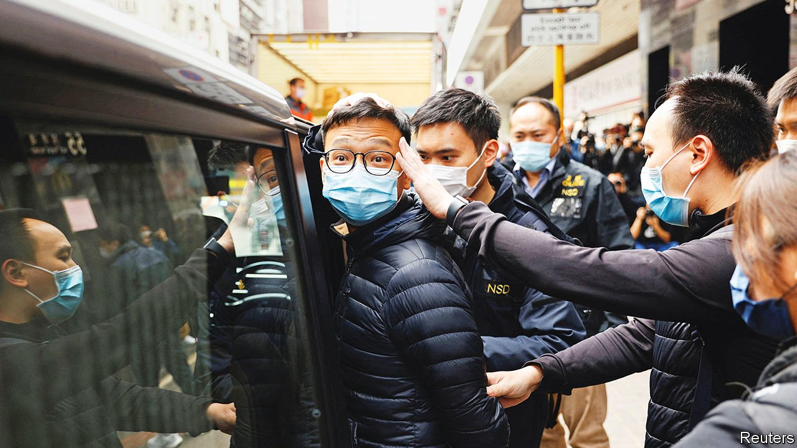

###### Showing who’s boss

# China crushes Hong Kong’s independent news outlets 

##### The world loses an important way to understand Hong Kong and China 

 

> Jan 8th 2022 

LIFE AS AN independent journalist in Hong Kong, long hard, is becoming impossible. On December 29th Stand News, the territory’s leading pro-democracy news outlet, was forced to shut after hundreds of police raided its office, froze its assets and arrested seven people. The current and former editors were charged with conspiracy to publish seditious content and denied bail. Fearing for their reporters’ safety, two other news sites, Citizen News and Mad Dog Daily, halted operations on January 4th.

After the enforced closure in Hong Kong last June of Apple Daily newspaper, Stand and Citizen were the two most popular Chinese-language, pro-democracy outlets. Both rose to prominence in the protest movement in 2019, and were known for their popular live-streams and comprehensive coverage. A Stand reporter, Gwyneth Ho, who was attacked while covering the protests, entered politics and is now in jail under a national-security law that China imposed in 2020. The chief editor at Citizen, Daisy Li, said they were “no longer able to say for sure” what may violate the security law. Hong Kong’s chief executive, Carrie Lam, denied it had anything to do with the closures.


Citizen had been a lifeboat for independent journalists, rescuing some who had resigned or been fired from other outlets, including Apple Daily, Cable TV and RTHK, the public broadcaster (the output of which now resembles that of Chinese state media). Journalists posted photos of farewell cards: “We fought the good fight, we finished the course, we kept the faith.”

Controls on the press are likely to tighten. Hong Kong’s security chief, Chris Tang, said in December that he “fully supported” the introduction of “fake news” regulations. Traditional news outlets have grown increasingly cautious, while the influence of Communist-backed newspapers such as Wen Wei Po and Ta Kung Pao has grown. The last significant independent news outlet in the city is Hong Kong Free Press, an English-language news site. Almost half of around 100 respondents surveyed by Hong Kong’s Foreign Correspondents’ Club were considering leaving because of concerns over press freedom. China’s foreign ministry accused the club of “sowing discord”.

The onslaught on free speech extends beyond independent news organisations. On January 4th Chow Hang Tung, an activist barrister, was sentenced to 15 months in jail for arranging a commemoration of the Beijing massacre of June 1989. A vigil for victims in 2020 led to prison terms for 23 other activists. In December three universities removed monuments inspired by the massacre. Even Disney+, a streaming service, removed from Hong Kong broadcasts of an episode of “The Simpsons” that mentions the massacre and refers to Mao Zedong as “a little angel that killed 50m people”. With every passing day, Hong Kong becomes more like the rest of China.

Yet Hong Kong’s press used to be vital in helping the world understand China. Its journalists have broken many important stories about the country. No longer. Hardly any Hong Kong outlets, for example, covered the political scandal that followed the accusation in November 2021 by Peng Shuai, a famous Chinese tennis player, of sexual assault by a senior Chinese official. Citizen and Stand were exceptions.

The space for civil society is also shrinking. Some 60 pro-democracy grassroots organisations were forced to close in 2021. On January 3rd members of a new Legislative Council were sworn in. Hong Kong’s emblem, the bauhinia flower, was replaced in the chamber by China’s national crest. A band played the Chinese national anthem. Three new members chose to take their oaths in Mandarin, rather than Cantonese, the traditional language of Hong Kong. The elections in December had been radically different from previous ones, with only 20 of the 90 seats directly elected. After a vote in November 2019 when the pro-democracy camp won nearly 90% of the seats, the government overhauled the electoral system. Most opposition politicians are now either in jail or have gone into exile.

A record-low number of voters cast ballots in December’s “patriots-only” race. All but one of the 90 seats were won by candidates from the pro-establishment camp. The government warned that anyone calling on others to cast invalid votes may be in breach of the security law. At least ten people were arrested for violating election laws. The government threatened the Wall Street Journal with being in breach of one after it published an editorial entitled “Hong Kong Says Vote—or Else”.

Citizen’s China team, widely regarded as the best in Hong Kong, released their last 38-minute episode on January 3rd. It followed Zhang Zhan, a citizen journalist who covered the early days of covid-19 in Wuhan and is now dying in jail on a hunger-strike. “If the truth doesn’t come out, the lies win,” she says, interviewed in a car. “The liars,” she goes on, looking off-camera, “will turn lies into truth.” ■

