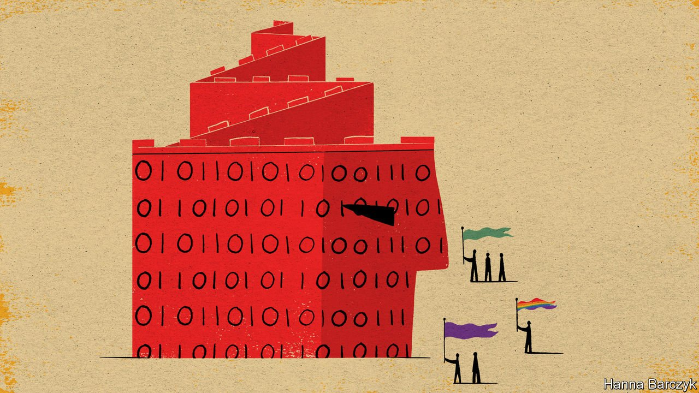

###### Chaguan

# China’s online nationalists turn paranoia into clickbait 

##### They see hostile foreign forces at every turn 

 

> Jan 8th 2022 

AN ANXIOUS WORLD has long worried that rising nationalism might one day lead ordinary Chinese—especially the young—to outbursts of uncontrollable rage. If recent months are any guide, outsiders missed a more insidious threat: that anti-foreign paranoia would become a nasty but profitable game.

These are frightening times for Chinese civil-society activists, non-governmental organisations (NGOs) and private businesses that see their role as building bridges between China and other countries. Nationalist bloggers, supported at times by media outlets controlled by the Communist Party and the People’s Liberation Army, have spent months denouncing groups and individual campaigners for receiving foreign grants, or merely for relaying foreign concerns about China’s growing impact on the world, even in such relatively safe fields as the environment.


Last year Paperclip, a maker of popular science videos, was attacked by online nationalists and driven out of business, accused of spreading anti-China hatred with a film noting that China is a big buyer of Brazilian soyabeans linked to deforestation in the Amazon, and saying that eating less meat is good for the planet. Online celebrities have been called race traitors for making videos about over-fishing, some of them for a British-headquartered charity, in which they urged Chinese to consume seafood more responsibly. Nationalists detect an “evil” agenda to deny China protein that Americans and Europeans wish to keep for themselves.

China House, a social enterprise based in Shanghai that promotes sustainable development in Africa, and that offers young Chinese opportunities to volunteer to help marginalised folk, faces ongoing attacks. It drew ire for drawing attention to discrimination faced by African migrants in southern China, and for investigating Chinese buyers of illegal ivory. Sai Lei, a blogger behind some of the loudest recent campaigns, declared China House’s founder an er guizi, a contemptuous term for collaborators with Japanese occupiers in the 1930s and 1940s. Reposted by the Communist Youth League, his video has to date been viewed 5m times.

A veteran of the NGO world calls this the worst time for Chinese civil society since 1989. Yet this atmosphere of fear was not triggered by new government policies, or by a wave of arrests. Instead, disconcertingly, some of the most damaging attacks came from previously little-known social-media entrepreneurs. Still more shockingly, the secret weapon of these bloggers is to make anti-foreign bigotry fun. Their core audience is young men aged 18-25. If followers are initially hooked by videos denouncing “anti-China traitors”, their attention is kept with nationalist memes, conspiracy theories and dark in-jokes. Calling targets er guizi is only a start. Because state security services offer rewards of up to 500,000 yuan ($78,700) for reporting agents of a foreign power, those Chinese deemed unpatriotic are mocked online as “a walking 500,000” in anticipation of their denunciation as spies, or simply “500,000”. Nationalism has become an entertainment industry. In the words of a Chinese liberal whose employer was targeted last year, nationalists discovered that videos about “anti-China” treachery generate clicks. “If you have a lot of clicks you become influential, and influence drives revenues.”

Chaguan asked Sai Lei why he started making nationalist videos, after years of making explainer films about science and cars. Before agreeing to a telephone interview the 30-year-old, whose real name is Li Sirui, asked for questions in advance, citing his distrust of foreign media. He described his suspicion, starting in 2020, that a hidden agenda lay behind what seemed to be growing criticism of China. While relating his story, Mr Li mixed together many things that shocked him: comments by President Donald Trump about covid-19; BBC news reports about alleged forced labour in Xinjiang’s cotton industry; and unsourced titbits that he had “read somewhere”, such as a claim that pandemic face-masks donated by China “have Huawei chips in them”. He called such claims “very clearly fake news” and added, “We need to be vigilant as to what the intent is behind all this.” He insisted that his campaigns are not co-ordinated with officials in advance. “We are a private company, we’re not connected to the government.”

In this grim moment, those under fire are struggling to discern how closely clickbait nationalism aligns with the party’s agenda. In the 1980s and 1990s overseas NGOs and foundations were welcomed as they brought foreign economists and legal scholars to China and funded scholarships for Chinese to study in the West. That era is over. Today’s Chinese leaders think the West at once less useful as a source of knowledge and more likely to be hostile.

Telling the Chinese that every foreigner is a potential spy

Now that they have fewer opportunities to co-operate with domestic reformers inside China, some international NGOs have pivoted to lobbying China to be a more responsible global actor, on issues from climate change to illegal fishing far from home. That is a more confrontational role for outsiders to play. Pushing back at critics creates synergies between click-seeking online nationalists and national-security hawks, who never believed that foreigners would help China without expecting something in return.

In November law-enforcement officials accused Rendu Ocean, a non-profit that surveys marine pollution around China’s coastline, of collecting oceanic data that could be used by spies. Later that month the Global Times, a tabloid often given exclusives by state security agencies, warned Chinese working for environmental NGOs that they may be unwittingly aiding foreign “espionage activities”, for instance when they host academic forums exploring China’s intentions in climate negotiations. Such hostility sits awkwardly with President Xi Jinping’s stated ambition for China to lead the world in “ecological civilisation”. For now delegitimising critics with foreign links is useful. Whether that dynamic can easily be reversed is a problem the party will face another day. ■

Read more from Chaguan, our columnist on China:

 (Dec 11th) (Dec 4th)

 (Nov 27th)

