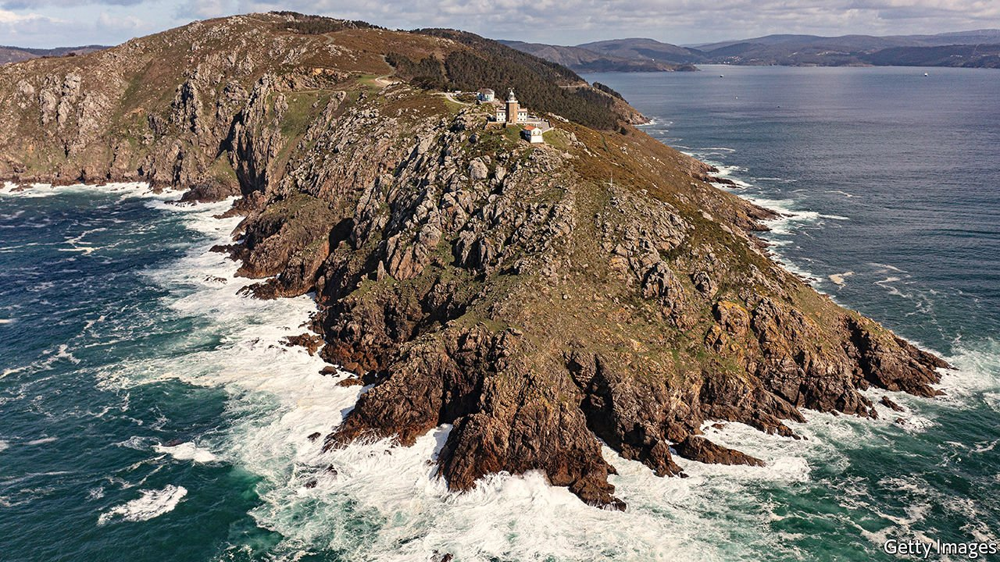

###### To the end of the earth

# Spain’s high-speed network reaches Galicia 

##### Which was already doing rather well 

 

> Jan 6th 2022 

FOR CENTURIES the main way to Galicia, Spain’s north-western corner, was on foot, on the pilgrims’ trail to Santiago de Compostela. Poor roads meant that, until a decade or two ago, the drive from Madrid took nine hours. Recent improvements have cut the trip to the closest Galician city, Ourense, to about five.

Now the journey can be made in two hours and 15 minutes thanks to Galicia’s first connection with Spain’s enviable high-speed railway network. Next year the line should be extended to Santiago, the regional capital, and A Coruña, its biggest city. “Cinderella can now travel in a bigger and more comfortable car,” said Ourense’s mayor, Gonzalo Pérez Jácome, using his nickname for his city, which he says is treated like an unloved stepchild. No one wants to be left out of the system—Spain has the biggest high-speed rail network in the world after China’s—but he doubts that the new extension will bring dramatic changes.


Spaniards have long been leaving poorer rural areas for better opportunities in richer cities. Politicians in rural areas lament this. But it is not obvious that pricey infrastructure will do much to curb it. Mr Jácome notes that Zamora, until recently the high-speed trains’ last stop en route to Galicia, has gained weekend tourists but continued to lose population since their arrival in 2015.

In any case, Galicia has been doing well. It was once a byword for isolation and poverty, “the end of the world”, as the name of its westernmost point, Cape Finisterre, indicates. So many Galicians emigrated that gallego is still synonymous with “Spaniard” in parts of Latin America. But GDP per person, 66% of the national average in 1955, is now 92% of it. Ángel de la Fuente of FEDEA, an economic think-tank, points to fish processing, carmaking and clothing (Inditex, the parent company of Zara and other brands, is based there) and reasonably business-friendly politics, though he says a single cause of its catch-up is hard to identify.

Another fix for Spain’s regional disparities has been proposed by the Socialist-led national government: opening new state bodies outside the capital. Many bigwigs in the conservative People’s Party (PP) say this would be pointless. Galicia’s leader, the PP’s moderate Alberto Nuñez Feijóo, has a warmer reaction, noting that it makes little sense to put the country’s Institute of Oceanography in landlocked Madrid. Once, people would have said the same about putting world-conquering companies and ultra-modern trains in Galicia.

