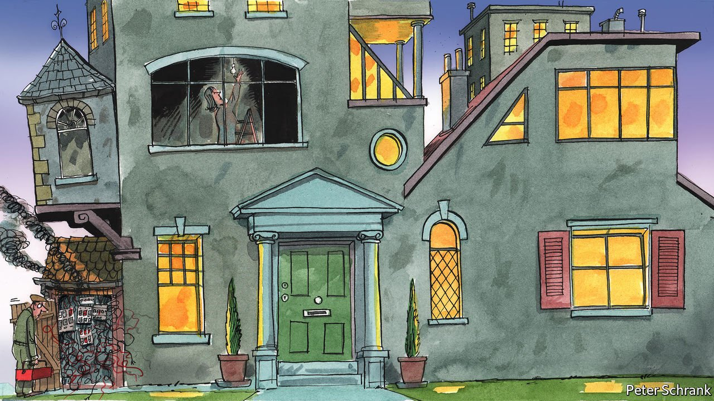

###### Charlemagne

# The return of big government sparks questions for Europe 

##### The EU will have to evolve from forbidding things to proposing them 

 

> Jan 8th 2022 

CRANK UP THE power flowing into a building and the lights shine that much brighter. Without an upgrade in its wiring, though, fuses will soon blow or smoke emerge from unexpected places. Political structures are much the same. A surge in power delights all involved—until some not altogether welcome things start happening.

Across the world the political current is swelling. The role of the state is expanding. The pandemic has eroded the already-shaky consensus about the limits of governments’ role in liberal societies. National polities, those age-old edifices, have ample experience navigating such surges and sags. For the European project, a hotch-potch of creaking foundations and shaky extensions improvised over the years, more state power will require a rethink of the institutional cabling that keeps the lights on.


Big government ought to be familiar territory for Europe. Meddlesome public sectors are the norm at national level, crowned by EU institutions long derided by critics as a bonkers bureaucracy hell-bent on dictating the curvature of bananas. In fact the European project has more often been a force for governmental restraint. From its origins in the 1950s, the Brussels machinery has been less a Leviathan dictating new policies so much as a self-imposed straitjacket constricting national politicians. Why, the consensus went, should Europeans compete senselessly against each other when too often the culmination of such contests involved soldiers crossing borders and bombers flattening cities?

The project’s most impressive achievements (and the emergence of its latest iteration, the EU, in 1993) came at a time when politicians the world over accepted that the public sector was bloated and overmighty. Few national leaders tried as hard as Margaret Thatcher to restrain it. But many outsourced the job to the Eurocracy. Brussels became an unexpected force in the checking of governmental power, a fountainhead of edicts to grudgingly obedient national politicians not to do things they might otherwise have got away with.

The single internal market, created 29 years ago, still requires the elimination of all obstacles to the free movement of goods, people, money and services—tying the hands of politicians who would like to stem migration from other EU countries, for example. Schengen forbids the erection of border barriers between its members. Trade deals negotiated by the EU remove tariffs in a continent where protectionism is sometimes popular. State-aid rules bar politicians from throwing public money at favoured industries, no matter how keen they are to promote national champions. Above all, the introduction of the euro in 1999 eliminated the possibility of devaluation and, in theory at least, put tight controls on budget deficits.

Now those who favour more government have the upper hand, from London to Washington and from Paris to Berlin. Can Europe, and more generally the fluid apportionment of powers between national and federal levels, adapt? Not easily. For the EU, banning stuff is straightforward: you only have to decide what to ban. Actually doing things is harder. First you must decide what to do, then figure out how to do it. Take public subsidies to industry. Forbidding them, as Europe has long done, merely involves chastising those that break the rules. But creating new handouts involves picking which companies should receive public largesse, and how much. Should it be microchip plants or defence firms? Who decides when priorities ought to change? Who pays?

There are two ways that Europe can shift gears as government swells, argues Fabian Zuleeg of the European Policy Centre, a think-tank in Brussels. The first involves the EU getting out of the way. Countries can simply resume doing what they were once ordered not to do. For example, the rules around state aid and budget deficits were suspended as covid-19 raged, and are unlikely to snap back fully. That gives national governments more scope to indulge in once-forbidden behaviour. The drawback is that it throws the European project into reverse. The second path is for big government to happen at the European level. Some powers are shifting to EU institutions. In 2020 the European Commission, the bloc’s executive arm, was given the job of sourcing vaccines for everyone from Finland to Portugal. Europe’s ambitious green agenda is largely piloted from Brussels. The Next Generation EU (NGEU) fund, a €750bn ($846bn) pandemic response, is a step towards a federal budget. All that comes on top of already powerful bits of the edifice, notably the well-run European Central Bank.

EU turn if you want to

This “more Europe” approach raises questions about whether the EU’s current institutional wiring is good enough. The Brussels machine is a fearsome regulator and legislator, but are its executive skills up to snuff? If the vaccine procurement episode is anything to go by, the answer is no. Early fumbles meant Europeans got their first jabs long after Americans and Britons did.

A lot more centralisation would also require more oversight. The commission is acquiring vast new powers. For example, it can withhold NGEU funds from countries that fail to enact the reforms they have promised in order to get their hands on a share of the cash. With such powers should come more accountability. Yet what happens in Brussels is seldom much scrutinised beyond its bubble. The European Parliament ought to do the job, but is often focused on dogmatically demanding a bigger role for the EU (and for itself).

Homeowners faced with vast electrical projects often settle for make-do solutions. Europe is likely to do something similar. Nobody is keen on a grand package of institutional reform, which only cumbersome treaty changes and consequent referendums could bring about. A new EU programme here, a fresh fuse-box there, will do the trick for now. But it may not prove a lasting fix. ■

Read more from Charlemagne, our columnist on European politics:

 (Jan 1st) (Dec 18th) (Dec 11th)

