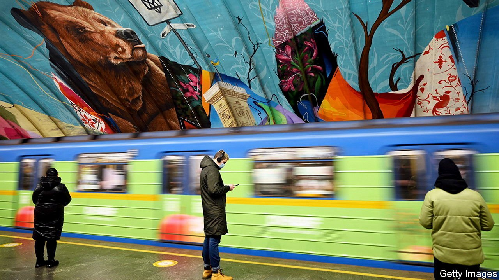

###### Keep calm and carry on

# Ukrainians are peculiarly relaxed about Russia’s troop build-up 

##### Many have grown inured to a risk they can do nothing about 

 

> Jan 8th 2022 

IN THE SNOW-BLANKETED town of Vovchansk in eastern Ukraine, where 20,000 people live just five minutes’ drive from the border with Russia, Sergei Sergienko lists his tribulations. Jobs are scarce, so he must leave at 5.00am for construction work in Kharkiv, the nearest city, for which he earns 700 hryvnias ($25) a day. His father is in recovery after covid-19 put him in hospital. Absent from Mr Sergienko’s list is the fear that Russian troops might sweep into Ukraine across the border down the road. “I try not to fill my head with worries about war, there are enough problems without it,” he says. Besides, he adds with a shrug, it is not something he can control.

Ukraine is deeply wary of threats to , so one might expect widespread alarm at the sight of 100,000 or so Russian troops at the border, and at the muttering of , Russia’s president, about “military-technical” action. Things are not so simple. Ukrainians have weathered eight years of war against troops backed by Russia in the breakaway “republics” of Donetsk and Luhansk, which have claimed 13,000 lives. But they have also lived through rhetorical twists and turns, the making and breaking of cease fires, and countless predictions of horrors that usually never came. In such a world, scepticism is a form of wisdom.


A slight majority of Ukrainians believes an invasion is likely, according to the Kyiv International Institute of Sociology, a polling outfit. Guessing the form it might take is a macabre game for some. Hackers could launch cyber-attacks on Ukrainian infrastructure. Troops could reach Kyiv and oust the government, or seize all land to the east of the Dnieper river, which bisects the country. Perhaps Mr Putin is after a strip of land connecting Russia to Crimea. Maybe he’d like to pry Russian-speaking cities like Odessa and Kharkiv away from Ukraine. Or perhaps it is all a ploy. If Mr Putin has settled on a plan, he is giving nothing away.

 


The dynamic of efforts to avoid a war resembles that of a hostage negotiation. Russia points its guns at Ukraine, but directs the demands it unveiled on December 17th at America. These include a ban on Ukraine ever joining NATO, and on the alliance conducting any more drills on Ukrainian territory. Mr Putin seems poised to send troops to fight and die in Ukraine if talks break down. The West has no such inclination. And no last-ditch donation of Western weaponry will fix the mismatch between Ukraine’s forces and Russia’s.

And yet even the  expecting war are going about their lives. Take Serhii Kolisnyk, an IT professional in Kyiv. In his home is a ready-packed bag that he can head off with in an instant. It contains clothes for winter and summer, along with military gadgetry and what he calls “NATO bullets”—5.56mm cartridges from Lithuania, the alliance’s standard ammunition. A bullet wound on Mr Kolisnyk’s chest from 2015, when he was fighting in Donetsk, attests to his sincerity. But for now he is concentrating on his work. “Otherwise you will lose yourself in thoughts and not get much done,” he says.

The puzzle of how to prepare for war without tormenting oneself is a collective one. In Kyiv, streets and markets bustle. Nightly news channels seldom lead with worries over war. But preparations are afoot, and not always smooth. In hipper areas of the capital, old air-raid shelters that became fancy bars and cafés must prepare to become shelters again. A three-minute test of Kyiv’s sirens was expected on December 29th before authorities postponed it indefinitely the day before. A poorly presented plan ordering women in certain useful professions like IT to register with the armed forces sparked confusion, internet memes and a viral petition decrying it.

Volodymyr Zelensky, Ukraine’s president, is not exactly uniting the country behind him. Polls suggest that few voters fancy him as a wartime leader. That may explain why his tussles with political foes have not ceased. The president predicted an oligarch-led coup against him in early December that failed to materialise. On December 20th his predecessor, Petro Poroshenko, was charged with treason over alleged payments for coal sourced from Ukraine’s occupied territories. (He denies any wrongdoing.)

It is not only the spectre of war that haunts Ukraine, but also that of a new peace with new politics. Since its revolution of 2014 Ukraine has tried to reform its economy and armed forces, and buttress the rule of law. One motivation has been the lure of membership of NATO and the EU, which ask applicants to spruce up before joining. But a Russian invasion, or desperate compromises to avert one, could create a climate in which Ukrainians no longer believe the Western dream is possible. That might cause reform to stall.

Politicians in Ukraine would like to feel in charge of their country’s fate. But their wish to throw their lot in with the West has prompted the Kremlin to dismiss them as puppets unworthy of direct communication. In an article published in October Dmitry Medvedev, a former Russian prime minister and president, offered a preview of the regime’s negotiation strategy: “It makes no sense for us to deal with the vassals. Business must be done with the overlord.” Russia and America have agreed to bilateral talks, scheduled for January 9th-10th. There will be no Ukrainians in the room.

That makes it hard for Mr Zelensky to adhere to his catchphrase: “nothing about Ukraine without Ukraine”. His government claims to be untroubled by the talks, and the Western powers insist they are constantly consulting it. But Mr Zelensky might well be feeling the same impotence as Mr Sergienko in Vovchansk. ■

