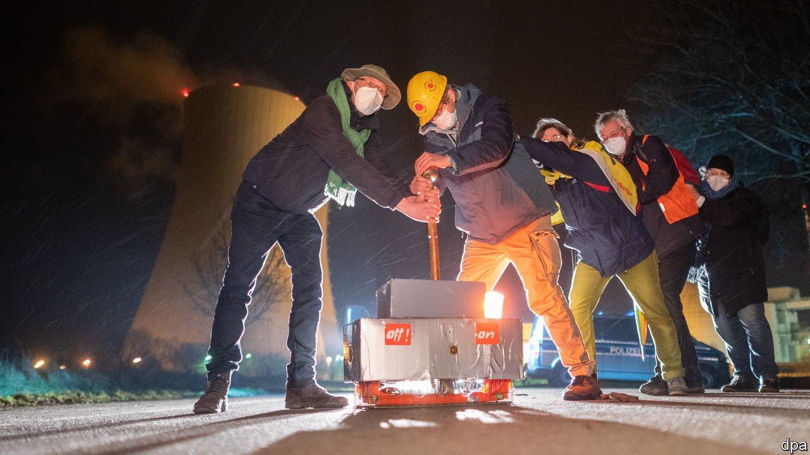

###### Nein, danke!

# Why Germans remain so jittery about nuclear power 

##### The first of many coalition rows 

 

> Jan 8th 2022 

THE END of 2021 brought mixed news for Germany’s anti-nuclear crowd. On December 6th the gaggle of activists who had gathered outside the Brokdorf nuclear plant, in northern Germany, every month for the 36 years it had operated swapped their usual thermoses for champagne. For on December 31st Brokdorf, the construction of which had inspired some of the roughest protests in German history, was one of three nuclear plants switched off for good. The remaining three will be closed down by the end of this year, concluding a nuclear exit two decades in the making.

Then came the downer. Just before midnight on December 31st, after months of dithering, the European Commission circulated a draft energy “taxonomy” that labelled natural gas and nuclear fission as sustainable, with conditions. The taxonomy, which must be finalised and then approved by the EU’s 27 governments and the European Parliament, is designed to steer investment to . But if the aim was to please everyone by finding room for all but the dirtiest fuels, it failed in Germany. Robert Habeck, the vice-chancellor and co-leader of the Green party, called the draft “greenwashing”, citing concerns about safety and nuclear waste. An MP from the Social Democratic Party (SPD), which leads the governing coalition, compared nuclear supporters (ludicrously) to anti-vaxxers.


Atomic fission was once the future in Germany. That was before the emergence, in the mid-1970s, of the world’s most enduring anti-nuclear movement. Unlike environmental groups in some other countries, says Jan-Henrik Meyer at the Max Planck Institute for Legal History and Legal Theory, Germany’s Greens emerged directly from the anti-nuclear campaign. Its precepts guided their actions in state parliaments as well as the national one, culminating in a decision by an SPD-Green coalition in 2000 to abandon nuclear for good. In 2010 Angela Merkel partially reversed that decision. Less than a year later, amid huge protests in the wake of Japan’s Fukushima meltdown, she made the biggest U-turn of her career and agreed to turn off all Germany’s nuclear plants by 2022.

A disaster, say critics. Nuclear power entails hardly any carbon emissions and offers consistent baseload supply, unlike intermittent renewables. If new plants are pricey and create waste, prematurely decommissioning old ones seems self-defeating, especially when bureaucracy and bottlenecks are slowing the rollout of renewables. In the short term the burning of coal and gas may rise to make up the shortfall. And the transition to electric cars and the need for clean hydrogen will require yet more electricity, and thus an even more extensive rollout of renewable sources.

Many Germans deny that scrapping nuclear has made emissions higher than they would otherwise have been. Emissions from power generation have fallen, even as nuclear plants have closed. Moreover, they argue, renewables would not have grown so quickly had nuclear been preserved. “There was a clear connection between the exit from nuclear and the entry of renewables,” says Simon Müller, Germany director at Agora Energiewende, a think-tank. The coalition that sought to halt nuclear power in 2000 also introduced vast subsidies for renewables as part of Germany’s Energiewende, or energy turnaround. If the subsidies hurt German consumers, who have long faced Europe’s dearest electricity, the rest of the world has benefited from the cheaper photovoltaic cells and wind turbines they made possible.

But Germany’s Sonderweg (special path) in energy policy is not to the taste of countries with different histories, politics and energy mixes. France is placing a big bet on nuclear; several central European countries see it as a way to wean themselves off coal. Many resent the finger-wagging tone in Berlin, especially when Germany is boosting imports of Russian gas.

Germany is unlikely to try to overturn the commission’s proposals, which would require a big majority of EU countries. But it will not be deflected from its anti-nuclear, pro-gas course: the commission has no direct say in countries’ energy choices. As the EU works on laws to realise its ambition to go carbon-free by 2050, and fears of a winter energy crunch grow, these new-year spats herald bigger rows. ■

