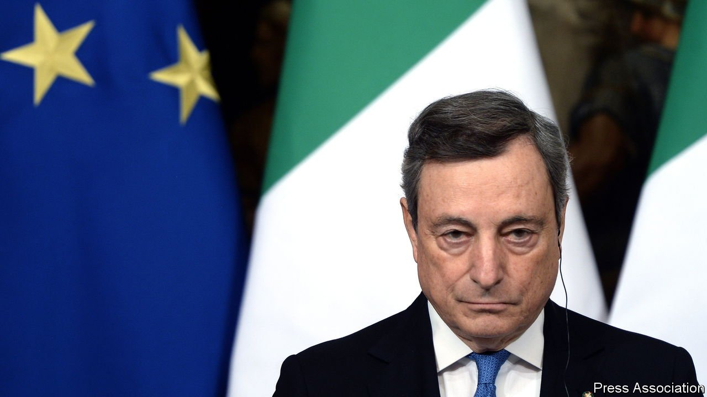

###### Decision time

# Will Mario Draghi move to Italy’s largely ceremonial presidency? 

##### Many think the prime minister will shortly switch jobs 

 

> Jan 8th 2022 

ITALIAN PRESIDENTIAL elections customarily have more twists and implausible turns than a Verdi opera. Voting in the latest—to replace President Sergio Mattarella—is to begin on January 24th. Over the coming weeks party leaders can be expected to trade bluff and counter-bluff, leaking the names of candidates whose chances they are in fact content to sacrifice while keeping secret until the last moment the identity of the one they really favour.

The outcome matters: Italian presidents have the power to dissolve parliaments and name prime ministers. They also hold office for an unusually long time: seven years, during which they acquire a moral authority that can constrain the actions of the government.


This time, the choice may seem obvious. The prime minister, Mario Draghi, a former president of the European Central Bank, is internationally respected. He is free of party allegiance and heads a cabinet spanning the political arc from hard right to radical left. It would seem logical for this broad coalition to unite in his support.

Yet he faces an uphill struggle. Ironically, the only major party to have consistently, if surreptitiously, backed Mr Draghi’s elevation is the only one that has consistently criticised his performance. The hard-right Brothers of Italy (FdI), led by Giorgia Meloni, chose not to join Mr Draghi’s coalition last year. Ms Meloni’s party is notionally allied to the populist Northern League, headed by Matteo Salvini, and the centre-right Forza Italia party, led by the 85-year-old Silvio Berlusconi who, without actually declaring his availability, has indicated that he too wants the presidency.

Ms Meloni has had no choice but to offer Mr Berlusconi public support. But, unlike Mr Salvini’s, hers has seemed distinctly lukewarm. Were Mr Draghi to get the job instead, it would end his government and perhaps prompt an early election. That would suit the FdI, riding high in the polls, and particularly Ms Meloni, who on present form would emerge as leader of the biggest party on the right, and prime minister should the right secure a majority as the polls currently suggest.

Enrico Letta, leader of the centre-left Democratic Party (PD), currently level-pegging the FdI in the polls, initially wanted Mr Draghi to remain prime minister until the next general election, due in 2023. But Mr Letta is said no longer to rule out backing his becoming president. The overriding priority for the PD is to ensure that the present coalition remains intact until the vote—not least to prevent the League, whose leader, Mr Salvini, has long been uneasy with the arrangement, from slipping away. The radical right could be an even more formidable force if it came into an electoral campaign after a year or more united in opposition.

Which is where Mr Berlusconi—or rather, his allies’ support for him—becomes a problem. As Mr Draghi mused on December 22nd, it is unlikely that a coalition that had fallen out over the presidency could magically reunite to govern the country. But a joint candidate can only be agreed to in talks, and Mr Letta is refusing to negotiate with Mr Salvini until he rules out Mr Berlusconi. Italy’s longest serving republican prime minister he may be, but Mr Berlusconi is also a convicted tax fraudster and the erstwhile host of the notorious “Bunga Bunga” parties. Opposition to him is even stronger in the anti-graft Five Star Movement than in the PD. On January 3rd the Movement’s senators voted to try to square the circle by imploring Mr Mattarella to stay on until the next election. That is a solution the president has repeatedly dismissed. But it would offer a widely acceptable route out of a dangerous impasse. ■

