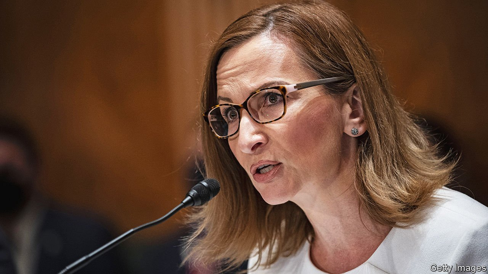

###### Regulatory flex

# A war of words ends with the Democrats in charge of a key regulator 

##### A boardroom bust-up at the FDIC reveals President Biden’s distaste for big banks 

 

> Jan 8th 2022 

“POWER GRAB”. An “attempt to politicise our regulators for their own gain”. “Extremist destruction of institutional norms.” The rhetoric flying around Washington sounds like the criticism once levelled against President Donald Trump about hot-button issues from border security to pollution controls. Instead, it is Republicans who have directed these barbs at Democrats in recent days, focused on something that, on the surface, seems far duller: the Federal Deposit Insurance Corporation, the agency tasked with protecting savers from bank busts.

As the heated language suggests, the stakes are in fact high. Along with insuring bank accounts, the FDIC is one of the institutions that approves bank mergers in America. That makes it a crucial player in the Biden administration’s plans to impose stricter rules on the financial system. And the Democrats have now taken full control of it after a nasty boardroom battle.


Democrats already held three of five seats on the FDIC’s board, which should in theory have let them have their way. But the chairwoman was still Jelena McWilliams, a respected lawyer appointed by Mr Trump. She had the power to set the agenda for meetings. The Democrats alleged that she used it to block a review of the policy for bank mergers—which she has denied.

The dispute exploded publicly last month when two Democrats on the board, including Rohit Chopra, director of the Consumer Financial Protection Bureau, attempted to work around Ms McWilliams. They announced that the Democratic majority had voted for a review of bank-merger rules, without her support. Ms McWilliams countered that there had not been a valid vote. In an article in the Wall Street Journal, she accused them of plotting “a hostile takeover of the FDIC”. On December 31st, with the board split beyond repair, she announced her resignation.

The clash is a window onto the efforts of progressives within the Democratic party to make their mark on the institutions overseeing the economy. Mr Chopra is an ally of Elizabeth Warren, a senator who is a champion of the Democrats’ left wing. Others liked by Ms Warren—notably, Lina Khan, head of the Federal Trade Commission, and Gary Gensler, chairman of the Securities and Exchange Commission—are also in key roles.

Progressives have not won all the personnel fights. Saule Omarova, their preferred candidate to lead the Office of the Comptroller of the Currency, a banking regulator, withdrew from the nomination process in December after Republicans decried her as a “radical”. The reappointment of Jerome Powell as head of the Federal Reserve was another disappointment for the left. Yet with three seats open on the Fed’s board, progressives can make inroads. Most crucially, Mr Biden is expected to nominate Sarah Bloom Raskin, another preferred candidate of Ms Warren, as the Fed’s vice-chairwoman for supervision, the most important regulatory post in the financial system.

What do the progressives hope to achieve? It is already clear that they want to curb big tech. The row at the FDIC reveals that they also intend to limit the formation of big banks. For now the review of the bank-merger policy is just a request for information. But the questions posed by Mr Chopra in a blog post in December leave little doubt about his desired direction: “Should financial institutions that routinely violate consumer-protection laws be allowed to expand through acquisition? …How should we make sure that a merger does not increase the risk that a bank is too big to fail?”

Many bank analysts like the idea of midsized American firms banding together to take on the big four (JPMorgan Chase, Bank of America, Citigroup and Wells Fargo). Progressives would argue that this gets things backwards. If the power of giant banks imperils financial stability, the creation of yet more giants would only exacerbate that, says one official. Other possible changes include integrating climate concerns into financial regulation and beefing up some capital requirements. Democrats will, as ever, need to surmount legislative and lobbying hurdles to make any of this happen. But with the FDIC now firmly in their grasp, the path is a little clearer. ■

For more coverage of Joe Biden’s presidency, visit our dedicated  and follow along as we track shifts in his . For more analysis of the biggest stories in economics, business and markets, , our weekly newsletter.

