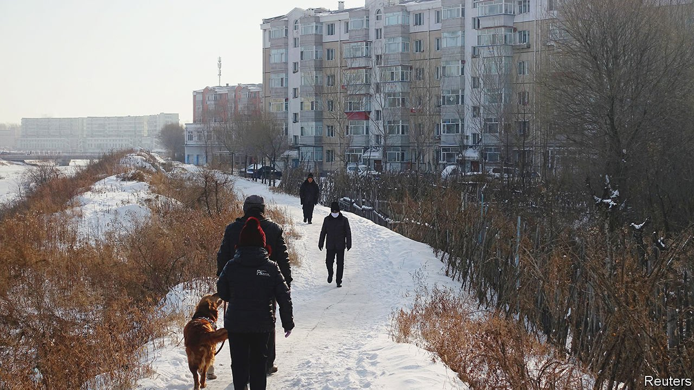
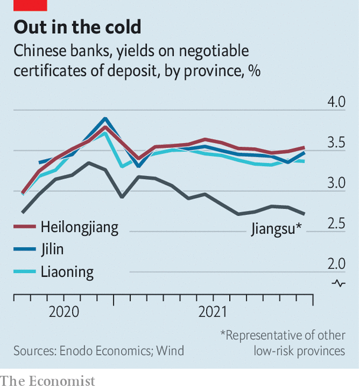

###### North-eastern exposure

# Could China’s north-east be home to its next banking disaster? 

##### The economy is struggling, and its banks are under stress 

 

> Jan 8th 2022 

“CABBAGE HOMES” have brought some notoriety to Hegang in recent years. Flats in the small city in China’s far north-east have been selling for outrageously low prices—some for just $3,500 apiece—earning a comparison with the cheapest items in vegetable markets. The region’s economic outlook has been so poor for so long that it cannot retain residents. The city, which is in Heilongjiang province, has lost about 16% of its population in a decade. The cabbage homes were built by the government to help alleviate poverty, but they have found few takers. The local government is now struggling to make good on its debts and is restructuring its finances. In late December officials said they had stopped hiring new government employees in order to save money.

Hegang is one of many gloomy stories from China’s rustbelt provinces of Heilongjiang, Jilin and Liaoning. The region bordering Russia, known for its long, bitterly cold winters, has slogged through years of depressed economic conditions as state-owned industrial plants have closed down and young people have migrated south. Poor energy infrastructure meant that companies in the area were disproportionately affected by an acute power shortage in 2021. In a desperate attempt to keep families from moving away and to spur population growth, Jilin has announced that it will hand out “marriage and birth consumer loans” of up to 200,000 yuan ($31,500) to couples.


The destitution is also raising concerns about the region’s banks, the combined assets of which amounted to 15.8trn yuan in September. Bad debts are already higher in the north-east than in any other area of China; loan-loss provisions are the lowest. Yet spotting a crisis in the making is a tough task. Hiding bad debts is an easy trick for smaller banks. Local regulators are understaffed. And domestic credit-rating agencies cannot be counted on to identify problem lenders. In the first seven months of 2021 rating agencies downgraded just six banks. They often take action only when a lender is on the brink. Huancheng Rural Commercial Bank, based in Jilin, for instance, suddenly declared that its net profits had fallen by 42% not long after it was downgraded.

 


For an insider’s view on China’s problematic banks, look at how much investment managers at the country’s biggest lenders charge smaller ones for loans. Most banks across China pay similar yields on negotiable certificates of deposit (NCDs), securities that resemble short-term loans from one bank to another, and which trade in the interbank market. Yields paid on NCDs issued by most banks across the country fell throughout 2021, signalling a decrease in perceived risk. Yet those paid by issuing banks in the three north-eastern provinces diverged from the rest throughout 2021 (see chart).

The average premium paid on one-year NCDs issued by banks in Liaoning, compared with those in healthier provinces, shot up from about 0.24 percentage points in February to 0.65 towards the end of the year, according to Enodo Economics, a research firm. Banks in Heilongjiang and Jilin have paid similar premiums. The higher yields indicate that large banks believe the local governments of the north-east may struggle to bail out their financial institutions in the event of a crisis, analysts at Enodo said. (The surveyed NCDs were all still rated as AAA, the safest possible, by rating agencies, however.)

The north-east is a prime contender to host China’s next banking disaster. Of the four major bail-outs of city commercial banks since 2019, two have been based in the region. Failures of regulation and corporate governance have meant that some institutions have come under the influence of private corporations or individuals, who have skewed their lending. Shengjing Bank, a large bank based in Liaoning with assets of 1trn yuan, has a high level of exposure to Evergrande, a failing property developer. Some of the region’s lenders have lost billions of dollars when financial products have gone sour. Regulators in Liaoning recently planned to merge 12 troubled banks together in an attempt to prevent a crisis. That plan was later watered down to just two. It is unclear how the problems at the remaining ten lenders will be handled. ■

For more expert analysis of the biggest stories in economics, business and markets, , our weekly newsletter.

