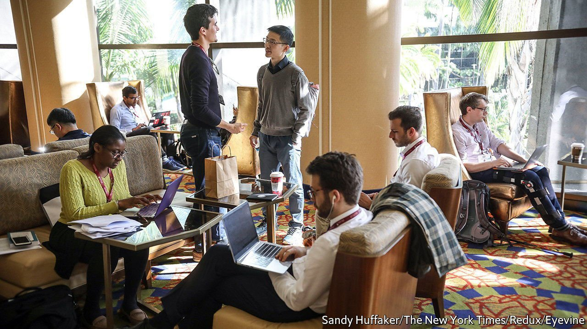
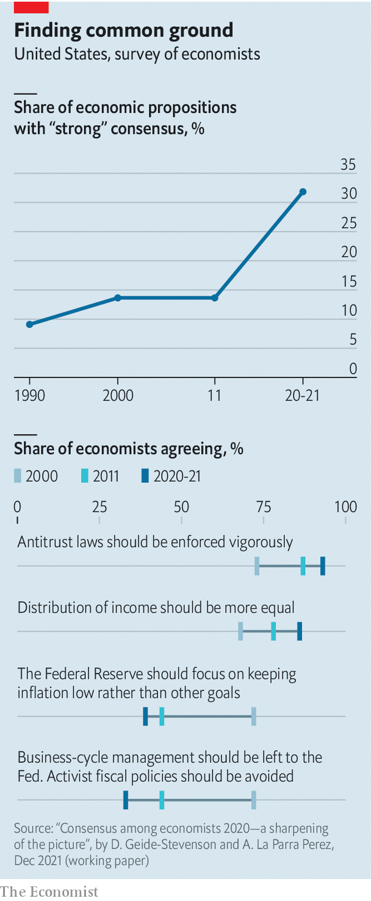

###### The new consensus

# Economists are agreeing with each other more 

##### A new survey finds growing consensus, notably on the need for more activist economic policy 

 

> Jan 8th 2022 

OBSERVERS HAVE long poked fun at the inability of the economics profession to make up its mind. “If parliament were to ask six economists for an opinion, seven would come back,” runs one version of an old joke. Yet the gibes may be losing their force. A new paper, by Doris Geide-Stevenson and Alvaro La Parra Perez of Weber State University, finds that economists are agreeing with each other more on a number of policy-related questions.

The paper publishes the results of the latest wave of a survey of economists that has been conducted roughly once a decade since 1976 (though the results of the first wave are not entirely comparable with later ones). Members of the American Economic Association were asked whether they agreed with a number of propositions, ranging from the economic impact of minimum-wage increases to the desirability of universal health insurance. Based on the frequency of responses, the researchers devised an index that captured the degree of consensus on each question.


The results suggest that the extent of consensus has risen significantly. Economists were in strong agreement on about a third of the propositions in the latest wave, compared with around 15% in 2011 and less than 10% in 1990 (see top panel). Respondents were more united on their diagnosis of economic problems. And, strikingly, more of them were convinced of the need for muscular policy.

 


Inequality was a growing concern. The share of respondents who wholly or somewhat agreed that the distribution of income in America should be more equal rose from 68% in 2000 to 86% in 2020-21. Fully 85% thought corporate power was too concentrated. Another worry was climate change, which most agreed posed a big risk to the economy. (Both questions were asked for the first time in the latest wave.)

Unsurprisingly, given their views on market power, respondents’ support for a vigorous use of antitrust policy has increased markedly over the past two decades (see bottom panel). Another notable change was in the enthusiasm for fiscal activism. More economists thought that the Federal Reserve alone could not manage the business cycle—perhaps consistent with the decline in its policy rate towards zero—and were keener on a bigger role for government. More of them also agreed that fiscal policy could have important economic effects, both during downturns and over the long term.

The dismal science has not become entirely harmonious, though. Economists were slightly more split on the consequences of lowering income and capital-gains taxes in the latest wave, with roughly half of respondents agreeing with the propositions put to them by the researchers, and the rest disagreeing. Enough room, still, for healthy debate.

For more expert analysis of the biggest stories in economics, business and markets, , our weekly newsletter.

