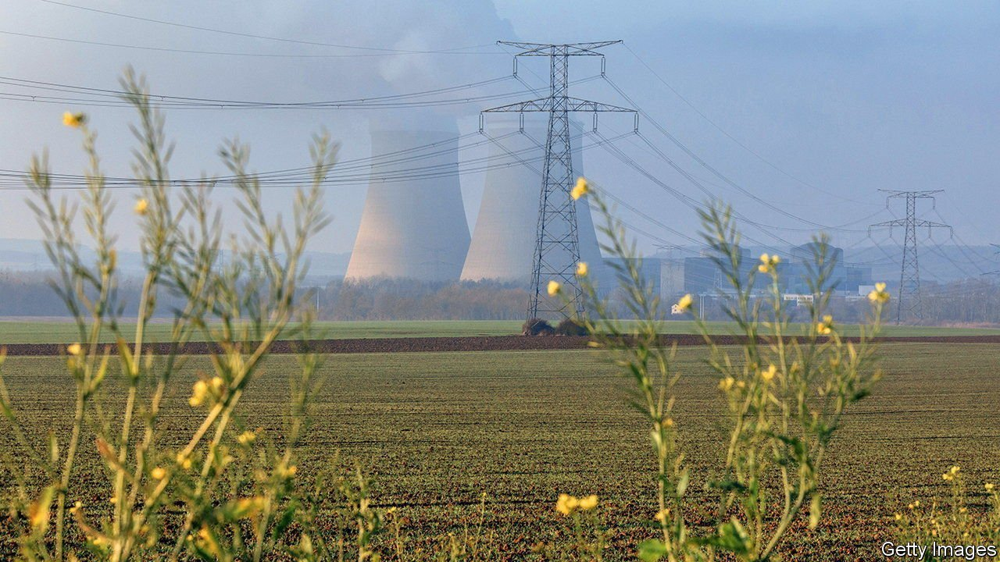

###### Gold standard

# The EU’s green-investing “taxonomy” could go global 

##### But will it steer capital towards deserving projects? 

 

> Jan 8th 2022 

HOURS BEFORE Brussels entered 2022, a bombshell dropped. In a draft sent to EU countries, the European Commission proposed classing some nuclear and gas projects as green in its “taxonomy”, a list meant to define sustainable investing. Austria threatened to sue; Germany cried foul. The plan is still likely to win majority support from member states, which have until January 12th to opine. It could set the terms for green investing well beyond Europe. But will it steer capital towards deserving projects?

The idea emerged after the 2015 Paris climate deal, when the EU’s effort to craft a common green-bond standard for corporate and sovereign issuers revealed that members did not agree on what counted as green. Some countries have since worked on their own classifications, but Europe’s, which maps swathes of the economy over 550 pages, is the most comprehensive.


The taxonomy hopes to end the practice of greenwashing and boost investors’ faith in sustainable assets. It will offer a common set of criteria that investors and banks can use to screen potential investments. Most money managers already have their own teams and tools to measure greenery. But the lack of a shared benchmark means scorecards remain subjective and inconsistent across the industry, which confuses investors. Having a dictionary where they can look up whether an investment can be labelled green puts everyone on the same page.

Another aspect of the plan is to link the taxonomy to disclosure. Starting later this year, some 11,000 listed European firms will have to report how much of their sales and capital expenditure fits within the classification (the number of businesses covered will eventually expand to 50,000). Since January 1st asset managers must already detail what share of the products they label sustainable is compliant with the bits of the taxonomy that are already in force. From 2024 most European banks will also have to report a “green asset ratio” using the same criteria. All this should put more and better climate-related data in the public domain. “It is our best hope globally to measure how much money is going into activities aligned with net zero”, says Daniel Klier of Arabesque, an asset manager.

Eventually the classification will also underpin EU certifications for securities issuers, creating a direct link with capital markets. The green-bond standard, for one, is expected to use the taxonomy as its benchmark for eligibility. The commission will probably also use the classification as it doles money out to member states from its Recovery Fund, some of which is linked to greenery.

The degree of detail and stringency of Europe’s approach could help make the taxonomy the global gold standard. Other countries outside the bloc are working on schemes of their own. Each will probably be moulded by political compromises, geostrategic concerns and carbon pledges. But foreign companies, asset managers and banks could end up adopting the EU’s taxonomy anyway, because their European clients may need them to report the right data, so as to produce their own disclosures. Some may lobby their own governments to limit divergence.

Whether all this is enough to channel funds towards the right investments is another question. One immediate problem relates to implementation: because of missed deadlines, green-finance firms are being asked to report on their compliance with the taxonomy before companies are required to provide the underlying data, making the job difficult.

A bigger drawback is the taxonomy’s limited coverage. At present it applies to a subset of economic activities. Disclosure requirements also let small public companies, and all private ones, off the hook. Morningstar, a research firm, reckons it will affect just half of fund assets in the EU (excluding private vehicles). That leaves much in the dark at a time when listed giants, including miners and utilities, are rushing to divest their dirtiest assets to private investors. More may come to light as the EU’s reporting requirements expand to cover new companies, some of them private. But that will take time.

The biggest problem lies in the flawed expectation that the mere existence of the taxonomy will alter investors’ preferences. A project’s greenery is just “one data point”, says David Henry Doyle of S&amp;P, a rating agency. Creditworthiness, interest rates and earnings prospects may matter more. The classification, notably, creates no incentive for backing green assets that are starved of funding, such as low-carbon steel or electric-car charging stations. Instead investors may continue to chase safe, liquid assets such as wind or solar plants, jacking up prices. Green is good, but it is not enough.■

For more expert analysis of the biggest stories in economics, business and markets, , our weekly newsletter.

