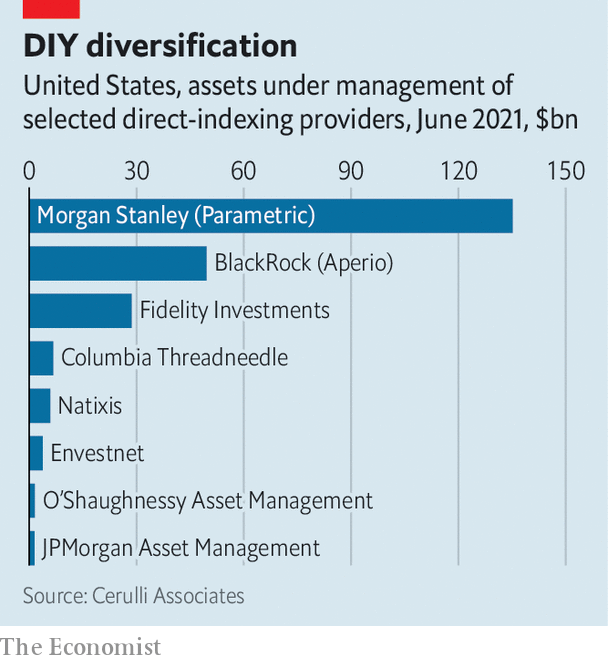

###### Direct to market

# The rise of personalised stock indices 

##### Direct-indexed accounts combine the benefits of customisation with those of passive investing 

 

> Jan 8th 2022 

IN 2001 ANDREW LO, a professor at the Massachusetts Institute of Technology, predicted that technological advances would one day allow investors to create their own personal indices designed to meet their financial aims, risk preferences and tax considerations. Such an idea “may well be science fiction today”, Mr Lo wrote, but “it is only a matter of time.” More than 20 years later, that time may have come.

A revolution in passive investing that began in the 1970s led to the introduction of funds that track the performance of an index, such as the S&amp;P 500, affording investors diversification at a low cost. Now a growing number of American fund managers and brokers are offering retail clients more personalised products that combine the benefits of passive investing with greater customisation. Direct-indexed accounts, as such products are known, promise to track the performance of a benchmark index. But unlike off-the-shelf mutual funds or exchange-traded funds (ETFs), which are pooled investment vehicles overseen by portfolio managers, investors in direct-indexed accounts own the underlying securities, and can tailor their portfolios to suit their needs.


The idea is not new. “Separately managed accounts”, custom portfolios of securities managed by professional investors, have been around since the 1970s. But such products have historically been available only to institutional investors and “ultra-high-net-worth” clients with millions of dollars to invest. Today direct-indexed accounts are within reach of the “mass affluent”, with liquid assets in the hundreds of thousands. “It’s what institutions have been doing for years,” explains Martin Small, head of the US wealth-advisory business at BlackRock, an asset manager. “But with technology and scale and more automation, we can deliver it in smaller account sizes.”

Analysts point to three forces behind the trend. The first is advances in technology, including sophisticated algorithms and the computing power needed to continuously analyse and execute trades across hundreds of thousands of portfolios simultaneously. The second is the rise of zero-commission trading, which dramatically lowers costs. The third is the emergence of fractional-share trading, which allows investors to buy securities in bite-sized pieces, making it easier to build small diversified portfolios. Companies like Amazon, a single share of which costs more than $3,000, can be included without breaking the bank.

 


Direct indexing is still a small part of the asset-management industry. According to Cerulli Associates, a research firm, roughly $400bn was held in direct-indexed accounts by the end of June 2021. But Morgan Stanley, a bank, and Oliver Wyman, a consultancy, estimate that this figure could reach $1.5trn by 2025, representing a growth rate of nearly 40% a year. Industry executives are bullish. “Personalised investing is coming at all of us like a freight train,” Walt Bettinger, the boss of Charles Schwab, a broker, said in October.

Such enthusiasm has fuelled a flurry of acquisitions. In October 2020 Morgan Stanley acquired Parametric Portfolio Associates, the biggest provider of direct-indexing services. A month later, BlackRock snapped up Aperio Group, another big provider. Several other big fund managers and brokers, including Charles Schwab, Vanguard and Franklin Templeton have made similar acquisitions. “Nobody wants to be left behind,” says Kevin Maeda, the chief investment officer of direct indexing at Natixis, a bank. “There’s a gold-rush mentality,” reckons Tom O’Shea of Cerulli.

Direct indexing has both benefits and costs. Its main selling point is its ability to lower tax bills. This is achieved primarily through a process called “tax-loss harvesting”, which involves selling and replacing losing stocks to offset gains in winning ones, thereby reducing capital gains subject to taxation. Although this technique can generate returns on the order of 1-1.5% per year, the benefits are close to nothing for individuals in lower tax brackets, or for investors who hold the bulk of their assets in retirement accounts, such as 401(k) plans, which defer taxes on investment gains until funds are withdrawn.

Another advantage of these accounts over conventional mutual funds or ETFs is customisation. For ethically minded punters, this could mean excluding fossil-fuel producers, tobacco companies or weapons-makers. The more customisation, the greater the likelihood that portfolio returns diverge from benchmark returns.

Direct-indexed accounts are often characterised as a disruptive threat to mutual funds and ETFs. In truth they are part of the same long-term trend. “This is really about the growth of indexing,” says Mr Small of BlackRock. “The growth of direct indexing and ETFs go together, they’re just different ways to gain index exposure,” he adds. Brian Langstraat of Parametric Portfolio Associates says that the primary driver of direct indexing is not lower costs or fractional shares but the decades-long shift towards passive investing. “The trends that are behind it are the same ones as five years ago,” he says, “and will be the same ones five years from now.” ■

For more expert analysis of the biggest stories in economics, business and markets, , our weekly newsletter.

