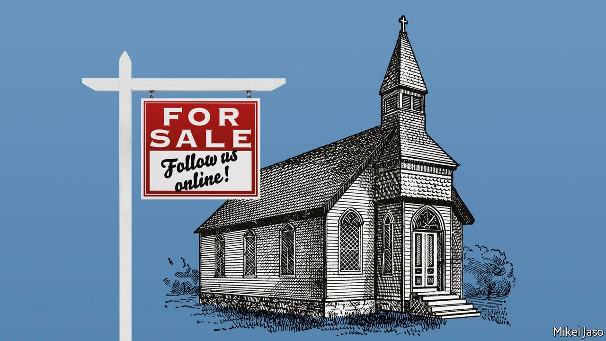
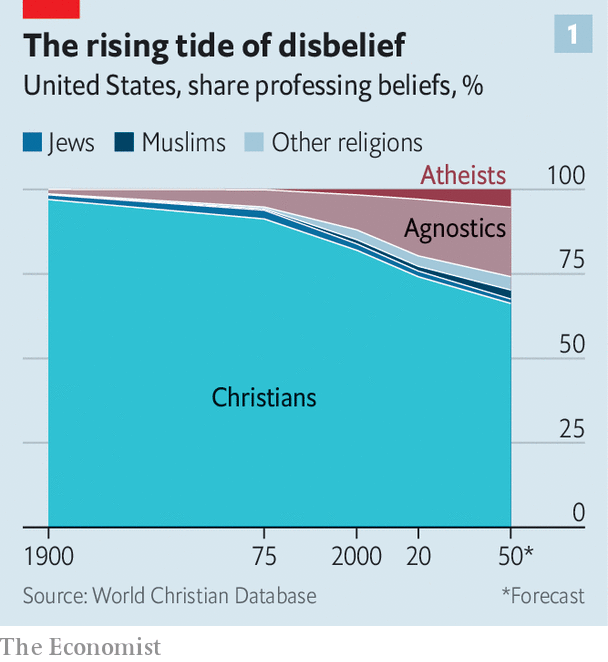
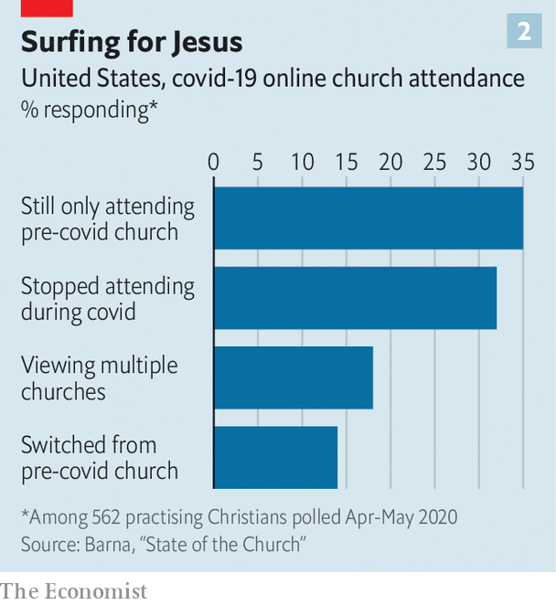

###### God, Mammon and real estate

# The world’s religions face a post-pandemic reckoning 

##### Many need to sell their property; some branches will have to merge 

 

> Jan 8th 2022 

ASK A VICAR, a rabbi or an imam about the biggest challenge facing his or her congregation, and the need to foster spiritual values in a secular world may leap off the tongue. Yet the world’s religions face an equally acute but different sort of problem: how to stay in business in a material, competitive sense. In religion as elsewhere, covid-19 has helped sort out winners and losers. Churches that were catering effectively to the needs of their flocks even before the pandemic have often thrived as people worry more about death—and in lockdown have found more time to spare for worship and prayer.

But churches that were already struggling have found it ever harder to retain their congregations. The pandemic has speeded a shift to online services, giving many of the once faithful an excuse to stop showing up. Many religious institutions closed their doors overnight, moving their services onto Zoom. Now, as their buildings reopen, they are uncertain about how many worshippers will return. If, as seems likely, fewer come back, two trends that were already noticeable may intensify. Many religious organisations will get rid of their underused properties. And more churches will merge.


Economists have long analysed religious groups as if they were businesses. In 1776 a Scotsman, Adam Smith, argued in “The Wealth of Nations’‘ that churches are enterprises, similar to butchers, bakers and brewers. In a free and competitive market, where they rely on donations and volunteers to make ends meet, clergy must act with “zeal” and “industry” to fill their pews. Mergers, acquisitions and bankruptcies are inevitable.

 


Nowadays the market for religion is in flux, perhaps more than ever. On the demand side, churches in the Western world are suffering from the global secularisation that began long before the pandemic. Even in America, the most patent example of a rich country that has thrived alongside religion (some say because of it), the share of citizens identifying as Christian has been dropping, from 82% in 2000 to less than 75% in 2020 (see chart 1). According to the latest poll by the World Values Survey, a global network whose secretariat is in Austria, about 30% of Americans say they attend a religious service at least once a week. That is a lot compared with other rich countries. But the figure has fallen steadily from 45% at the turn of the millennium.

On the supply side, competition tends to be vigorous where governments do not dictate what religion people should follow. John Gordon Melton of Baylor University in Texas reckons there are around 1,200 Christian denominations in the United States along with an array of other faiths. To woo their congregations, they need to make worship attractive in all sorts of ways. Three-quarters of Americans, according to a Gallup poll, say music is a factor; 85% consider social activities a lure. As Roger Finke at Pennsylvania State University puts it, the key to pluralism is not that there are “more religions” but that they should “match” consumer tastes.

Covid has spurred innovation in churches across the world. The Milton Keynes Christian Centre in Britain, for example, has developed religious-education courses and prayer groups both online and in person. It backs a food bank and has opened what it calls a “sensory suite” (“a calming, soothing space”) for children with learning difficulties. “Churches are having to revisit their ministry strategies to make sure they are engaging with where our culture is today,” says Tony Morgan, founder of The Unstuck Group, a church consultancy based in Atlanta, which advises the parish in Milton Keynes.

 


Many churches, however, have failed to keep up. Their clergy did not move online during lockdown, either because they lacked the technology or disliked the idea. Some have been slow to reopen their doors. Meanwhile, the streaming of services has made it easier for worshippers to “church hop”. In a poll of practising Christians in America in 2020 by Barna Group, which conducts worldwide research into religion, 14% had switched churches, 18% were attending more than one church, 35% were attending only their pre-pandemic church and 32% had stopped going to church altogether (see chart 2).

An essential move for any church, whether it is struggling or thriving, is to balance its books, and that nowadays invariably means sorting out its property portfolio. Organised religion is grappling with the same problems faced by landlords of tired shopping malls and vacant offices as businesses go online. Do they stand by and watch attendance shrink? If not, how should they rethink their property?

Get real (estate)

For centuries religions have amassed earthly riches in the form of property. The Vatican owns thousands of buildings, some in the swankier parts of London and Paris. The Church of Scientology owns glamorous addresses in Hollywood said to be worth $400m, a medieval-style castle in South Africa and an 18th-century mansion in Sussex, England. The Wat Phra Dhammakaya, a temple owned by Thailand’s wealthiest Buddhist sect, boasts meditation halls around the world. It is a mystery how much the Church of Jesus Christ of Latter-Day Saints, better known as the Mormon church, possesses; it is said to have American investments worth $100bn, including cattle ranches, a theme park in Hawaii and a mall near its Salt Lake Temple in Utah. Smaller religious institutions also depend on property for their earthly wealth. Temples, synagogues and mosques all watch warily as property prices rise.

This has become all the more vital as formal religious attendance falls, and donations fall with it. Church buildings in Britain have closed at a rate of more than 200 a year in the past decade. Hundreds more may be sold off or demolished in the next few years. Even in America, tens of thousands of buildings are at risk of shutting their doors for ever. Nearly a third of American synagogues have closed in the past two decades.

The Church of St Mary in Berlin, a vast red-brick Gothic structure, reflects this trend. It is full of frescoes and stone reliefs dating back centuries. The pews, however, are empty. The congregation has been dwindling since the second world war. Its Lutheran pastor, Gregor Hohberg, says that young Berliners still have “religious needs” but fulfil them at yoga classes and meditation groups. The public, he says, doesn’t realise that the church welcomes gay families and that lots of pastors are women. Father Hohberg says that most Germans think the church is out of date.

Meanwhile, across the world, the soaring costs of utilities and urgent repairs are becoming prohibitive. The Church of England says it needs £1bn ($1.3bn)—more than seven times its annual income in 2020—for repairs in the next five years. English churches have closed at an alarming rate for the past 30 years. In America expenses related to buildings account for more than a quarter of church budgets. Yet churches across the country are reckoned to have 80% more space than they need.

Many mosques, especially in the West, are in financial difficulties, too. Though they often attract more worshippers than well-funded churches, their annual budgets, estimated at around $70,000 for the average mosque in America, are often too small to keep buildings in good repair.

The internet has been both a blessing and a curse. A virtual sermon by the Archbishop of Canterbury in 2020 was heard by an estimated 5m people—more than five times the number of weekly churchgoers in Britain before the pandemic. Yet online participation comes at a price. If believers stop visiting them, ancient buildings risk becoming obsolete.

Hence religious groups are selling property faster than before, or are exploring other uses for it. Faith leaders seeking a place in Heaven are learning to adapt by selling or renting out real-estate assets on Earth, where moth and rust doth corrupt. Jehovah’s Witnesses, who claim a worldwide membership of 9m, have sold their British headquarters, where they used to print leaflets and a magazine, the Watchtower. Hillsong, an Australian megachurch which claims 150,000 weekly worshippers in 30 countries, rents theatres, cinemas and other venues for Sunday services.

But parting with holy property can be awkward. In 2020 the overseers of the famous Hindu temple of Venkateswara in Tirumala in the Indian state of Andhra Pradesh were branded as “anti-Hindu” for trying to auction off dozens of “unviable” property assets that had been donated by members. They were made to drop the idea.

Get going or get gobbled up

Another, more radical, approach to such problems is becoming more common: if your church cannot thrive on its own, merge with another. A few months ago Jim Tomberlin, a pastor turned consultant, was sounded out by a church near Detroit, Michigan, that had been struggling with barely fifty people in its congregation and a mortgage of $450,000 on its property. Its leaders want to join up with another parish 15 minutes’ drive away, whose church has a flock of a thousand—and a healthy balance-sheet. Like many others in a similar bind, the minnows have asked Mr Tomberlin to mediate. “They recognise we either merge or die,” as he bluntly puts it.

The trend for churches to merge began before covid, but the pace may pick up. It is prompted not by theology but administration, as budgets tighten or pastors leave. Such consolidation is occurring between Roman Catholic churches, between synagogues and within other religions. But it is particularly common among America’s mainstream Protestant churches.

As in any business, when two churches combine, their leaders can clash, cultural changes can put members off, and joint finances do not always work out. In church mergers, the weaker one is likely to lose followers. About a fifth lose more than 40% of their congregation within a year of the union, according to a survey in 2019 of almost a thousand church leaders who had been through a merger in the past decade.

But around 1,750 Protestant “megachurches” with more than 2,000 regular attendees and multimillion-dollar budgets have sprung up—some as a result of mergers. Some have lots of sites. Warren Bird, an American pastor who is an expert on megachurches, says a good coupling of parishes is like a successful marriage. Each partner must bring its own gift to the arrangement, whereas a struggling church that combines with one that is thriving may simply get swallowed up.

Economists are not alone in thinking religious competition healthy. “If there were only one religion in England,” argued the French writer Voltaire in the 1730s, “there would be danger of despotism. If there were two they would cut each other’s throats, but there are 30, and they live in peace and happiness.” Perhaps he was unduly sanguine. But the virus has certainly made godly institutions take stock of their commercial as well as spiritual assets. ■

Dig deeper

All our stories relating to the pandemic can be found on our . You can also find trackers showing ,  and the virus’s spread across .

