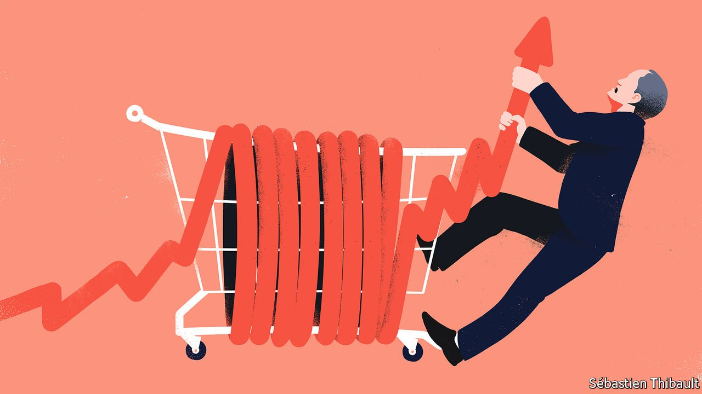
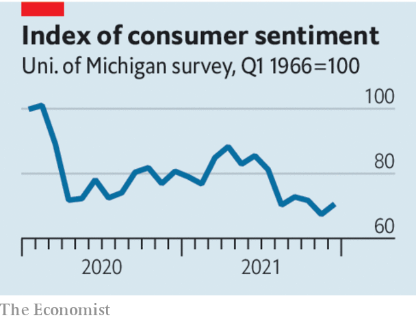

###### Beware snake oil

# Democrats seem drawn to hare-brained schemes to control inflation 

##### It is up to central banks to bring price growth down 

 

> Jan 8th 2022 

RAPIDLY RISING prices are as conspicuous as they are unpopular. Annual inflation of 6.8% has left American consumers even more anxious about the economy than they were during the pandemic-induced crisis in the spring of 2020. They are gloomy (see chart), even as many of them enjoy rising incomes, bargaining power over their employers—the result of a —and soaring house prices. Their unease is a problem for President Joe Biden, whose economic management does not poll well. By one count, over two-thirds of voters disapprove of his record on inflation.

 


The White House is therefore now keen to fight the rise in prices. But Democrats are slipping into a bad habit that often afflicts politicians at such a moment: blaming greedy corporations and rigged markets instead of their own flawed policies. It is a recipe for more mistakes.


Over the past year corporate profit margins have surged as the economy has recovered. Elizabeth Warren, a senator, says that this shows how businesses have exploited the pandemic to “gouge” consumers; Mr Biden’s press secretary has castigated firms for “jacking up prices during a pandemic”. The administration thinks that antitrust enforcement can help control price growth. On January 3rd Mr Biden unveiled plans to increase competition among slaughterhouses, which he blames for a 16% rise in meat prices in the year to November. He has also called for investigations into the energy and shipping industries, the sources of recent shortages and bottlenecks.

Scrutinising concentrated markets may be a good idea, but it will not do much to fight inflation. It is absurd to think that corporations became more greedy over the past year or that markets are suddenly less competitive. Prices have accelerated in part because Mr Biden’s excessive economic stimulus led to a surge in spending on physical goods at a time when the pandemic had already bunged up global supply chains. History shows that companies’ profit margins are a poor guide to inflation. In the mid-2010s, when inflation languished beneath the Federal Reserve’s 2% target, they were almost as high as they are today. In the late 1960s, as inflation took off, they fell steeply.


The danger of misdiagnosing the cause of inflation is that it eventually leads not just to irrelevant policies but to damaging ones. One risk is price controls. The Roosevelt Institute, a left-wing think-tank, has called for the federal government to “regulate and negotiate” more prices. Isabella Weber, an economist at the University of Massachusetts Amherst, wants “a systematic consideration of strategic price controls”. Both point to high corporate profits to support their arguments.

As America learned when President Richard Nixon froze prices and wages in 1971, controls would distort the economy and harm growth while at best delaying inflation. Today’s advocates tend to call for surgical interventions rather than across-the-board freezes, but it is naive to think that the bureaucracy could make a success of micromanaging the price mechanism.

It may seem far-fetched to think that politicians would resurrect policies that had been so thoroughly discredited. But consider that another plank of America’s hapless inflation-fighting in the 1970s, under President Gerald Ford, was “the vigorous enforcement of antitrust laws”. Then, as now, the government’s eagerness to pin the blame on businesses inspired bad ideas.

The uncomfortable truth for Mr Biden is that the Federal Reserve, not the White House, controls the tool to bring down inflation: higher interest rates. The government could help cool the economy by cutting spending or raising taxes. But belt-tightening, unlike bashing corporations, is unpopular. Politicians’ unwillingness to do what is necessary to fight inflation is why central banks are independent—and why it is good news that the Fed looks as if it will raise rates as soon as the spring. ■

For more coverage of Joe Biden’s presidency, visit our dedicated  and follow along as we track shifts in his . For exclusive insight and reading recommendations from our correspondents in America, , our weekly newsletter.

