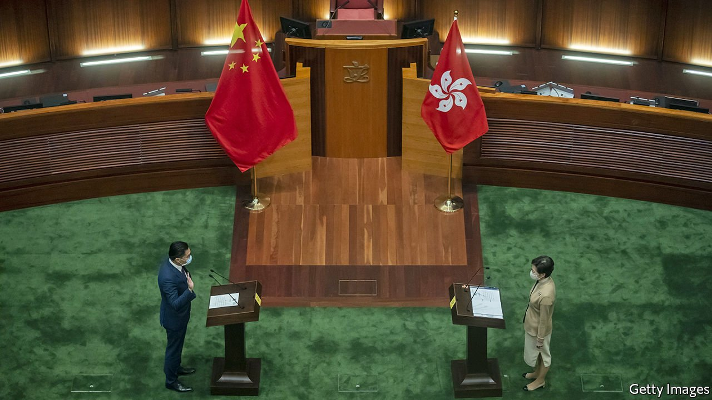

###### Pliant patriots

# Hong Kong’s new legislature is a mockery of democracy 

##### And its media are losing any independence 

 

> Jan 8th 2022 

“D EMOCRACY IN Hong Kong is flourishing.” These words, used by the Chinese Communist Party in a recent white paper, suggest a strange definition of democracy. On January 3rd lawmakers newly elected to the territory’s Legislative Council took their oaths. Not since long before China regained control of the former British colony have the body’s members been . All but one of the 90 councillors are party supporters. China made sure of that.

In elections in December, , meaning the party’s cheerleaders, could stand. The opposition was in tatters anyway. Many of its politicians were in jail, or heading there, for  in favour of real democracy that engulfed the territory in 2019. Most of those still free decided to shun the rigged polls. Turnout was at a record low.


The past few days have seen other reminders of how swiftly and dramatically Hong Kong  since the party began tightening its grip there in 2020. Police have  of a popular pro-democracy news website and charged two of them with sedition. The portal has shut itself down. Two similar outlets have followed suit to protect their staff. The University of Hong Kong has removed a statue commemorating the massacre of protesters in Beijing in 1989. “Flourishing” used to be a good word to describe Hong Kong’s political spirit. A better one now would be “crushed”.

Under British rule, Hong Kong was hardly democratic either. The governor was a Briton sent from London. When China took over, only one-third of legislators were directly chosen by popular vote. China fed hopes for reform, promising in the constitution for the territory that the “ultimate aim” was “universal suffrage”. But it never meant that critics of the party could take control. The explosion of discontent in 2019 prompted China to impose a draconian national-security law that quashed dreams of free elections. With hindsight, after the British withdrew, the main surprise was how long Hong Kongers managed to carry on enjoying so many freedoms abhorred by China.

The Communist Party wants the new legislature to drive even more nails into democracy’s coffin by passing another security-related law. This yet-to-be-drafted bill is commonly known as Article 23, after a clause in Hong Kong’s constitution that requires the territory to adopt its own legislation concerning crimes such as treason, secession, sedition and subversion.

Why bother, when the  already covers much of that ground? Chillingly, Hong Kong’s security chief, Chris Tang, says there “may still be gaps that need to be filled”. China, it seems, wants no loophole for political dissent. Never mind that public fear of such legislation sparked a huge protest in 2003 and deterred officials from pursuing plans to get it passed. There will be no wavering this time.

In part to show disapproval of the clampdown, America and some allies have declared a  of next month’s Winter Olympics in Beijing. They will send athletes, but not official envoys. That is appropriate, but it will not change China’s behaviour. The party sees pro-democracy activism in Hong Kong as a threat not only to stability there, but to its rule in Beijing.

The white paper is the latest broadside in China’s campaign to redefine democracy and portray the party as its torchbearer and Western versions as a sham. Only now that Hong Kong’s legislature is freed from gridlock, the party says, and the government is unfettered by mayhem, can real democracy flourish.

Some businesspeople will shrug. But the debauching of democracy also threatens things they see as vital to Hong Kong’s prosperity: legal independence, regulatory fairness and corporate transparency. Firms should worry about the gradual erosion of these principles. Witness, for example, China’s tirades against the Hong Kong Bar Association’s outgoing chairman, who has criticised the national-security law, and the government’s takeover of some powers from a previously self-regulating accountants’ body. As independent institutions, bit by bit, fall under the party’s sway, Hong Kong becomes ever more like the mainland. “Prospects are bright for democracy in Hong Kong,” intoned the white paper. On the contrary, a pall has been cast over a once-vibrant city. ■

