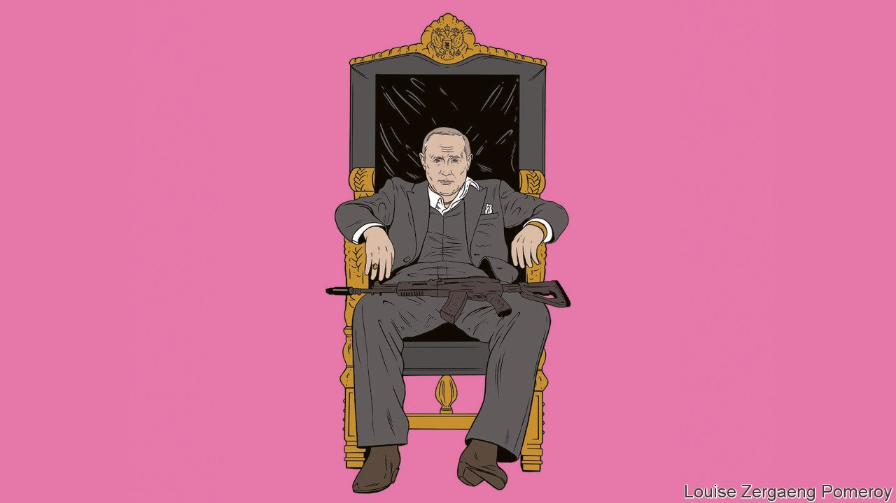

###### Russia and NATO

# How to talk to Mr Putin 

##### Russia’s aggression towards Ukraine has created a chance to enhance the security of Europe 

 

> Jan 8th 2022 

IT IS USUALLY a bad sign if talks start with one side brandishing a gun. And so it may prove when Russian diplomats meet their North American and European peers next week, backed by 100,000 troops poised to invade Ukraine. At stake is the future of a country that increasingly sees itself as part of the West, as well as America’s role as the anchor of European security. As the crisis comes to a head, the risk of miscalculation is growing.

Russia’s president, Vladimir Putin, has already issued his demands for the talks, which will kick off between Russia and America in Geneva on January 10th, move to Brussels for the NATO-Russia Council two days later and wrap up at the Organisation for Security and Co-operation in Europe on January 13th. Mr Putin wants NATO to forswear all further expansion—everywhere, and not just in Ukraine and Georgia, two former Soviet states. America must no longer protect its allies with tactical nuclear weapons and short- and medium-range missiles. And Russia wants, in effect, a veto over troop deployments and exercises in the eastern parts of NATO territory and over military co-operation with all former Soviet countries.


Many of these demands are so extravagant and so detrimental to Europe’s security that they may really be an ultimatum drafted to be rejected, creating a pretext for another . If Mr Putin is indeed bent on going to war, he will. However, robust diplomacy could yet give him pause and help stop the long decay of relations between Russia and the West. Even if talks fail, NATO could emerge stronger, more united and clearer about the threat it faces.

Be in no doubt that Mr Putin has brought on this crisis. Perhaps he wants Ukraine to fail because, were it to become a thriving democracy, it would stand as a rebuke to his claim that Western values are unworkable in Orthodox, Slavic Russia. He may also intend to divide and weaken NATO as well as to create an enemy abroad so as to justify repression at home—as with Memorial, a civil-rights group, shut down just before the new year on the trumped-up charge of being a “foreign agent”. And Mr Putin has come to regret the security arrangements that Russia freely signed up to after the cold war. Today, he believes, Russia is stronger and America is declining and distracted by the challenge from China. For whatever reason, he seems in a hurry to establish his legacy by renewing Russia’s sphere of influence.

Some things are in his favour. He has the aggressor’s advantage, controlling the timetable and the scope of an attack, should there be one. Everyone knows that Ukraine matters more to him than to any NATO country, which means that the West will not send troops to defend it.

But not everything is going his way. Ukraine is as populous as Iraq. Although Russia’s forces should be able to defeat it in battle, holding swathes of territory there could come at a high price, especially if the Ukrainians mounted an insurgency. And in Kazakhstan, on Russia’s southern border, Mr Putin is being asked to —a distraction and awkward proof of his willingness to oppress. For these reasons, he may have to curb his ambitions and, say, seize enclaves around Donetsk that are already controlled by Russian-backed irregulars, or establish a land bridge to Crimea, which he annexed in 2014. His doubts about how far to go can be exploited.

Mr Putin’s other problem is that his aggression has united NATO and given it new purpose. His ultimatum, combined with his willingness to see prices of Russian gas surge in Europe in 2021, has cut the ground from under those arguing for closer ties to the Kremlin. America has helped galvanise Europeans, by sharing detailed intelligence about huge numbers of troops massing near the Ukrainian border.

The West should have two objectives in next week’s talks: to deter war in Ukraine if possible, and to enhance European security. Stopping a Russian invasion involves the threat of severe economic sanctions, as well as aid and defensive weapons to help make Ukraine indigestible. At the same time, the West can seek to reassure Mr Putin by clearly stating that, although Russia has no formal veto over who joins NATO, neither Ukraine nor Georgia is about to become a member.

Done right, the second aim, of enhancing Europe’s security, can also lower tensions over Ukraine. Although some Russian demands would leave Europe vulnerable, others could be the basis for talks that benefit both sides. Consider a regional agreement about the deployment of missile forces or confidence-building measures to make exercises less threatening. There is no shortage of things to discuss, from the Arctic to cyber-security, to new missile technologies. Negotiations would be drawn-out, such is the mistrust between the two sides, but that might be no bad thing, because they could turn into a useful forum.

The question is not whether such talks are possible—they are clearly in Russia’s interest—but whether Mr Putin really wants them. He has often behaved as if Russia’s security depends on making the West feel less safe. However, negotiations would enhance his status as a world leader. By circumscribing the domains of military competition, they might also help him cope with the fact that Russia cannot begin to match the combined resources of the West.

The profound doubts about Mr Putin’s real intentions mean that, even if talks begin, NATO needs to demonstrate that it is prepared to defend its members. The most vulnerable are the Baltic states. After Russia seized Crimea, NATO’s western powers started to rotate more troops in the east. Because of Russia’s threats, credible preparations for enhancing those rotations ought to begin immediately. Even if Ukraine is not about to join NATO, Russia is driving Sweden and Finland towards membership. The alliance should be ready to welcome them. Throughout, America should ensure that deals are never struck above European countries’ heads: that is Russia’s style.

Mr Putin says that his country is threatened. It is not. NATO is a defensive alliance. Even after Crimea, it has held back from putting permanent combat forces into eastern Europe. The real threat is Mr Putin. When he issues his demands down the barrel of a gun, it should stiffen the resolve both of the West and of the resilient Ukrainians to deter and resist him. ■

For subscribers only: to see how we design each week’s cover, sign up to our weekly .

