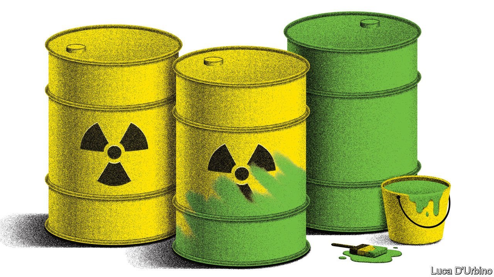
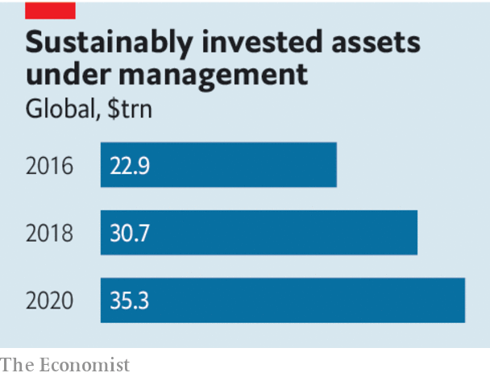

###### The meaning of green

# The EU’s green rules will do too little to tackle climate change 

##### Relying on investors to save the planet using a “taxonomy” has limits 

 

> Jan 8th 2022 

INVESTORS’ ENTHUSIASM for financing the green transition is growing—just look at the surge of interest in the electric-car industry. Tesla’s shares rose by 50% in 2021; those of CATL, China’s battery giant, rose by 68%. Yet if you look more closely, you will find huge problems. If the world is to reach net-zero emissions by 2050, investment will need to more than double, to $5trn a year. And fund management is rife with “green-washing”. Sustainability-rating schemes have proliferated but are wildly inconsistent, while many funds mislead investors about their green credentials.

To the rescue has come the European Union, which has devised a new labelling system, or taxonomy, that sorts the economy into activities it deems environmentally sustainable, from the installation of heat pumps to the anaerobic digestion of sewage sludge. The idea is that funds and firms will use this to disclose what share of their activities qualify as green, and that clarity will help unleash a flood of capital from markets. The proposals have been in the works for years, and on December 31st the European Commission circulated its latest thinking.


Countries have different energy sources, so the exercise was bound to be political. Still, the classification looks sensible. Labelling nuclear energy as green—subject to conditions including the safe disposal of toxic waste—has been met by howls from the  in Germany. But nuclear can play an important part in getting to net-zero; indeed, by deeming it green only during the transition, the taxonomy is, if anything, too timid. The plan to label natural gas as green has been controversial, too. But the rules reflect a hard-headed assessment that it will be a vital transition fuel in the next decade. They treat gas projects as green for a limited period, if they replace dirtier fossil fuels, receive approval by the end of the decade and contain plans to switch to cleaner energy sources by 2035.

The plan’s flaws lie in its bureaucratic outlook. The simplistic nature of the labelling may lead to a purity test in which funds exclude assets that are dirty. In fact a key job of capital markets is to own polluting companies and manage down their emissions. The classification is static, whereas changes in technology will cut the carbon-intensity of some activities and lead to inventions the classifiers have not envisioned. It fits a pattern of European climate-finance ideas that are well-meaning but marginal, including using the European Central Bank to buy green bonds (which could overstep its mandate), and imposing green “stress tests” on banks, even though the lifespan of their assets is shorter than the horizon for the most devastating climate change.

 


What else to do? The goal should be to make it easier for investors to track the carbon emissions of their portfolios (today this is hard to do accurately). Funds with zero emissions would be virtuous, but those that cut their footprint fast might be even better. This will require new disclosure, so that investors can track emissions and avoid double-counting across supply chains. Such a system would be simpler to administer, and ask less of countries that struggle to agree on what counts as green. A new global green-disclosure body has been set up but it needs to act faster.

The EU’s broader aim should be to use carbon pricing to alter how capital is allocated. Relying on investors to save the planet using a taxonomy has obvious limits. Less than a third of global emissions stem from firms that are publicly listed and controlled by institutional investors. And investors do not have a clear incentive to be green. If you don’t mind the stigma, owning polluting assets can be profitable, which is why they are increasingly held privately.

By contrast, putting a price on carbon sends a signal that reaches across the whole economy, not just into listed firms, and fully aligns the profit motive with the objective of cutting emissions. The EU’s main carbon-pricing scheme is the rich world’s largest but, although work is going on to expand it, it covers only 41% of emissions. If the EU wants to lead the world by unleashing the power of finance to combat climate change, the carbon market is where it should be focusing its efforts. ■

