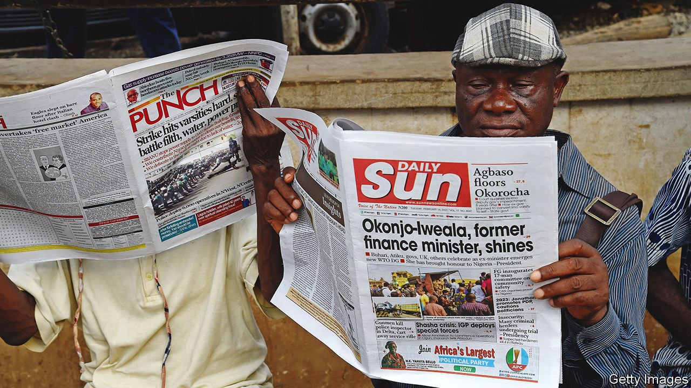
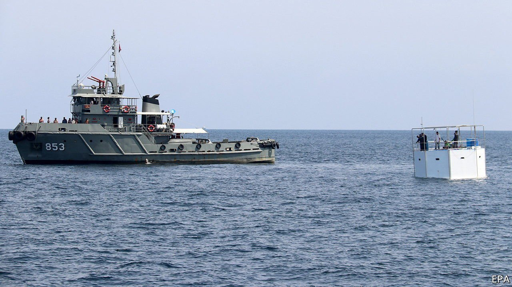
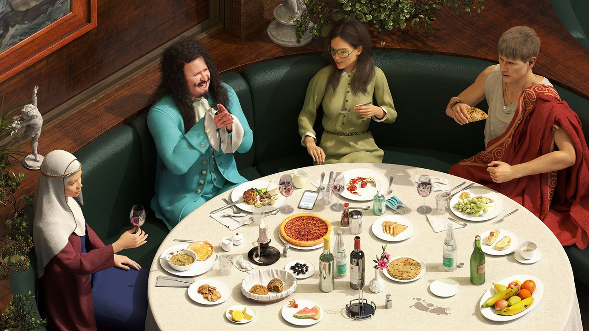

###### On American power, wireless connections, Africa, cruise ships, restaurants, Stephen Sondheim

# Letters to the editor 

##### A selection of correspondence 

 

> Jan 8th 2022 

Letters are welcome via e-mail to 

Stopping invasions

I was surprised that your briefing on American foreign policy, which characterised the global order created after the second world war as “breaking down”, did not mention the UN charter (). The charter, the legal bedrock of the post-war order, says that UN member states “shall refrain in their international relations from the threat or use of force against the territorial integrity or political independence of any state.”


Your thoughtful discussion spoke of an uncertain path ahead amid global menaces. Two of them stand out in particular: the threats being made by China to the territorial integrity of Taiwan (which is surely a state under international law) and Russia’s threat to Ukraine. In those cases the refusal of American politicians to consider war to defend the victimised countries and vindicate the charter’s most important rule would suggest that America has conceded a basic premise upon which the post-war order was founded. Acquiescence in Russia’s annexation of Crimea carried America a step down that dangerous path.

If countries no longer respect or demand adherence to the UN charter’s prohibition of the use of force, our world is in deep trouble.

CHRIS BORDELON

Philadelphia

You encouraged more American and Western military engagement to make the world safer. With respect, you must be insane. Such thinking belongs in the pre-nuclear weapons era. American involvement defending Ukraine against Russia or Taiwan against China, however morally worthy, would increase the risk of nuclear weapons being deployed by Russia or China at the urging of nationalistic hawks within those countries. Once the first weapon is used, the next steps become wholly unpredictable and potentially catastrophic for our civilisation. Just because no nuclear missiles have yet been launched does not mean that they never will be.

Russia has made it clear that buffer states are an essential part of its defence strategy if not national identity, a principle that NATO seems unable to understand. China, similarly, is not about to give up its claims to Taiwan. Neither of these perspectives will be changed by the threat of Western hard power. On the contrary, militaristic Western threats could rally nationalistic feelings in Russia and China. Even more so if Donald Trump’s finger is once again on America’s nuclear button.

MICHAEL WELLS

Gullaug, Norway

 


Connections

“” (December 4th) claimed that the digitalisation of Africa will be grounded in fibre, steel and concrete. This misses a critical element in the goal to create a truly connected Africa. The challenge to deliver reliable internet connections to existing users while providing new connections to the almost 350m Africans who have no connection is multidimensional. It will require a combination of the infrastructure you mentioned with technologies such as satellite, cellular, software-defined networking and renewable energy (solar power) to bring reliable access to cloud-based applications. Fibre, steel and concrete will only get Africa so far.

STEPHEN SPENGLER

Chief executive

Intelsat

McLean, Virginia

 


Who is an African?

The appointment of Africans to lead international organisations is hopefully a growing trend (“”, December 11th). There is, however, a very important point in regards to African identity. You mentioned Ngozi Okonjo-Iweala’s leadership of the WTO as one of several recent sub-Saharan African appointments to top jobs. However Audrey Azoulay, a Moroccan Jewish woman, has been director-general of UNESCO since 2017. Given the importance of promoting education, the role of women and preserving cultural heritage in Africa, it is a big deal. This may also highlight an uncomfortable racial expectation of what it means to be African.

Elon Musk, born among the jacaranda trees of South Africa, is one of the most influential Africans in the world. He hasn’t only broken a glass ceiling, he is changing the way we live our lives. Barack Obama, a man of Kenyan heritage, broke the highest glass ceiling of them all in recent memory. It is the very international organisations to which you refer that have promoted the misconception that Africa is racially homogeneous.

ZAID BELBAGI

Casablanca, Morocco

 


Cruising homes

Your article on seasteading told us about a company that wants to build floating districts that can be comfortable and affordable (“, December 4th). Such entities already exist; they are called cruise ships. One could reconfigure a mega-ship by knocking together several smaller staterooms into suites and selling them as condominiums. The ship would have all other facilities: housekeeping, several restaurants, entertainment, exercise and banking facilities and even some health care. Such a vessel could call itself the independent nation of Waterworld and moor in international waters, moving around to visit nice places. At each destination its citizens would be conveyed from the ship to the port for land excursions, but never staying in a country long enough to be subject to taxation. This model is scalable to cruise ships that would be bigger than today’s vessels, which are limited in size because of the constraints of navigating ports and canals.

AVINASH DIXIT

Princeton, New Jersey

 


The joy of eating out

Focusing on an economic history of restaurants (“”, December 18th) omits a lovely service that restaurant staff provide: the one smiling face a person might see all day. Many benefits are enjoyed when renting the real estate of a table for an hour or two, such as enjoying food we would never take the time to prepare, but also the graciousness and courtesy of a person who devotes his or her energy to making us feel better. Restaurants provide a vital key to mental health.

LINDA NAKAMURA

San Francisco

Christian Lacroix’s glittering production of “La Vie Parisienne” at the Théâtre des Champs-Élysées this Christmas reminded me of one of the reasons why gentlemen went to restaurants in the 19th century: they could entertain women who were not their wives. Parisian restaurants such as the Café de Paris were famous for their private rooms, including the number 16, to which Offenbach pays such lyric tribute in “La Vie Parisienne”. Over time it became acceptable to take one’s own wife out to dinner.

DAVID CHAFFETZ

Lisbon

You say potato…

I take issue with a reader’s assertion, in relation to a lyric by Stephen Sondheim, that “grass” rhymes with “ass” (, December 18th). In Britain grass is pronounced “grarse” (in southern England at least), and hence rhymes perfectly with arse.

He had clarse, did Mr Sondheim.

DAVE LE BRUN

Wotton-under-Edge, Gloucestershire

