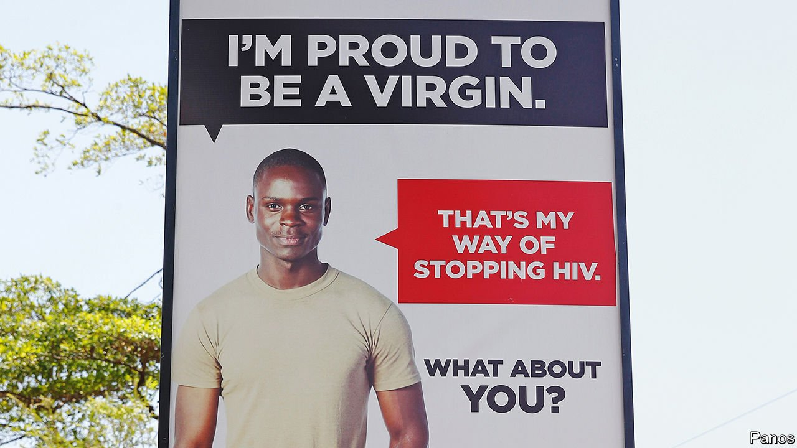

###### The birds and the “be quiet”

# A Ugandan court has unbanned sex education 

##### But any new policy is sure to annoy religious leaders 

 

> Jan 8th 2022 

IN 2016 UGANDAN officials burst into the halls of Green Hill Academy, a highly regarded primary school in Kampala, Uganda’s capital. They were on a curious mission. The minister for ethics and integrity had ordered them to seize copies of Jacqueline Wilson’s “Love Lessons”, a book about how a 14-year-old girl called Prudence falls in love with her art teacher. Conservative Ugandans threw a fit, fretting that “erotic” and “distorted” books were brainwashing their children. Within months all forms of sex education were banned. Last November a court lifted the parliamentary ban and gave the education ministry homework—to write a new policy on how it will teach children about sex.

The court case was not without surprises. Ismail Mulindwa, a senior official in the ministry, argued that teaching young people about sex could lead them to masturbate or become homosexual. (Presumably he thought these were bad things.) Conservative views on sex education start at the top. President Yoweri Museveni and his wife Janet, the minister of education, have long promoted celibacy as the best way to prevent sexually transmitted diseases. Both are against condoms, arguing they promote promiscuity. And the first lady seems to think that contraceptive pills not only fail to prevent pregnancy but also erode morals, turning Ugandans into sex-crazed people who “have sex, take pills, conceive and abort”.


Ignorance is risky. Though deaths from AIDS, a disease caused by the HIV virus, have fallen sharply, partly because many people with it are now getting treated, the virus is still a big cause of death in Uganda. Less than half of young Ugandans know how to avoid catching HIV while having sex. Few seem to know much about contraception either. Around a quarter of teenage girls are pregnant or already have a child. Some 15% are married by the age of 15; around half have tied the knot by 18.

These alarming figures have been exacerbated by the government’s blundering response to covid-19. It shut schools at the start of the pandemic almost two years ago and is only reopening them this month. By June last year the teenage-pregnancy rate had jumped by 17% from March 2020.

Officials drafting the new policy could perhaps learn from past mistakes. An earlier framework in 2018 suggested lifting the ban on sex education. However, it also suggested teaching children that the best way of not catching HIV is not to have sex. It barely mentioned contraception. All it said about masturbation was that no one should do it. Its only reference to gay sex was the name of the law banning it.

The framework mentioned God 62 times and made “God-fearing” its main guiding principle. Yet some pious folk were still not satisfied. Some Muslims felt the policy was too Christian; some Christians thought it was not conservative enough. The Reverend Stanley Ntagali, the archbishop of the Anglican Church of Uganda, denounced the framework as part of the “UN’s pro-promiscuity, pro-gay, pro-abortion sexual agenda”. A coalition of religious leaders agreed on only one thing: to reject the policy altogether.

Officials drafting the new framework might consider what has worked elsewhere. UNESCO has found that teaching young people about condoms is far more effective at curbing pregnancies, HIV and other sexually transmitted diseases than only teaching them abstinence. A better framework should also try to help young people avoid exploitative or violent relationships, says Rose Wakikona of the Centre for Health, Human Rights and Development, a Ugandan non-profit organisation that brought the case that overturned the ban. She describes a separate case of a nine-year-old rape victim, who testified that a man “slept on her” because she was unable to describe the act.

Education is a start, but it is only one piece of the puzzle. Some 28% of married Ugandan women who want to use contraceptives cannot get them, making Uganda’s “unmet need” for contraception higher than the average for sub-Saharan Africa, where 25% still do not get it. It is not just the education ministry that has plenty of homework to finish. ■

