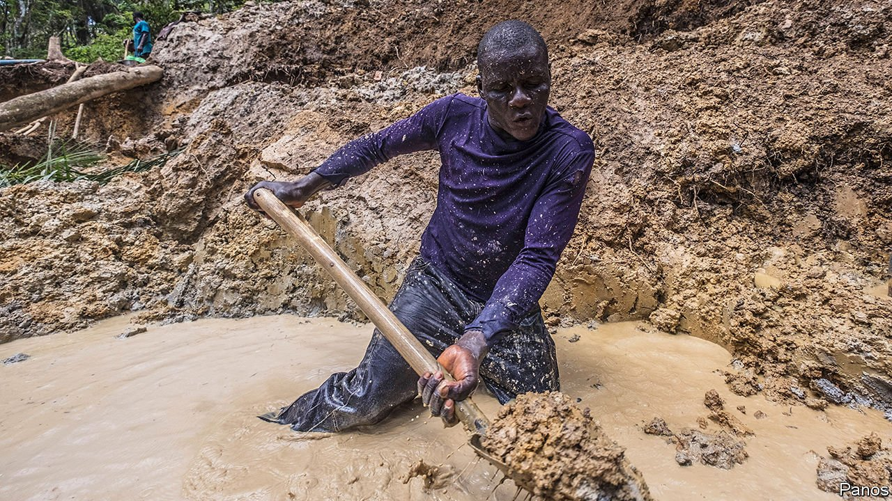
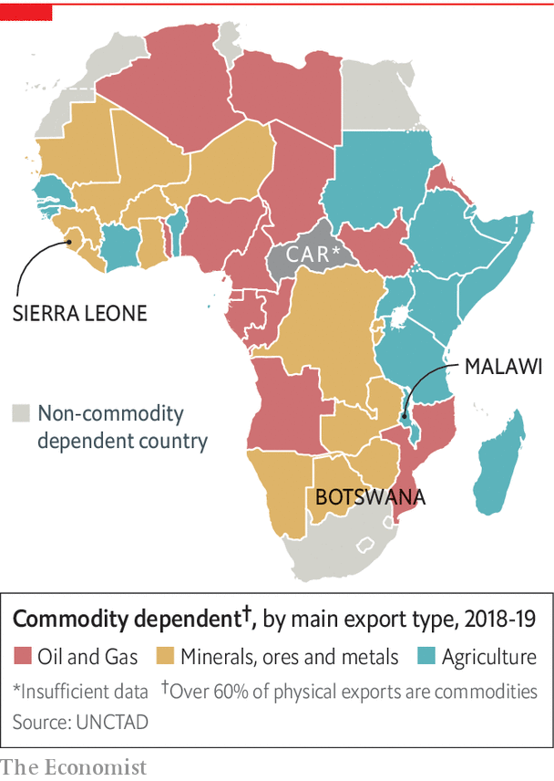
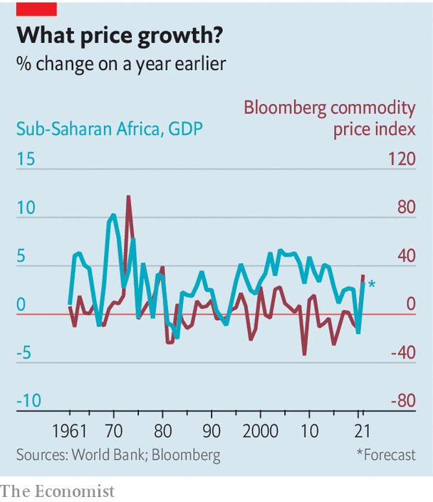

###### When you are in a hole...

# How Africa can reduce its reliance on commodities 

##### Invest the profits in infrastructure and people 

 

> Jan 8th 2022 

IN EASTERN SIERRA LEONE six shoeless men thwack shovels into a bank of reddish earth and heave the dirt into a stagnant pond. They hope to find diamonds. Even if they do, they will not strike it rich. The men are paid about $0.90 a day by a backer who bought the licence to mine and who keeps 70% of anything they find. The remainder adds up, on average, to about $135 a year each, says one. Ibrahim, a 25-year-old wearing a sodden sock to protect his foot from the metal shovel, is a third-generation miner. He does not earn enough to send his children to school. “If I cannot support my children to be educated, how can I be sure they will not come here, too?” he asks.

Like Ibrahim’s family, many African economies have relied too much on raw materials for too long. The UN defines a country as dependent on commodities if they are more than three-fifths of its physical exports. Fully 83% of African countries meet that threshold, up from 77% a decade ago. Some depend on produce such as tea, but most rely on mining or on pumping oil. When commodities crashed in 2015, foreign direct investment (FDI) and growth tumbled and have yet to fully recover.


Broad averages obscure some of the progress that has been made to diversify economies. Over the past decade resources have become less important to GDP. The share of commodities in goods exports from the continent as a whole has fallen, too. And in countries such as Botswana and Malawi, services have grown strongly. Even manufacturing is rebounding.

 


Yet Africa has a long way to go if it is to break free of the resource curse. In countries rich in diamonds or oil, political power can be a licence to loot. So unscrupulous folk are tempted to grab and hang on to it by any means available. Resource-rich countries are more likely to suffer dictatorships, and also tend to have more and longer civil wars. In Sierra Leone, for example, diamonds fuelled a bloody conflict that dragged on for 11 years.

Commodity prices leap and fall, leading to booms and busts. In Sierra Leone the normally sober IMF, excited by two new iron-ore mines and high prices, forecast growth of 51% for 2012. That spurred the government to splash out. But GDP that year grew by 15%. In 2014 iron-ore prices plunged and the mines closed. The economy, which was also hit by Ebola, shrank by 20% in 2015. “When the mine stops, it’s bad for business,” says Idrissa, who sells bags in Lunsar, a mining town.

Oil and minerals create few jobs. At a gold mine in Sierra Leone the Chinese manager’s six ducks watch as a solitary red lorry dumps rubble. The avian observers outnumber the workers on duty. Across this country of 8m people, about 8,000 work in commercial mines. Cash crops create more jobs, but, without processing, do relatively little to improve productivity (which is needed to make a country rich).

Worse still, commodities exports can often hold back the rest of the economy by pushing the exchange rate up and making other exports uncompetitive. Every extra dollar in foreign currency earned from exporting resources reduces non-resource exports by $0.74, reckon Torfinn Harding of the NHH Norwegian School of Economics and Anthony Venables of Oxford University. So tight is this straitjacket that Michael Ross of the University of California found that among 38 big oil exporters, neither good government nor democracy has any solid relation with diversification. The only thing that correlates is having less oil.

 


Yet it is too easy to blame economics alone. “The fault, dear Brutus, is not in our stars but in ourselves,” quips Herbert M’cleod, who is based in Sierra Leone for the International Growth Centre, a research outfit. Governments often spend windfalls from commodities on fat salaries rather than investing them in infrastructure or education. They are “eating the future”, laments Paul Collier of Oxford University. All too often when cash is tight, politicians try to renegotiate existing deals to get more tax, or simply grab mining or oil companies. “Let’s own the minerals ourselves,” muses Jacob Jusu Saffa, the chief minister (ie, prime minister) of Sierra Leone, in frustration at the lack of revenue. “Let’s own the companies.” Yet the result of state ownership is usually idle or unprofitable mines and angry investors who take their money and skills elsewhere.

Often overlooked is the reality that some politicians simply do not want to diversify. Money from oil tends to go through state coffers, where greedy hands can skim it off. Politically connected bigwigs often benefit in other ways too, says Rabah Arezki, a former chief economist at the African Development Bank. In many cases imports, which tend to jump during commodity booms, are controlled by a few big players. If there is little competition from domestic producers, they can bump up prices and gouge ordinary folk. As long as they share some of this wealth with their friends in politics, the government will do little to encourage local production. In any case, creating, say, a clothing industry from scratch is slow, so there is little reason for politicians to put in the effort if the credit will be claimed by their successors.

Even so, it is possible for governments to manage their commodities better. One basic principle, especially for things like oil and minerals that will run out, is to turn riches in the ground into other sources of wealth, such as roads or an educated population. The World Bank now argues that, even if countries cannot diversify their exports, they will still be making progress if they diversify their sources of wealth.

Sierra Leone’s government is taking note. It now spends about 21% of its budget on education, up from 13% in 2017. As a result, more youngsters are passing their final exams than ever before. Mining began in Sierra Leone about a century ago. “If we had invested in humans for a hundred years,” sighs David Moinina Sengeh, the education minister, “we would be in a much better place today.” ■

