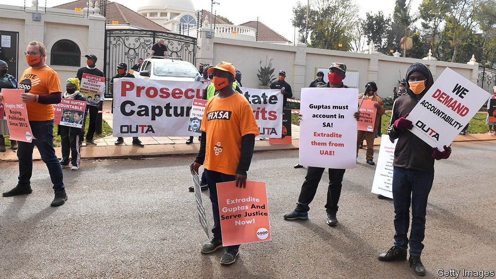

###### How to capture a state

# Jacob Zuma presided over a mountain of sleaze in South Africa 

##### A commission implicates his inner circle and some big firms 

 

> Jan 8th 2022 

IT WAS MEANT to last no more than six months, but the more muck it raked, the more it found. Four years after it was appointed to investigate allegations of “state capture” during the presidency of Jacob Zuma (2009-2018), a judicial commission headed by South Africa’s deputy chief justice, Raymond Zondo, has released the first volume of its findings. It is damning, alleging in forensic detail that Mr Zuma and his friends set about taking over state-owned firms and government institutions in order to siphon cash out of them.

That the commission uncovered a mountain of corruption will not surprise many South Africans. Nor will the allegation that the former president seems to have been in the thick of it: well before he reached the top, Mr Zuma was already facing charges of fraud, bribery and money-laundering relating to an arms deal signed in the late 1990s. Ordinary South Africans are used to being ripped off by their rulers, after decades of dodgy dealings under the old apartheid regime and then decades of naked cronyism and rotten contracting under the African National Congress (ANC), the current ruling party, to which Mr Zuma belongs. But even the most jaded observers were shocked by some of the commission’s findings.


At the centre of the allegations of sleaze are the Gupta brothers, three Indian-born businessmen who befriended Mr Zuma and went into business with his son, Duduzane. They all deny wrongdoing. In 2016 Thuli Madonsela, then the public protector (a constitutionally protected ombudsman), accused the Guptas of having—and profiting from—excessive influence over South African politics. Her report was entitled “State of Capture”. With little faith that her successor would keep probing Mr Zuma, she cannily ordered the president to appoint the judicial commission that uncovered a “scarcely believable picture of rampant corruption” during his term.

The commission’s report, the first of three due before the end of February, said that 1,438 people or companies were implicated in wrongdoing. These include close friends of the former president, among them senior figures in the ANC, as well as the party itself, which the commission said was financed with the proceeds of crime. The commission also said that several companies have questions to answer, including the South African branch of Bain &amp; Co, an international consulting firm.

South Africa’s president, Cyril Ramaphosa, may try to use the commission’s report as a cudgel against the pro-corruption wing of his own party. But that wing is strong. A serious crackdown could split the ANC and possibly force him from power. Justice Zondo is prodding Mr Ramaphosa to crack down anyway. His first report recommends a slew of reforms to public procurement, senior appointments at state-owned firms and political-party finance, among other things. And he has said the commission will bequeath to the country 1m gigabytes of data containing evidence of corruption, fraud and state capture that could be made available to prosecutors by Mr Ramaphosa. By hanging this pistol so conspicuously on the wall, Justice Zondo no doubt hopes he has made it hard for Mr Ramaphosa to avoid firing it. ■

