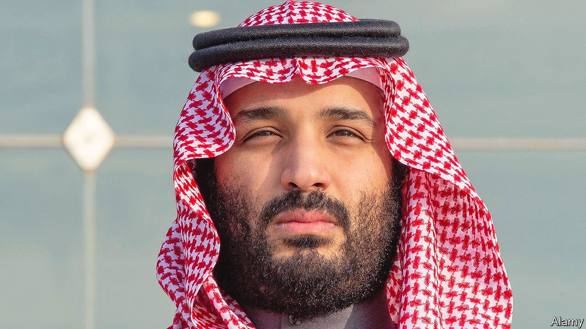

###### Bubbling below the surface

# Many Saudis are seething at Muhammad bin Salman’s reforms 

##### Can they do anything about them? 

 

> Jan 6th 2022 

ON DECEMBER 30TH the authorities in Saudi Arabia stuck notices to the shrines in Mecca and Medina, Islam’s holiest cities, telling worshippers to stay two metres apart, lest they spread covid-19. But Muhammad bin Salman, the kingdom’s de facto ruler (pictured), seems less keen on imposing restrictions elsewhere. His men have been drawing crowds to concert halls and fairgrounds in other cities. A government-endorsed rave last month brought together 700,000 young Saudis to dance for four days. “This kingdom is preventing virtue and promoting vice,” says a teacher in Medina’s quiet city centre.

Public-opinion polls are rare in Saudi Arabia. So it is tough to gauge the backlash against Prince Muhammad’s efforts to open up and reform one of the world’s most closed and intolerant countries. But soundings from inside the kingdom indicate that there are at least three unhappy groups: Salafists, who espouse a fundamentalist version of Islam; princes from the ruling House of Saud; and ordinary Saudis who liked things better the way they were. Only repression and fear prevent them from trying to unseat Prince Muhammad and turn back the clock.


Start with the Salafists, who fume that Prince Muhammad has broken an alliance between them and the House of Saud dating back three centuries. The prince has curtailed the powers of the religious police, who can no longer force shops and restaurants to close five times a day for prayer, or prevent men and women from greeting each other with kisses on the cheek. Officials in Riyadh, the capital, dictate Friday sermons. Preachers who are popular on social media have been banned from tweeting anything but praise for the prince’s achievements.

Some Saudis still spread critical Salafist commentary by word of mouth. The clerics are said to have condemned the government-sponsored winter festival, featuring rides, games and music, in Riyadh. They accuse Prince Muhammad of playing God. The critics are “like ants. Their kingdom is underground,” says a Saudi religious commentator in the western city of Jeddah. “The prince has closed their mouths, but he hasn’t ended their kingdom.”

Many royals are upset, too. They long had the power to petition the king, and had plenty of money to spend on the public and themselves. But Prince Muhammad has hobbled the aristocracy. He locked a number of prominent princes (and many businessmen) in a luxury hotel in 2017, shaking them down for cash and assets. Other princes complain of similar treatment, minus the hotel stay, as well as cuts to their perks (such as free flights, utilities and medical care). It has become harder for them to grab commissions on government contracts. In general, they say, Prince Muhammad has turned a more consensual system of politics into one-man rule.

Many Saudis have been happy to see corrupt princes taken down a peg. Others are thrilled with Prince Muhammad’s expansion of personal freedoms. But some are uncomfortable with all the change. The sight of girls studying with boys in primary schools has made parents uneasy. Men often see women’s empowerment as their own disempowerment. In the old days, “if I reported my daughter for leaving at night without my permission, they’d return her in handcuffs,” says a former soldier. “Now if you try to stop her, she complains to the police and they detain you.”

Some Saudis believe that Prince Muhammad, rather than replacing religious fanaticism with moderation, is jettisoning religion altogether. “Like Europe, he’s throwing God out with the church,” says a Sufi mystic in Medina.

The prince’s economic policies are adding to the discontent. Businessmen complain that the prince is using the kingdom’s vast sovereign-wealth fund and other royal entities to crowd out the private sector. Subsidies have gone down, while taxes, fees and fines have gone up. A cab driver notes that the state-controlled price of petrol, once cheaper than water, has quadrupled on Prince Muhammad’s watch. (Economists and environmentalists applaud this.) There is little accountability. The prince and his fading father, King Salman, have ended the practice of hosting majlises, or weekly councils, where Saudis could appeal to their ruler.

Will anything come of all this unhappiness? Few believe the preachers will remain silent for ever. Some wonder if a Saudi version of Ayatollah Ruhollah Khomeini, who led the revolt against the shah’s rule in Iran, might emerge. A former senior official invokes the memory of King Faisal, who was assassinated by his nephew in 1975. “Prince Muhammad knows what the family can do,” he says. “They won’t forgive him.” Others hope that President Joe Biden will stand in the way of the prince’s succession. Without Prince Muhammad in charge, some analysts think his reforms would be reversed. “Change is imposed from above and has sadly not established grassroots,” says one.

But these scenarios seem unlikely. Prince Muhammad’s repression appears to be working. Royals who question his actions are under house arrest (including two former crown princes). Thousands of preachers are behind bars, say dissidents, including Salman al-Odah, who boasted 14m followers on Twitter. Critics of the prince have been cowed. Even in London they turn off their phones before voicing their concerns. “Saudi Arabia has become a full-blown surveillance state,” says Thomas Hegghammer, an expert on extremism. “With the technology available, I don’t think a revolt or a coup is possible.” ■

