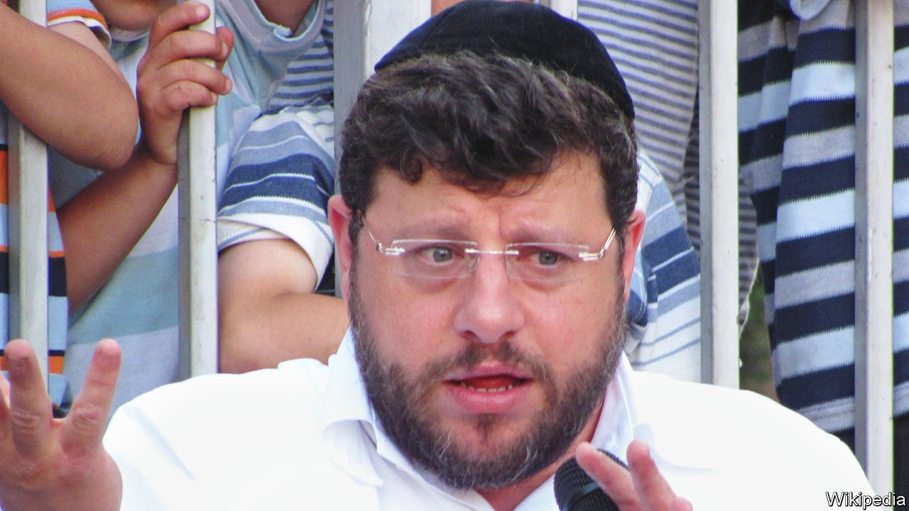

###### Losing control

# Sexual-assault allegations test ultra-Orthodox leaders in Israel 

##### Rabbis have tried to control the narrative around Chaim Walder. It’s not working 

 

> Jan 8th 2022 

CHAIM WALDER was an icon of ultra-Orthodox Jewry in Israel. His best-selling books stood out for their portrayal of young, devout characters who speak openly about their problems and emotions. Mr Walder’s work could be found in nearly every ultra-Orthodox (or Haredi) home. By the time of his death on December 27th, the author was as prominent as any top rabbi.

Mr Walder (pictured) shot himself in a cemetery in central Israel, weeks after being accused of sexually assaulting women, girls and boys. He denied the charges in a suicide note. The affair is testing ultra-Orthodox rabbis, who had for decades endorsed his work.


Mr Walder published 80 books, mainly for children. He was also a columnist for Yated Ne’eman, a rigid ultra-Orthodox newspaper. As such, he was entrusted with interpreting current events from the rabbis’ perspective. The paper dropped Mr Walder after the allegations were reported elsewhere. No explanation was given. Haredi newspapers are forbidden from discussing sexual matters, including sexual violence. Photographs of even modestly dressed women are banned too.

But Mr Walder’s suicide could not go without comment. Yated Ne’eman eulogised him as an illustrious “man of education and good deeds” who had been “suddenly taken away in his prime”. The sexual-assault allegations were not mentioned. In their guidance to Haredi schools, rabbis directed teachers to focus on the “public shaming” Mr Walder had suffered, rather than on his alleged victims.

The rabbis thought they could control the narrative, at least among ultra-Orthodox Jews, who are not supposed to own televisions or radios, and who often have mobile phones that are blocked from getting onto the internet or using messaging apps. But many young Haredim ignore these strictures. They are active on social media, where Mr Walder’s record was more openly discussed. “The rabbis cannot comprehend that all the details spread on social networks and outside Israel, way beyond their control,” says Pnina Pfeuffer, the founder of New Haredim, a movement promoting more liberal attitudes than the traditionalists espouse.

It is hard to know how big a problem sexual abuse is among the world’s 2m Haredim. As a voting bloc in Israel, they are powerful, so the government and the police are loth to intervene in their affairs. In both Israel and in America, where nearly a third of Haredim live, victims and their families are often urged not to report incidents to the secular authorities. In America, at least, more open-minded rabbis and community leaders have publicly addressed the Walder affair.

Israeli rabbis are unsure how to grapple with the issue—and their own loss of control. As young Haredim get their hands on more information, their elderly leaders seem increasingly out of touch. Haredim are still reeling from their decision to ignore covid-related lockdowns and keep schools and synagogues open, leading to higher death rates among the faithful. Some are now calling the Walder scandal the Haredi version of #MeToo. “It’s a watershed moment for a community that was built on isolation,” says Ms Pfeuffer. ■

