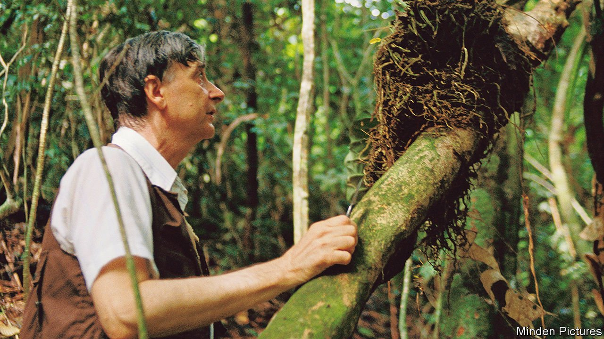

###### E.O. Wilson

# Edward Wilson, controversial biologist, is dead 

##### He introduced the world to sociobiology 

 

> Jan 8th 2022 

ONE DAY in 1936 Edward Wilson, a budding seven-year-old naturalist, was out fishing. He hooked a pinfish, which has sharp spines down its back. He pulled too hard. As the fish came out of the water, one of its spines went into his right eye. Keen not to cut short a day outdoors, he soldiered on without going to hospital. As a result, he lost most of the sight in that eye.

This loss of vision was not the only reason he turned from vertebrates to ants. But it gave him a nudge: “I noticed butterflies and ants more than other kids did, and took an interest in them automatically.” A long and productive career saw him write hundreds of papers and publish dozens of books, collect two Pulitzer prizes, and make fundamental contributions to ecology, conservation and evolutionary biology.


But it was insects in general, and ants in particular, that were his first love. He began as a muddy-booted field biologist of the old school, tramping across Australia, Fiji and New Guinea, collecting and cataloguing new species. As biology became more technical, in the wake of the discovery in 1953 of the double-helix chemical structure of DNA, he moved with the times. Recognising the need to sharpen his mathematical skills, the tenured Harvard professor enrolled himself in calculus classes alongside his own undergraduate students.

As with all the best scientists, he delighted in drawing connections. Ants are biological robots, their behaviour controlled by chemicals called pheromones. (Some of Wilson’s early work was in decoding these signals; learning, as he put it, to speak to another species.) But from those simple chemicals arises an astonishing variety of behaviour. Ants march in columns like Roman legionaries, practise agriculture, form living rafts to survive floods, and run complex societies in which the individual good is subservient to that of the colony.

Exploring the evolutionary principles underlying that behaviour got him thinking about how they might apply to other species, a topic he explored in 1975 in a book called “Sociobiology: The New Synthesis”. The chapters that applied biological reasoning to the behaviour of other animals were uncontroversial. But when, at the end, he extended the analysis to humans he was denounced by some of his left-wing Harvard colleagues, compared to the Nazis, and physically attacked at a lecture.

Wilson’s crime was not error, but heresy. Over a century and a half after Darwin’s elucidation of natural selection, Homo sapiens remains an animal with a tendency to think itself semi-divine, or at least somehow above that sort of evolutionary messiness. Time has proved Wilson right. These days few dispute that human behaviour is at least partly shaped by genes. But while the principle is (mostly) accepted, the mechanisms remain obscure. Untangling exactly how, and how much, genes affect human behaviour remains a piece of vast and fascinating unfinished business.

To enjoy more of our mind-expanding science coverage, , our weekly newsletter.

