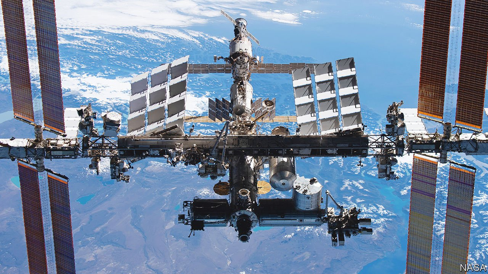

###### Agricultural science in orbit

# Outer space offers plant breeders some curious advantages 

##### Radiation and microgravity may give rise to better crops 

 

> Jan 8th 2022 

PLANTS GROWN in orbit, and thereby deprived of the comforting directional pull of Earth’s gravity, typically struggle to distinguish up from down. This makes it harder for them to carry water and nutrients around themselves. It also fouls up their ability to draw carbon dioxide needed for photosynthesis from the air. The stress caused by all this seems to increase the level of genetic mutation induced by a given amount of radiation—of which there is much in space, in the form of cosmic rays and effluvia from the sun. And mutations are the lifeblood of plant breeders.

On Earth, breeders induce them by exposing plants and seeds to radioactive isotopes, X-rays and so on. Most are harmful. But some hit the jackpot, conferring properties like drought resistance, blight resistance or shorter stems, favoured by farmers, and sweeter flavours, brighter colours or thinner peel, favoured by consumers. Plucked from their progenitors by selective breeding and added to cultivars, such mutations are worth millions. Mutagenesis, then, is an important business.


And it is one that StarLab Oasis, a firm in Abu Dhabi that was spun out of a Texan enterprise called Nanoracks in 2021, reckons it may be able to perform better. As the firm’s name hints, the plan is to do the job using the natural radiation of space. Its researchers intend to start sending payloads of seeds to the International Space Station (ISS) later this year. Once there, those seeds will be cultivated by astronauts on board the station and allowed to grow and breed.

Subsequent generations of seeds resulting from this breeding will be returned to Earth and germinated in StarLab Oasis’s greenhouses. They will then be subjected to ills including drought, pathogens, poor soil, excessive heat and voracious insects. Those which best endure these assaults will be bred from in their turn, in the hope that something valuable emerges.

A cut-down version of this approach, launching packets of seeds on satellites and returning them to Earth after a period of exposure to cosmic radiation, has had some success. China says it has conducted more than 30 such missions, and that these have yielded at least 200 improved crop varieties. StarLab Oasis’s boss, Allen Herbert, believes, however, that his firm is the first private organisation set up to take this route and, in particular, actually to raise plants in space for the purpose.

Mutagenesis is not, moreover, the only facility offered by space which may be of interest to botanists. The stress responses themselves also yield useful information.

Robert Ferl and Anna-Lisa Paul are joint heads of the Space Plants Lab at the University of Florida, Gainesville, which already has experiments on board the ISS. These are studying how Arabidopsis thaliana, a species of cress that is botany’s equivalent of animal scientists’ mice and fruit flies, responds to the rigours of orbital free fall. The answer is that the plants switch on some genes which would normally remain dormant, while switching off others that would normally be active.

In particular, as Dr Ferl, Dr Paul and their colleagues have found, spacefaring specimens frequently divert resources away from tasks, such as strengthening the rigidity of cell walls, which are less pertinent when the directional pull of gravity is missing. Conversely, in a bid better to determine which way is “up”, they become more sensitive to light. As Dr Paul puts it, plants “reach into their metabolic toolbox” to cope with the unusual stress. In doing so they pull out tools that may be used rarely on Earth, but which plant breeders might be able to deploy in advantageous ways by improving gas exchange, inducing better root growth or reducing stem size.

The ISS will not, though, last for ever. And Nanoracks is involved in a proposal to replace it. As the name of its progeny in Abu Dhabi also suggests, this is Starlab, a putative crewed space station planned by a group led by Lockheed Martin.

Starlab is intended to be a commercial enterprise, with plant breeding as one of its sources of revenue. It is not planned to go into orbit until 2027, and the schedule for such projects is in any case almost always optimistic. But if it does get off the ground, the idea that one of its modules might, in effect, be a plant-growing annex to the main living space, akin to a conservatory on Earth, has a pleasing domesticity to it. Perhaps the crew will relax there after a hard day’s work. ■

To enjoy more of our mind-expanding science coverage, , our weekly newsletter.

