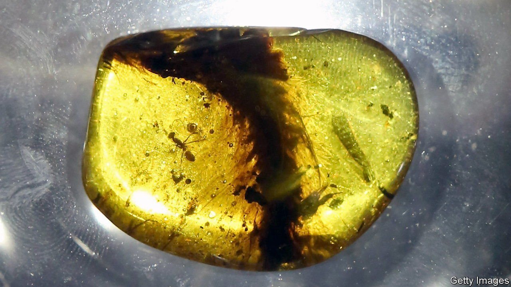

###### Fossil hunting

# The tricky relationship between palaeontology and poor countries 

##### More is known of rich-world than poor-world fossils. That is bad 

 

> Jan 8th 2022 

WHAT YOU see depends on where you stand. The unarguable fact that most palaeontologists live in the rich world means two things. One is that the fossils of these places are far better studied than those of poorer countries, which is a scientific pity. The other is that what knowledge has been garnered about poor-country palaeontology is frequently the result of visits by rich-country palaeontologists.

All this was well known, if not quantified, before Nussaibah Raja put numbers on it in a paper published in Nature Ecology and Evolution. Ms Raja, however, sees not just a regrettable history-induced bias that should certainly be addressed in future, but also a continuing pillage of poor countries by the scientific establishments of rich places more powerful than they.


Perhaps. But an alternative view is possible. This is that many of the world’s poor countries have higher priorities than studying their fossils, that letting foreign researchers do it for them is not wrong, provided no laws are broken, and that it is patronising to suggest otherwise. Moreover, as Ms Raja observes, several not-yet-properly rich places, notably China, Brazil, Argentina, Mexico and India, are indeed developing as palaeontological powers in their own right. And, as she further points out, Chinese palaeontologists are starting to take an interest in neighbouring Myanmar’s fossiliferous amber beds that a cynic might see as at least as predatory as that of any Western fossil hunter.


Ms Raja rightly notes that rich-country scientists could do more to assist their poor-world hosts, especially by recruiting local researchers onto their teams to transfer expertise—something they are currently bad at. But it takes two to tango. And not everywhere yet has the political will, institutional depth, or, indeed, money, to join in the dance. ■

To enjoy more of our mind-expanding science coverage, , our weekly newsletter.

