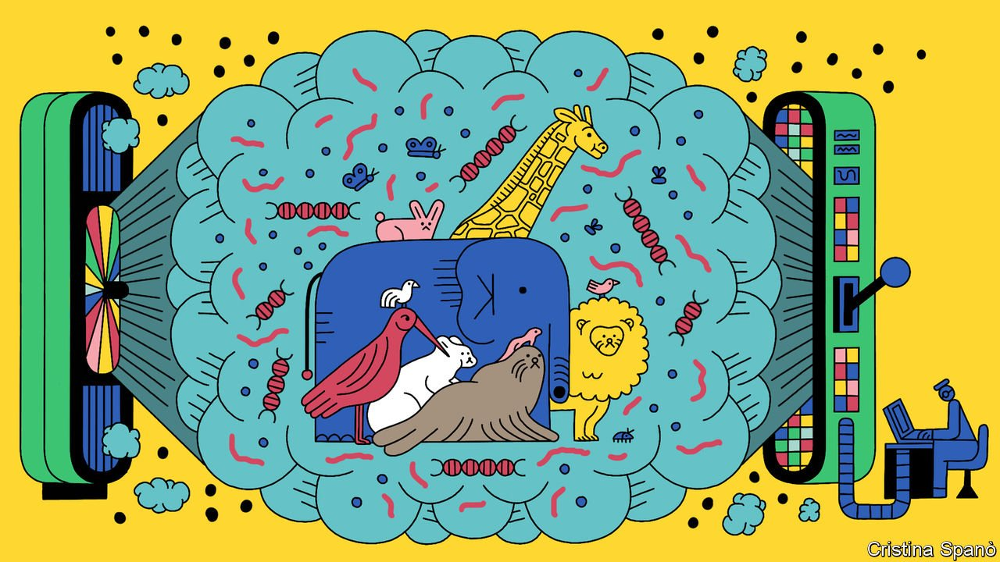

###### Ecology

# Wildlife can now be detected by sniffing DNA in the air 

##### Hard-to-see animals are thus easier to record 

 

> Jan 8th 2022 

IN THE PAST, studying ecosystems for signs of change has needed lots of boots on the ground. Plants, being sedentary, can be recorded easily by unleashing an infantry of PhD students eager to make a name for themselves. Taking a census of an area’s animals is, however, a different matter. It frequently involves sitting quietly for hours on end, noting which species walk, flutter or slither by, and what they are up to. Sometimes, the troops assigned to do this see a lot. Sometimes not.

Any viewer of crime dramas might think, though, that there is a better way. Just as DNA traces on an unwashed glass or a carelessly discarded cigarette butt can place a suspect as having been in a particular place, so can DNA shed by a creature as it goes about its business. Ecologists have thought of this, and it certainly works for things like animal droppings. But these, too, must first be detected and collected—and they will identify only the animal that dropped them. What would really speed things up would be a means of sampling an entire habitat at one go.


Such an approach is called metagenomics, and it does already exist. But, at the moment, it is applied mainly to bodies of water and to soil, rather than to open-air dry-land habitats. Several groups of researchers would therefore like to extend it more widely—by plucking the DNA concerned from thin air.

Sniffing around

Two of these groups, one led by Christina Lynggaard of the University of Copenhagen and the other by Elizabeth Clare of York University, in Toronto, have used zoos to test ways of extracting DNA from the atmosphere. Zoos are ideal for this because they house known animals. Both groups have just published preliminary results in Current Biology. Others, meanwhile, are already looking in the wild.

Dr Clare’s team adapted an existing sample-collection method by pumping air through filters normally employed to extract DNA from water. Dr Lynggaard’s team tried three approaches. The first percolated the air to be analysed through some water, to try to dissolve any DNA it was carrying and so permit that DNA to be analysed by conventional metagenomic methods. The second and third used fans—in one case large, of the sort employed to cool big computers in data centres, and in the other small, used to cool desktop devices. In both instances these fans blew air through filters of the type that air-conditioning systems use to remove particles of pollution.

Dr Lynggaard’s zoo of choice was Copenhagen’s. She put testing stations inside some of the animal houses and the rainforest house, and also near several outdoor enclosures. She let the water-percolation and large-fan systems run for 30 minutes. The small-fan system was allowed a more generous 30 hours to do its stuff.

Dr Clare, meanwhile, chose Hamerton Zoo Park, in Britain. She, too, ran her tests for 30 minutes at a time, and did so at a score of sites, both indoors and out.

Both groups scored palpable hits. All three of Dr Lynggaard’s methods detected 30 mammal species living nearby. Some, such as white rhinos, golden lion tamarins and Eastern grey kangaroos, were exhibits in the zoo. But many were not. Her equipment also noted, for example, red squirrels, hares, brown rats and domestic cats. Dr Clare’s findings were similarly encouraging. Her group not only logged 17 nearby zoo animals, but also eight other types of mammals and birds. These included hedgehogs, a species that has undergone a precipitous decline in Britain in recent years, and which is thus precisely the sort of creature that is of interest to those conducting ecological censuses.

Aerial metagenomics does, then, seem to work. But vertebrates, big and showy though they are, are by no means the only important fauna in an ecosystem. Arguably, insects are more so. And Fabian Roger, an entomologist now working at ETH Zurich, in Switzerland, has shown that the technique works with them, too, and can even yield novel information about an area’s inhabitants.

Dr Roger carried out his study in collaboration with colleagues from Lund University in Sweden when he was working there before his move to Zurich. Lund is just across the Oresund bridge from Copenhagen, and it was a system similar to Dr Lynggaard’s water-percolation approach that he used. One of his chosen sites was the roof of Lund’s ecology department—a well-established location for moth surveillance using conventional light traps. The other was in a forest in Smaland, a province of Sweden a little to the north of Lund. Here, the principal targets were bees and butterflies, which in this case had been monitored the old-fashioned way, using the booted ecological infantry.

Dr Roger has not yet published his results in a journal, but he reported them in December at an online conference called Ecology Across Borders. His version of the percolation system detected a combined total of 85 insect species at the two sites, 77 of which had been missed by more conventional sampling. It also recorded nine vertebrates (various frogs, birds and mammals) and lots of invertebrates other than insects. On the other hand, it missed 81 insect species shown by the other methods to have been present. It was especially bad at moths, noting a mere nine species while the traps caught a whopping 48. It did, though, manage to pick up five moth species that the traps had not.

Something which surprised both Dr Clare and Dr Lynggaard was that their zooquests detected not only exhibits, local wild animals and pets, but also some species that were none of those things. Dr Lynggaard’s equipment logged three fish: roach, smelt and salmon. Dr Clare’s sniffed DNA from cows, pigs and chickens.

The probable source of these is feeding time. Copenhagen Zoo keeps storks, seals, sea lions, polar bears and crocodiles. All are piscovores, and the fish Dr Lynggaard detected are regularly on their menus. Hamerton, meanwhile, has a proud collection of terrestrial carnivores, including tigers, cheetahs, lynx and maned wolves. These frequently dine on chicken, pork and beef.

It is one thing to pick up DNA from a living animal that is constantly shedding hair, skin cells, sweat and, indeed, urine and faeces. It is quite another to detect it from an inert lump of meat—even allowing for that meat having been mauled while it was being eaten. This discovery might be used to help a branch of conservation different from the habitat monitoring that Dr Clare, Dr Lynggaard and Dr Roger have in mind, for it could be employed to create devices that detect species in which international trade is illegal.

Such species are often hidden contraband—pangolin meat on its way to market, for example. But the technique could also help distinguish whether something that was being imported openly, like a cargo of fish, was actually what it claimed to be rather than an endangered lookalike.

Early warning

Returning to the question of monitoring wild habitats, sampling airborne DNA might give early notice of the arrival there of new species—whether naturally from nearby, as a consequence of things like climate change, or more artificially, from far away, by the introduction of an alien and potentially disruptive organism. In the second case, early detection might allow action to be taken before the invader became established.

Conversely, DNA sniffing might one day give warning when a local species was in trouble, though it is not yet sensitive enough to do that. Also, as Dr Roger’s results demonstrate, it works best at the moment as an addition to, rather than a substitution for, established methods, so eager PhD students need not fret about redundancy just yet.

But one thing which has proved true so far about DNA-related technology is that it gets better and cheaper as time passes. Whether it will ever get to the point when ramblers through wood and over meadow will have to get used to the sight of DNA sniffers keeping a nose on the local ecology remains to be seen. But the results which Dr Lynggaard, Dr Clare and Dr Roger have come up with suggest that such sniffers will, at the least, be a valuable addition to ecologists’ arsenals. ■

