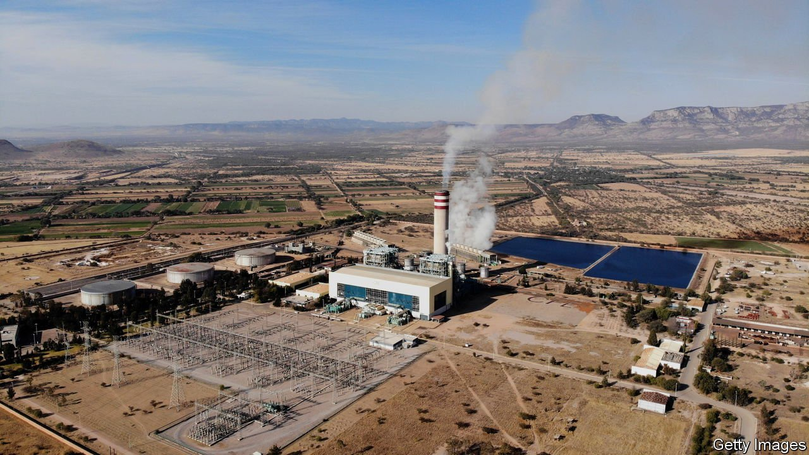
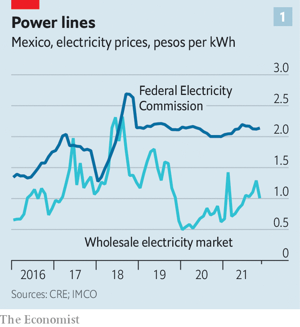
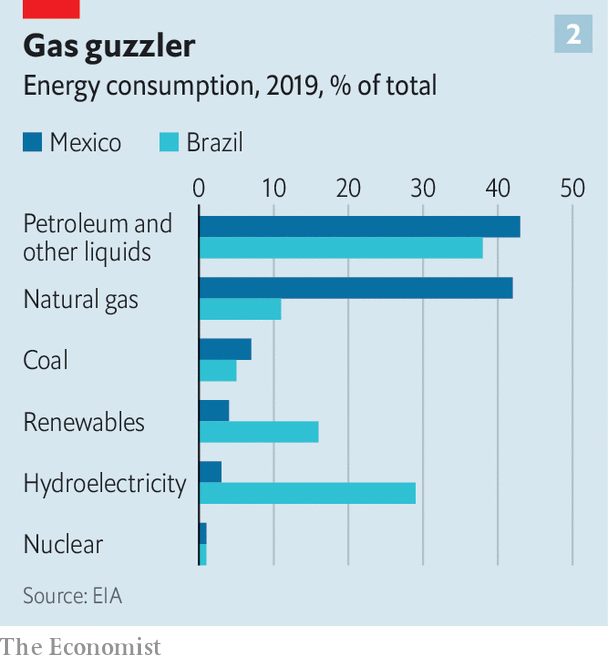

###### Blast from the past

# Mexico’s energy reforms will damage the economy and the rule of law 

##### President Andrés Manuel López Obrador wants to turn the clock back to the 1970s 

 

> Jan 8th 2022 

TO HEAR MEXICO’S president, Andrés Manuel López Obrador, tell the tale, the situation is dire and there is no time to waste. The reforms to the energy industry his predecessor helped push through in 2014 are causing “grave damage”; the constitutional amendments he has presented to the Congress will “rescue” Mexico.

In fact, the opposite is true: it is Mr López Obrador’s plans that are a grave threat, not only to the economy but also to the rule of law. In their current form, at least, they would make electricity both dirtier and more expensive, while damaging investor confidence and undermining institutions intended to keep an overweening government at bay.

 


Mr López Obrador, a left-leaning populist, sees the state as the mainstay of the economy, and energy as Mexico’s leading industry. He therefore wants to reverse the reforms of recent years and restore the state-owned oil and power companies to complete primacy within their respective domains. The hitch is that the liberalisation of power generation, in particular, has been an enormous success. Firms that were allowed to buy their own power from private suppliers instead of the state electricity company, Comisión Federal de Electricidad (CFE), saw the price fall (see chart 1). The power CFE itself bought at auction from private generation firms was some of the cheapest in the world. In 2014 electricity cost more in Mexico than in both China and Brazil, according to the World Bank; just two years later, Mexico’s power was the least expensive.


Cheap power, in turn, helped spur the growth of Mexican industry, and especially of the maquiladoras, or foreign-owned manufacturing plants that have replaced oil as the mainstay of the Mexican economy in recent decades.

America’s trade disputes with China and the desire of big businesses to relocate factories closer to American consumers should provide a further boost to Mexican manufacturing—but not if Mr López Obrador imperils the power supply.

Under the current rules both CFE and private firms generate power. The agency that manages the grid prioritises the cheapest sources. Since many of CFE’s power plants are old and inefficient, private firms do well out of this arrangement. So does the environment, as many of the private companies produce green power. By 2020 the generation of a kilowatt-hour of Mexican electricity emitted 7.6% less CO than five years earlier.

All fired up

. His constitutional amendments, which the lower house of Congress takes up this month, would restore CFE’s monopoly on selling power to the final consumer. Companies that generate power for their own consumption, or that buy it directly from private generation firms, would have to stop immediately.

Although private firms would still be allowed to sell power to the grid, CFE’s output would be prioritised, however expensive it was. The independent agency that manages the grid would be absorbed by the energy ministry, along with two other regulators. In effect, it would be up to CFE to decide from which firms to buy whatever supplementary power the grid required and to dictate prices. There would be no requirement for auctions or open tenders.

The impact of all this would be “catastrophic”, says Oscar Ocampo of IMCO, a think-tank. Mr López Obrador’s plans threaten at least $44bn-worth of private generation, of which $26bn is investment in . Blackouts could follow, as CFE may not have the capacity to produce enough electricity to meet Mexico’s needs. Even if there was enough of it, electricity would inevitably become much more expensive. CFE spends at least 40% more than its private rivals to generate a kilowatt-hour of power.

The government says blithely that ordinary Mexicans will not pay more for electricity. If it keeps its word, the state would have to absorb the enormous extra costs itself. CFE’s accounts have long been in dreadful shape. Analysts reckon CFE would need to spend at least an extra 62bn pesos ($3bn) a year to generate the power required, not taking into account the need for new investment in generation or subsidies to hold down costs to consumers.

Mr López Obrador may shrug at that. After all, Petróleos Mexicanos (Pemex), the state-owned oil company, is the world’s most indebted energy firm, with borrowings of $115bn. The government is propping it up with cash handouts equivalent to 1-2% of GDP. It is also winning tax breaks: the royalties it pays on the oil it extracts will fall from 54% to 40% (which is still high compared with Brazil’s 15% rate, for example). The amount the government has earmarked for Pemex in this year’s budget, 778bn pesos, is more than double what it plans to spend on education (364bn pesos).

There is little imminent prospect of either company returning any profits to the state. Pemex already struggles to cover interest payments on its debt and routine capital expenditure, let alone make big investments in exploration and new production. Its output has fallen from a peak of 3.5m barrels a day in 2003 to 1.7m today. If private companies are squeezed out of exploration—another element of Mr López Obrador’s energy policy—Pemex will no longer benefit from their expertise, capital and risk-sharing on new projects. In December Pemex said it would halt exports of crude in 2023, to steer more oil to its refineries. But those currently lose money.

 


The nationalist turn for the energy industry is not just bad for the books. It means that Mexico will not meet its pledge to produce 35% of electricity from clean sources by 2024—a target that analysts reckon it could exceed, thanks to its sunny and windy climate. The country’s energy mix is dominated by oil and gas, with natural gas the main source for electricity (see chart 2). The type of fuel oil used in some of CFE’s plants is so dirty that its use was banned in international shipping in 2020.

Worse, if energy costs rise and supplies become uncertain, manufacturers say they may no longer find Mexico a competitive place to make things. General Motors, an American car company, has said it will not invest further in Mexico if the laws do not encourage clean energy. Other multi nationals are similarly wary.

Then there is the damage to the credibility of the state. “They are changing the rules of the game as they go along,” complains Luis Cházaro, a lawmaker from the Party of the Democratic Revolution, which is in opposition. The law would retroactively cancel contracts, which might be as alarming to investors as higher power prices. The proposed changes would also probably breach several trade deals, including that with the United States and Canada. Indeed, the electricity bill signals the “retreat of Mexico as part of the rules-based international trade order”, says Mr Ocampo.

Mr López Obrador may struggle to get the amendments approved, since he will have to win over some opposition votes to attain the necessary two-thirds majority in both houses. But even if watered down, his plans would be damaging. And even if the amendments founder, he will continue to pursue the same goals through ordinary legislation and administrative fiat.

Much damage has already been done, reckons Montserrat Ramiro, a former commissioner at the electricity regulator. The president has stuffed energy regulators with allies who delay permits for all firms but CFE and Pemex. (Luis Bravo of CFE counters that the regulators are redressing years of bias towards the private sector.) In July Mexico’s tax agency barred more than 50 companies from importing petrol and other refined products, purportedly to crack down on tax evasion. Two months later it revoked or failed to renew important permits for Trafigura, a Swiss energy trader, and Windstar, an American one.

The fight against the president’s proposals will be the “mother of all battles”, says Odracir Barquera of the Business Co-ordinating Council, a private-sector lobby group, given the array of companies lined up against them. If Mr López Obrador wins, ordinary Mexicans will lose. ■

