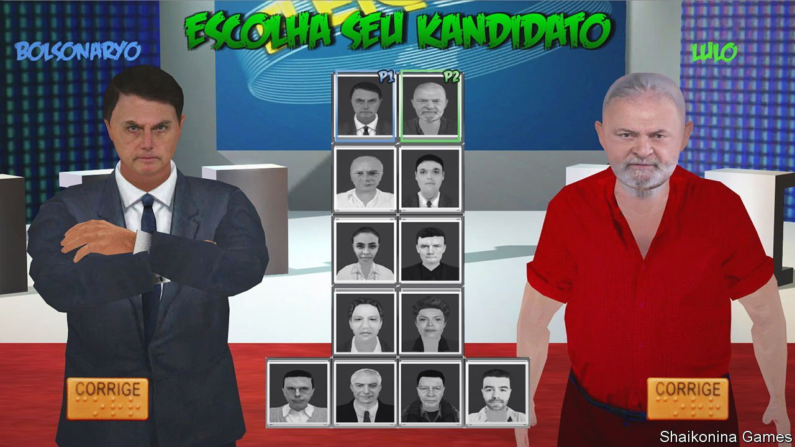

###### Bolsonaryo v Lulo

# Video games involving politicians have gone viral in Brazil 

##### A divisive political culture vents some steam online 

 

> Jan 8th 2022 

WHEN FELIPE ROSA, a softly spoken 11-year-old from São Paulo, got bored playing “Minecraft”, a video game, he downloaded a new game, “Kandidatos”, that went viral when it was released in 2020. The game involves hand-to-hand combat between Brazilian politicians, including “Bolsonaryo,” who looks just like Jair Bolsonaro, the right-wing president, and “Lulo,” a carbon copy of leftist ex-president Luiz Inácio Lula da Silva. Rudimentary graphics and symphonic rock accompany their grunts, punches and kicks. Mr Rosa was delighted. “It’s the crudeness that makes it cool,” he says.

Gabriel Nunes, the game’s creator, has been designing video games for over a decade but “didn’t make a cent before ‘Kandidatos’”. It was downloaded 50,000 times the week it launched (for $0.99 on Steam, an online shop). It has now been bought some 170,000 times. Hyped online, occasionally by famous gamers, it joins a growing number of meme-like games by independent developers in Brazil whose main purpose is to mock politics. At least a dozen have hit the market in recent years.


This reflects not only the occasionally farcical nature of Brazilian politics but also the history of video games in the country, home to the world’s fifth-biggest population of players. Bans on imports in the 1980s and steep taxes ever since have shaped its gaming culture in strange and unique ways. In 1987 Sega, a Japanese console manufacturer, teamed up with TecToy, a Brazilian toy company. Together they make a version of one of Sega’s consoles, the Master System, which by 2016 had sold a whopping 8m units, millions more than any Sega console in the United States. Sega consoles are now obsolete in most of the world, but in Brazil they still sell.

Similarly Mr Rosa’s father, Luiz Paulo, remembers buying pirated game cartridges smuggled in from Paraguay and playing knock-off or unofficial versions of games. “Bomba Patch”, an indie adaptation (or “mod”) of “Pro Evolution Soccer”, a Japanese blockbuster, features Brazilian teams and gets an update each year. Indie games are currently experiencing a worldwide comeback. In Brazil they never went away.

When, in the 2010s, a huge corruption scandal implicated nearly every political party in Brazil, it provided the perfect opportunity for the world of games to collide with that of politics, says Thiago Falcão of the Federal University of Paraíba. And as more people got mobile phones, the population of players grew. Today 96% of Brazilian gamers play some or all of the time on a mobile device. Phones, in turn, lend themselves to meme-like games that can go viral on messaging apps such as WhatsApp, which is used by a whopping 120m Brazilians (or 56% of the population).

Satirical political games have appeared in other countries, but such games are more numerous and popular in Brazil than anywhere else. And lately opportunities for farce have abounded. In December a former councillor and the mayor of a town in the Amazon decided to settle their differences by enacting a real-life version of “Kandidatos”. They faced off in a boxing ring before hundreds of paying spectators. The mayor won, but is now being investigated for alleged use of public resources for the event.

Mr Nunes says he made “Kandidatos” in order to poke fun, not to serve a political purpose. He usually turns in a blank ballot in elections. But much of the satire in the video-game world more generally skews right. In one game, “Bolsomito 2K18,” released during the campaign that resulted in Mr Bolsonaro’s election, the president is “an upstanding citizen who has had enough of the spread of corruption and immorality”. His avatar beats up black protesters and gay people. Prosecutors opened an anti-discrimination investigation into its creators. No charges were brought, but Steam made the game harder to find.

Serious gamers tend to be male, white and young. Many rejoice in immature, and often fairly offensive, humour, in much the same way as Mr Bolsonaro does. Before he was a presidential candidate he appeared on variety shows where his willingness to be the butt of jokes endeared him to ordinary folk. Isabela Kalil, an anthropologist who interviewed more than 1,000 right-wing Brazilians in the run-up to the election in 2018, notes that “nerds, gamers, hackers and haters” were among the first of 16 right-leaning categories to support him. Once in office he rewarded them by lowering taxes on video-game consoles three times, from 50% in 2019 to 20% now.

Left-wing politicians are catching on. In 2020 Guilherme Boulos, then a candidate for mayor of São Paulo, followed the example of Alexandria Ocasio-Cortez, a Democratic congresswoman in the United States, and live-streamed himself playing “Among Us”, a multiplayer video game set in outer space. Nearly half a million people tuned in. The creators of “Políticos Memes Kombat”, a game that is similar to “Kandidatos”, decided to include Mr Boulos as one of four new characters in an update, due to be launched in time for the presidential election this year. ■

