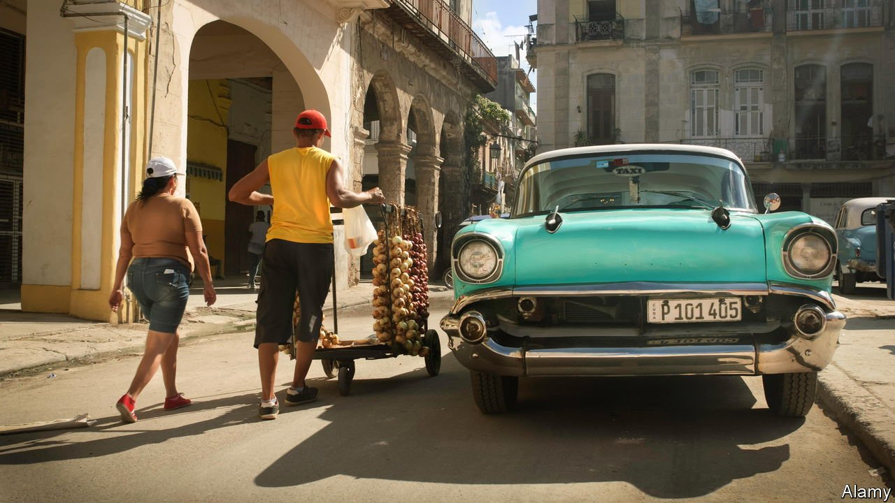

###### Crushing disappointment

# Why it is so tricky to buy a bulb of garlic in Cuba 

##### A shortage, and rising prices, hint at larger problems on the communist island 

 

> Jan 6th 2022 

“IF YOU WANT to make money in Cuba, buy garlic,” says a farmer in Artemisa province, in western Cuba. Garlic, known as “white gold” for its value, is critical to the unique sazón, or seasoning, of Cuban food—which often has to be made with a few ingredients imaginatively thrown together. As with so many things on the communist island, however, it is in short supply. A lack of fertiliser and pesticide makes it especially hard to grow. And it is harvested only once a year, in January.

Every year garlic-sellers on the streets of Havana peddle bulbs from backpacks, as if selling fake luxury handbags or electronics. The price of garlic tends to boom around November and December, before more comes onto the (black) market. A pensioner in one part of the capital complains that a bulb now costs 25 pesos ($1) and 450g (1lb) costs 240 pesos, four times the price in September.


Another way to get the bulbs is through ajeros, or garlic resellers. They pay garlic farmers $50,000-100,000 to buy their whole harvest and then resell it to a network of other resellers, who in turn sell to smaller resellers and so on. Ajero kingpins make so much cash from these transactions that banks, especially the small ones out in the provinces, sometimes have to close to the public while they process the sacks of money being deposited. “You can recognise the big resellers by their cars,” sighs the farmer in Artemisa.

Profiting from garlic is nothing new. In 1986 Fidel Castro, then Cuba’s dictator, discovered that a garlic farmer was making $50,000 a year—ten times a local surgeon’s wage at the time—by privately selling what he had left over after meeting his quota for the state agriculture system. Outraged to see that people were behaving like “capitalists in disguise”, he closed the private farmers’ markets where it was sold.

But the pandemic has exacerbated shortages of basic goods in Cuba, along with fertilisers, fungicide, seeds and supplies for animals. Thousands of rabbits died last summer in an outbreak of haemorrhagic disease. Pigs may be next; the country is on high alert following an outbreak of African swine fever in the Dominican Republic. Last year the government mooted eating guinea pigs, a popular food in parts of South America, but the idea was largely ridiculed. Then again, Cubans cannot live by allium alone. ■

