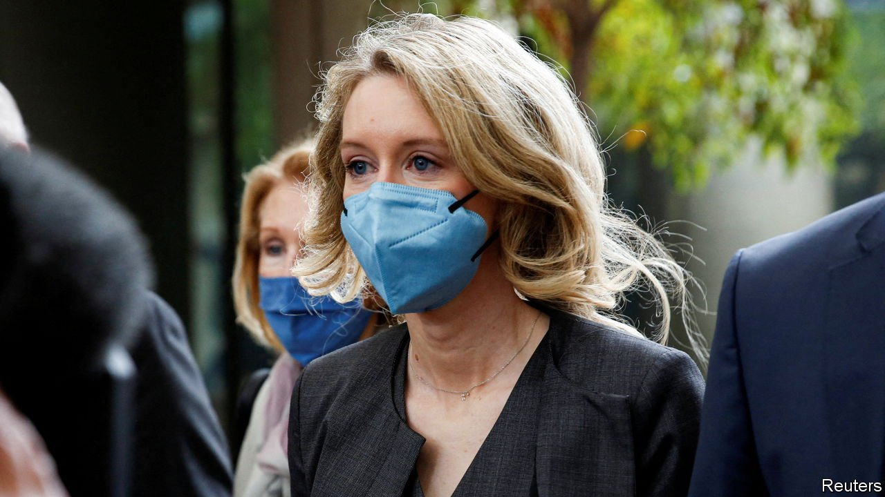
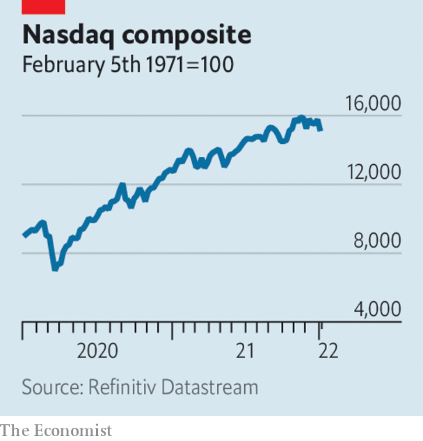

###### Business this week

# Business 

#####  

 

> Jan 8th 2022 

Following a three-month trial a jury in Silicon Valley found  guilty of intentionally deceiving investors in Theranos, a startup she founded that had promised to revolutionise medicine by detecting disease from just a few drops of blood. The jury was told that Ms Holmes knew that the firm’s core technology was faulty, and lied about its prospects. At Theranos’s zenith, in her black turtlenecks giving a TED talk, Ms Holmes symbolised the self-assured culture of tech startups. She will be sentenced later.

Erdogan’s folly


Turkey’s annual inflation rate soared in December to 36%, up from 21% the previous month. The country’s currency has slumped, falling by 44% against the dollar in 2021, mostly as a result of Recep Tayyip Erdogan’s unorthodox economic policy of badgering the central bank to cut interest rates. All this has only fuelled inflation in Turkey, which is dependent on imported energy and goods. The cost of trans port was up by 54% in December, year on year, and food and drink by 44%.

Toyota sold more cars in the United States than General Motors in 2021, the first time that GM has lost the annual crown of America’s biggest carseller since the early 1930s. The Detroit giant was hit particularly hard by the global shortage of computer chips, causing it to curtail production sharply. Its Japanese rival had stockpiled chips, leaving it ready to take advantage of rising demand for new cars when pandemic restrictions eased. Toyota says it does not expect to be America’s king of the roads in 2022.

Tesla was also able to overcome the crunch in chip supplies, almost doubling its deliveries of cars in 2021 in part by ramping up production in China of vehicles for the Asian and European markets. The electric-car maker’s good news was somewhat overshadowed by the criticism it received for opening a showroom in Xinjiang. One civil-rights group said that Tesla was “supporting genocide” in the Chinese region, where the Uyghur population is persecuted by the government.

 


With investors adjusting to expectations of a faster pace of interest-rate rises,  stockmarkets had a wobbly week. Tech stocks were hit hard; the Nasdaq had its worst start to a new year since 2008. Shares in airlines and the wider travel industry fared better as fears receded that Omicron would shut borders again. Last year also saw a few frights in the markets, but overall the S&amp;P 500 was up by 27% over the 12 months, the Nasdaq by 21% and the Dow Jones Industrial Average by 19%. In Europe the Stoxx 600 ended December 22% higher than when it opened in January.

 became the first company to reach $3trn in market capitalisation. It was a brief moment, as its value fell back amid the rout in tech stocks. The company’s share price has more than tripled since the depths of the pandemic in March 2020.

Having been booted off the New York Stock Exchange amid America’s prohibition on investments in certain Chinese companies, China  Mobile made its debut on the Shanghai stockmarket, a secondary listing to Hong Kong, where its shares also trade. It is one of the biggest ever share offerings in China, which may raise close to $9bn once all the options are exercised.

Meanwhile SenseTime’s stock roared ahead following a successful IPO on the Hong Kong exchange. The Chinese company develops facial-recognition software. Last month it was blacklisted by the Biden administration because its technology allegedly enables human-rights abuses in Xinjiang, a claim which SenseTime says is “unfounded”. The blacklisting forced a short delay to its IPO, which was relaunched with the help of several state-backed institutions in China.

Huawei said it expects last year’s revenue to top $99bn, a drop of 30% from 2020. The Chinese maker of telecoms equipment did not give details, but the decline undoubtedly reflects American and foreign bans that cut its access to chips using American technology.

The crisis deepened at Evergrande, as the debt-laden Chinese property developer confirmed it had been ordered to demolish 39 buildings on a man-made island that it has compared to the Palm Jumeirah in Dubai. The local authority in Hainan province said Evergrande had not been given permission to build the properties. Trading in its shares was briefly suspended in Hong Kong ahead of the announcement.

Dollar days

Warner Music snapped up the rights to David Bowie’s catalogue of songs, reportedly for $250m. It is the latest deal for the lucrative library of a rock star’s melodies; last month Bruce Springsteen sold the rights to his tunes to Sony Music for a reported $550m. The buyers get a steady income from licensing the tracks for radio, and increasingly, streaming services.

