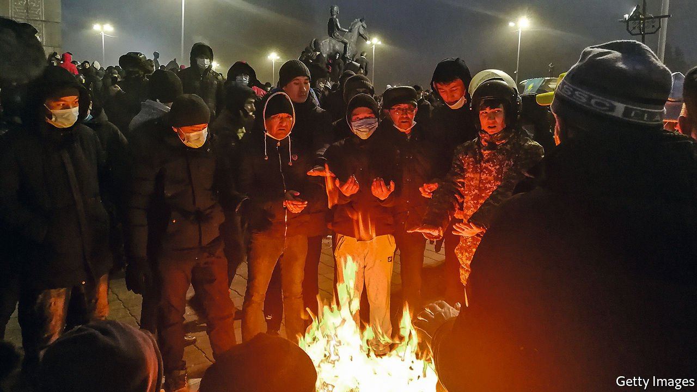
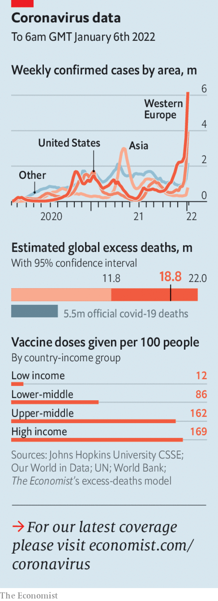

###### The world this week

# Politics 

#####  

 

> Jan 8th 2022 

Mayhem gripped . Big rallies against fuel-price rises morphed into violent protests against the autocratic regime. The president, Kassym-Zhomart Tokayev, dismissed his government, but this failed to soothe tempers. Rioters burned buildings and briefly seized an airport. Without evidence, Mr Tokayev accused foreign powers of stirring unrest. He asked for help from a regional military alliance that includes Russia. Internet access was cut off.


North Korea tested a “hypersonic missile”, according to the country’s state media. It is the second report in recent months of North Korea testing a weapon that is more manoeuvrable than a conventional ballistic missile.

 to slow the spread of the Omicron variant, which is highly transmissible but appears less deadly than previous strains of coronavirus. India, like most countries, is suffering a new wave of infections. Local governments are rushing to reimpose restrictions. Undeterred, politicians are still holding huge rallies in states that are holding elections in February and March.

, the world’s best tennis player, sparked a row when he arrived in Australia to prepare for a tournament with a covid-vaccine exemption. After the government said he should be treated the same as everyone else border officials revoked his visa.

Joe Biden tried to reassure Americans that  should be a cause of concern but not alarm, as recorded cases in the country hit 1m in a day. His comments were somewhat at odds with those of Anthony Fauci, the White House’s main covid adviser, who warned that hospitals were in danger of being overwhelmed.

Soon after he was sworn in as the new mayor of New York, Eric Adams faced down the main teachers’ union to insist that schools remain open. The union wants a brief return to remote learning, which it says will mitigate staffing shortages caused by covid-19. Mr Adams also kept in place a strict vaccine mandate on private firms, and said it might be expanded in April to include booster shots.

By contrast, in Chicago classes were cancelled. The main teachers’ union claims it would be unsafe to re-open. City officials accused it of ignoring the harm cancellation will do to children.

His new campaign slogan?

Emmanuel Macron summed up his covid-vaccination policy in France by saying he wanted to “piss off” people who haven’t been jabbed by barring them from restaurants, shops and social events. This was preferable, he said, to jailing the unvaccinated or forcibly injecting them. Critics swooned at his coarse language and robust sentiments. But many French people agreed with him.

Italy made vaccination mandatory for everyone over the age of 50. Those who are over 50 with jobs will no longer be given the option of taking a covid test to go to work.

, Hong Kong’s leading pro-democracy news site, was forced to shut after hundreds of police raided its office and arrested seven people. Two other media outlets also closed, citing fears for their reporters’ safety. Meanwhile, 90 . All but one are Communist Party supporters. “Unpatriotic” candidates (ie, critics of the party) had been barred from standing for election.

A second city in China was put into a strict lockdown following a rise in covid infections. Officials in Yuzhou, about 700km south-west of Beijing, vowed to quash the disease. Xi’an, a city of 13m, has been in lockdown since December 23rd. The government says it is ready to deal with any surge in cases ahead of the Chinese New Year and Winter Olympics in Beijing.

Haiti’s prime minister, Ariel Henry, was shot at during an event to mark the country’s independence. His office said it was an assassination attempt. Mr Henry’s behaviour has not endeared him to many Haitians. In September he sacked a prosecutor who had accused him of being complicit in the assassination last year of the then president, Jovenel Moïse, which he denies. No date has been set for delayed elections.

Meanwhile, one of the suspects in the Moïse assassination was charged in Miami. He is one of two dozen men, reportedly former members of Colombia’s special forces, who worked for a security firm in Miami and are believed to have been involved in the killing.

The Canadian government announced that it would pay C$40bn ($31.5bn) to repair the country’s child-welfare system, and to compensate indigenous people who were harmed by it. It is the largest settlement in Canadian history, the culmination of lawsuits brought by First Nation groups against the government. It follows the discovery of hundreds of unmarked graves at two residential schools.

 


 South Africa said it had uncovered “a scarcely believable picture of rampant corruption” in state-owned companies during the presidential term of Jacob Zuma. Its report alleged that Mr Zuma was “directly and personally involved” in efforts to take control of state institutions and companies.

, ending a power-sharing agreement between his civilian supporters and the army that was supposed to usher the country towards democracy. Thousands protested against being ruled by the generals, who have staged two coups since April 2019.

Statue of limitations

In Britain, a jury found four supporters of Black Lives Matter not guilty of criminal damage. They had , an 18th-century slave trader and philanthropist, and thrown it into Bristol harbour. The statue is now in a museum. One of the four said in court that the protest was “an act of love for my fellow man”. Critics of the verdict said it would encourage political vandalism.

