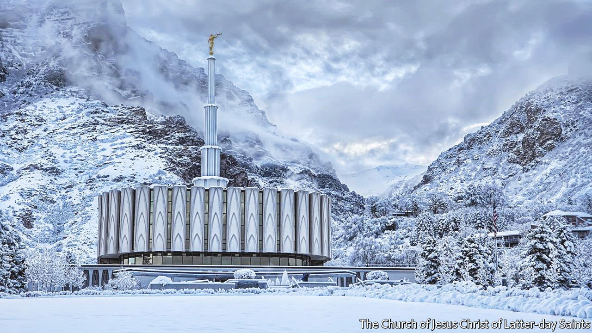

###### Go forth and multiply

# Can Mormonism thrive as a global religion? 

##### The church struggles to adapt to local customs and retain its distinct culture 

 

> Jan 8th 2022 

ONE IS A small city of fewer than 120,000 people. The other is home to more residents than New York City and Chicago combined. Yet one thing binds Provo, Utah, and São Paulo, Brazil: both boast white temples with a single spire that reaches towards the heavens. One is surrounded by mountains and the other by palm trees, but the simple architecture of Mormon churches mean they resemble each other. This sameness is a hallmark of the Church of Jesus Christ of Latter-day Saints, as Mormonism is formally known. Cristiane Fernandes, who worships at the temple in São Paulo, says the church is “like McDonald’s”, in that “the whole world is having the same lesson today”.

Mormonism is a distinctly American religion. Its early leaders travelled—and were chased—from upstate New York to the church’s current spiritual and cultural capital in Salt Lake City, Utah. Yet in recent decades the Christian sect has also spread beyond America’s borders. The church estimates that there are 16.6m Mormons around the world, a 50% increase since 2000. Matt Martinich, an independent demographer who runs a blog devoted to the church’s growth, estimates that baptisms of American converts may now account for only 20% of worldwide baptisms.


That looks like muscular, global growth for a religion that claims less than 2% of Americans as believers. But accounting quirks embellish the true picture. “The dirty little secret that everybody who has gone on a mission knows is that a lot of this growth is on paper only,” says Rick Phillips, a sociologist at the University of North Florida. Anyone ever baptised or born into the faith is counted as a member, even if they are no longer active in the church. Mr Martinich reckons that only about 40% of American Mormons are active.

Brazil has the third-largest Mormon population in the world, after the United States and Mexico. Church rolls suggest there were 1.1m Mormons in Brazil in 2010, but only about 227,000 Brazilians identified as Mormon in the census the same year. “Latin America has always been the problematic case,” says Patrick Mason of Utah State University. “On the one hand, it’s the poster-child for Mormon growth outside the United States. But it’s also the poster-child for low retention rates.”

The McDonald’s model

Scholars who study Latter-day Saints point to three main reasons why Mormonism may struggle to retain converts abroad. The first is the centralised nature of the church. The church’s wealth, leadership and theological teachings still emanate from Salt Lake City. Ms Fernandes’s quip that, like McDonald’s, Mormon churches around the world are similar has long been a point of pride. “The corporate mentality in post-war America was that you would have one corporate culture for your company—whether that was GE or IBM—and then wherever you went around the world, that would be the culture of your business,” says Jana Riess, author of “The Next Mormons: How Millennials are Changing the LDS Church”. “The church succeeded with that model for a long time.”

But can a one-size-fits-all religion thrive on a global scale? The sameness that makes a Mormon church in São Paulo feel like a church in Provo may be comforting to some, but it prevents the religion from adapting to different cultures. More decentralised Christian sects, such as Pentecostals, Seventh Day Adventists and Jehovah’s Witnesses, have grown more quickly in many countries.

Second, the congregation a Mormon joins is based on where they live. “If I’m a Pentecostal, and…I want a pastor who is a little more strict, or one who’s a little more liberal, I can find my theological niche,” says Mr Phillips. Not so for Mormons.

Third, some suggest that Mormons might reform their missionary practices in order to retain members better. About 55,000 missionaries are serving worldwide; 20,000 or so were prepped at a training centre that resembles a small college campus in Provo. When your correspondent visited just before Christmas, all the missionaries bound for Brazil had been recently dispatched. But Portuguese could still be heard in the halls. One group destined variously for Lisbon, Cape Verde and New York began their language class by singing “Noite Feliz” (“Silent Night”).

Much emphasis is placed on baptising new members; missionaries knock on doors and use social media to reach potential converts. But church leaders and academics agree that this alone is insufficient. Employing missionaries who grew up in places where the church is growing relatively quickly, such as the Philippines and west Africa, to proselytise to their own countrymen may also prove more effective than sending Americans.

Some things are starting to change. Ms Riess points out that the handbook of instructions that church leaders use was recently revised to allow for more musical styles and instruments in worship. The church’s leaders and its missionaries are, slowly, becoming more geographically diverse. In recent decades, missionaries have also been allowed much more contact with their families. Part of that is the result of better technology. But it may also be a clever way to boost retention rates: the more Mormon parents hear about their missionary’s experience, the more connected to the church they may feel.

At the training centre in Provo, existential questions about the future of the church feel very far away. Soon-to-be missionaries parade around with name tags announcing where they will serve. Tearful parents drop off their children for training much as others drop their teenagers off for college. Here, at least, fervour for the global church is alive and well. ■

