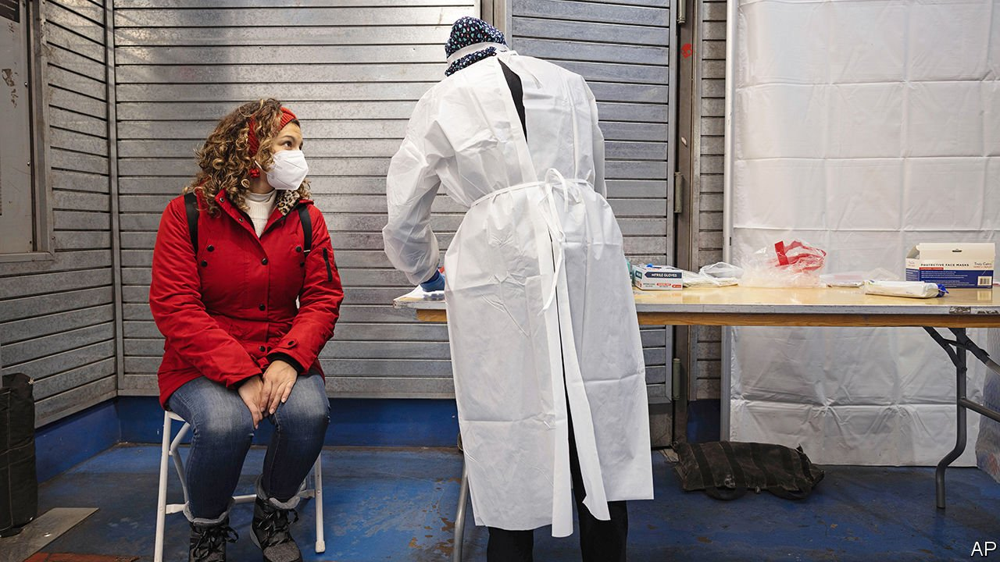

###### Covid reconsidered

# In America the pandemic seems to have hit a turning-point 

##### Health-care officials start to favour social well-being over individual illness 

 

> Jan 8th 2022 

, A major variant of the SARS-CoV-2 virus, prompted governments around the world to scramble to slow it down as it surged from late November. The  announced a travel ban (since revoked) against eight African countries and a shortened window for testing (from 72 hours to 24) for inbound travellers. Hospitals began filling with patients. By late December daily cases were higher than ever. More than 3,700 schools began in January with remote learning.

Yet some measures are being relaxed. The Centres for Disease Control and Prevention (CDC) shortened the recommended isolation period from ten days to five, plus five of mask-wearing. On January 4th it updated the guidance to encourage testing. Anthony Fauci, the leading adviser to the White House on infectious diseases, is calling for less emphasis on case rates and a focus on hospitalisations and deaths. Why this mixed response?


Though more contagious than Delta, the previous dominant strain, . It is spreading at a time when more people have immunity from vaccines or have had covid in the past; both offer high protection against severe covid. In Britain people with Omicron are 55-69% less likely than those with Delta to need hospital care, largely because more Omicron cases are reinfections. Vaccines also help. One study found that two doses of the Pfizer-BioNTech vaccine were 70% effective against hospitalisation for Omicron.

Hospitals are filling mostly with unvaccinated patients, and the least-vaccinated areas are being hit the hardest with severe illness. Some states, like Kentucky and Michigan, have experienced more covid-19 deaths than before vaccines were available. Their vaccination rates also lag behind: 54% and 57% of their populations are fully vaccinated, respectively, compared with over 70% in most north-eastern states.

America’s overall vaccination rate remains . On January 7th the Supreme Court will hear arguments in two cases challenging Joe Biden’s efforts to get more Americans jabbed. In National Federation of Independent Business v Department of Labour, Occupational Safety and Health Administration, the justices will weigh an emergency rule that all businesses with 100 or more workers need to be fully vaccinated or masked and tested weekly. After the Fifth Circuit Court of Appeals blocked the mandate in November, a three-judge panel of the Sixth Circuit Court of Appeals reinstated it. Now the Supreme Court will decide whether the vaccine-or-test rule can be imposed while litigation drags on.

The justices will also take up a rule by the Department of Health and Human Services requiring jabs for health-care workers at nursing homes and other facilities covered by Medicare or Medicaid. In November two district-court judges blocked this mandate as an unconstitutional usurpation of congressional power. The government argues that the mandates are justified to cope with a public-health emergency. Opponents say the purported emergency is overblown. They contend that the agencies lack authorisation to issue mandates that will disrupt health care.

The health-care industry can hardly afford further disruption. The CDC has reduced the isolation period in response to a need for workers. Many hospitals in New York could no longer accept patients in their emergency rooms because of staffing and bed shortages, says Martin Stallone, CEO of Cayuga Medical Centre in Ithaca, New York. The new CDC guidance allows critical health-care workers to return sooner (though Cayuga Medical is still recommending a 10-to-14-day isolation).

Shortages are affecting other industries, too. Airlines had to cancel thousands of flights, often because of lack of staff. According to the CDC, infected people are most contagious one-to-two days before the onset of symptoms and two-to-three days after. A five-day isolation, plus five days of masking, lets workers return more quickly, minimising disruption.

After nearly two years of prioritising individual risk-mitigation over social disruption, American health experts are beginning to lighten up. “This is a very different virus than the one that we saw earlier on in the pandemic,” explains Leana Wen, a former health commissioner of Baltimore. “The risk to most [vaccinated] individuals right now of Omicron is very low. The risk that Omicron is causing society in terms of widespread dysfunction is very high.” The pandemic seems to have hit a turning-point. ■

Dig deeper

All our stories relating to the pandemic can be found on our . You can also find trackers showing ,  and the virus’s spread across .

