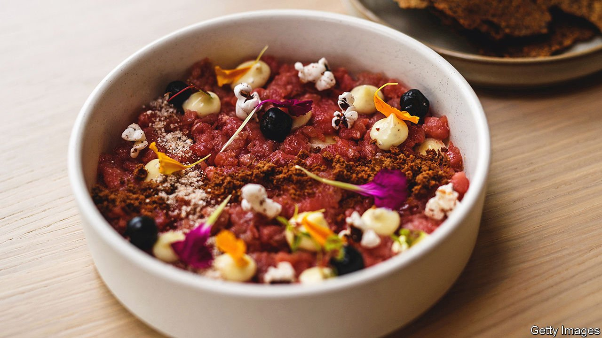

###### Indigenous cuisine

# Native American chefs are cooking up a culinary renaissance 

##### Crickets, blue corn and bison tartare 

 

> Jan 8th 2022 

SEAN SHERMAN reckons he uses 25 pounds (11 kilos) of crickets a week: “Pretty much every table buys some.” His restaurant, Owamni by the Sioux Chef, opened in Minneapolis in July and serves Native American fare. Customers can feast on blue-corn mush and bison tartare. Though indigenous restaurants remain scarce, they are spreading. Recent openings include Wapehpah’s Kitchen in Oakland, California, and Watecha Bowl in Sioux Falls, South Dakota.

What counts as Native American food remains up for debate. Mr Sherman uses only ingredients found in North America before Columbus arrived. Diners will find no wheat, beef, pork or chicken at Owamni. If rules change, they may be able to order something furrier. Mr Sherman has “a couple beavers'' in his freezer but “can’t sell them to the public because that kind of licensing doesn’t even exist”.


Lois Ellen Frank, a food historian and caterer, takes a different tack. She says if every society were constrained by the ingredients available to their distant ancestors, Italians would have no pasta al pomodoro and Britons no chips. (Both tomatoes and potatoes came to Europe from the New World.) Ms Frank includes foods introduced to the south-west by the Spanish, such as watermelon and wheat. On her menu are cactus-leaf salad and blue-corn gnocchi.

A fault line has emerged around fry bread, a pillowy, deep-fried flatbread that can be served sweet or as a taco. Legend has it that Navajo women invented it using the rations provided when the government forcibly moved their tribe from Arizona to New Mexico in the 1860s. Some chefs refuse to serve it, saying it represents colonialism and modern-day health struggles. In 2017 the Miss Navajo pageant ditched the portion of the contest where contestants make fry bread. Miss Navajo hopefuls now cook up other dishes including chiilchin, a red sumac-berry pudding. Others think fry bread is a symbol of survival and ingenuity.

Ms Frank has a middle way. She sometimes offers a healthier version: “no-fry fry bread”. She uses blue-corn flour and grills the stuff instead of frying it.

The scarcity of Native American restaurants has much to do with history. In the mid-1800s, as the government pushed indigenous people westward to take their land, many of their recipes no longer made sense in a new climate. Until the 1970s most Native Americans lived in rural places. By the time they moved to cities in numbers, they were “too late and too few” to have a booming restaurant scene, says Krishnendu Ray of New York University.

Indigenous eateries have opened from time to time since the 1980s, but have failed to catch on. This time may be different. President Joe Biden’s stimulus bill included a big increase in funding for tribal governments and programmes aimed at helping Native Americans. America is in a racial reckoning. That applies to food, too. Owamni has been fully booked every night since it opened.

For exclusive insight and reading recommendations from our correspondents in America, , our weekly newsletter.

