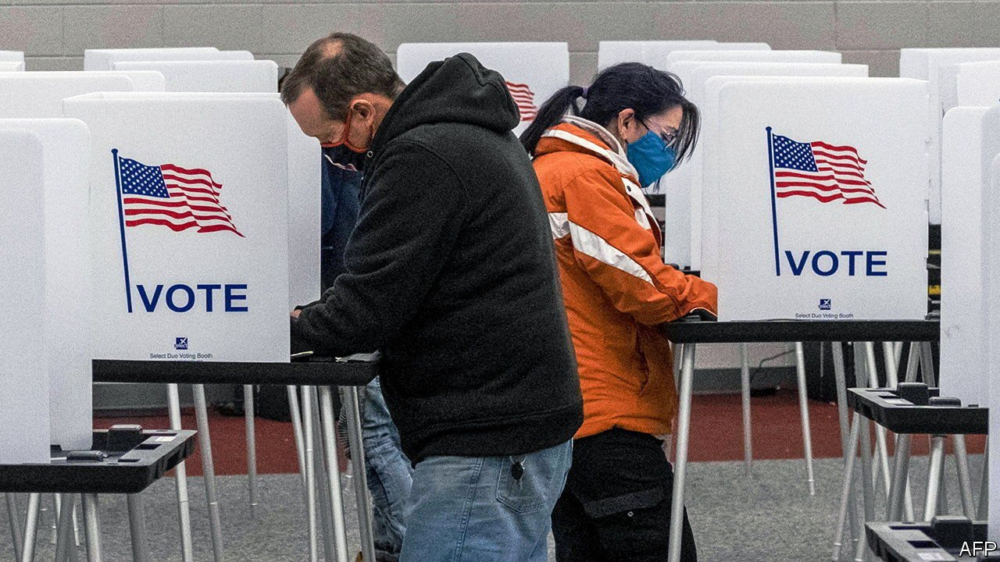

###### Electoral administration

# Reforming the Electoral Count Act would help prevent another riot 

##### Who counts wins 

 

> Jan 8th 2022 

FOR MUCH of the past year, Democrats in Congress have fitfully and unsuccessfully pushed various bits of voting-rights legislation. Whatever the merits of these bills, they are an odd first response to the insurrection of January 6th 2021. Record numbers of Americans voted in 2020. Long queues and pandemic-driven confusion notwithstanding, the problem was not access to the ballot, it was the attempted chicanery with the counting. The Electoral Count Act of 1887 (ECA), which tries to set guidelines for how Congress settles disputed results in presidential elections, is vague, confusing, possibly unconstitutional—and ripe for reform.

To understand what the ECA does, it helps to understand America’s byzantine method of electing a chief executive. When Americans cast a vote for president, they are actually voting for a slate of electors who will themselves vote for that candidate at the electoral-college meeting. Article II of the constitution explains that each state gets the same number of electors as it has members of the House and Senate, that states send certified election results to Congress, and that in a full joint session of Congress the president of the Senate (who is also the vice-president) will “open all the Certificates, and the Votes shall then be counted”. If no candidate reaches a majority of electoral-college votes, then the House chooses the president, with each state’s delegation getting a single vote.


The ECA was intended to be a guide for resolving disputes. It permits legislators to formally object to individual results or entire states’ slates, provided each objection is signed by at least one senator and representative. If majorities in both chambers uphold the objection, the votes in question are not counted. It also establishes a “safe harbour” deadline, establishing that as long as states resolve any disputed results at least six days before the electoral college votes, then those results are “conclusive” and Congress must count them.

But the ECA leaves much uncertain, including the grounds on which members of Congress can object, the role of courts in settling disputes and whether the vice-president has any discretion in the vote-counting process. Worse, it lets Congress reject valid votes. All that has to happen is for states to provide competing slates of electors (as urged by John Eastman, a lawyer advising Donald Trump in the denouement of the 2020 election) and for a majority of both chambers of Congress to back the alternative slates. Congress, rather than the American people, could thus select the president. The constitution’s creators rejected letting the legislature select the executive—but if Republicans control both chambers of Congress in 2024, as well as the governorships of enough crucial swing states, and a scenario similar to 2020 emerges again, it would be unwise to rely on principle and fealty to the founders prevailing over bare-knuckled realpolitik.

Many on the right are also concerned about ECA abuse. If Republicans can vote to reject results they dislike over unfounded allegations of fraud, Democrats could in theory do the same over concerns about racially biased election practices. Some libertarian-minded legal scholars argue that the ECA itself—specifically, the provisions that allow Congress to reject slates of voters—is unconstitutional, because Article II provides no mechanism for rejection.

By allowing federal legislators to impose their preferences, the ECA weakens state control over elections, which Republicans have traditionally defended. In 2020 Marco Rubio, a Republican senator from Florida, proposed extending the ECA’s safe-harbour deadline. John Thune and Mitch McConnell, the top two Republican senators, have expressed openness to reforming the ECA. Some Democrats see this offer as a ruse to weaken support for voting rights, which it may be—but one with a worthwhile result. ■

For more coverage of Joe Biden’s presidency, visit our dedicated  and follow along as we track shifts in his . For exclusive insight and reading recommendations from our correspondents in America, , our weekly newsletter.

