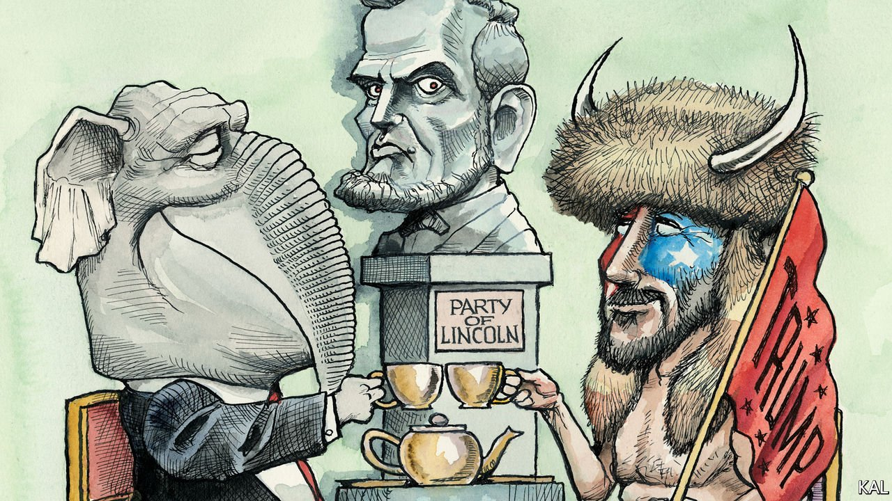

###### Lexington

# The insurrection, one year on 

##### The Republican Party has rewritten the history of the violence its leader caused 

 

> Jan 8th 2022 

DAWN BANCROFT, a 59-year-old gym owner from Pennsylvania, travelled to the national capital a year ago this week to hear Donald Trump speak, not to commit terrorism. Yet as she marched up Constitution Avenue, with the former president’s instruction to “fight like hell” ringing in her ears, Ms Bancroft apparently mislaid her moral compass.

Forcing a way through the mob outside the Capitol building, she and her friend Diana came to a shattered window and clambered through it. “We got inside, we did our part,” Ms Bancroft later explained in a video message to her children. “We were looking for Nancy to shoot her in the friggin’ brain. But we didn’t find her.”


After hearing the women plead guilty to a misdemeanour last September, Judge Emmet Sullivan wondered “how good people who never got into trouble with the law morphed into terrorists”. Court documents suggest that describes most of the 700-odd people so far charged over the insurrection—including around 225 accused of assaulting or impeding the police. Few had previous convictions or links to far-right groups. Most were the same unremarkable white people, in high spirits and wearing Trump merchandise, who swell the former president’s rallies. They are small-business owners, teachers, estate agents and retired folk.

Contrary to the implication of Judge Sullivan’s question, this is not mystifying but self-explanatory. If you believed the election had been stolen,  even before the results were out, why wouldn’t you take the desperate measures Mr Trump demanded? Ms Bancroft and the rest thought they were doing their patriotic duty.

Most made no effort to hide their identities. A Texan estate agent plugged her company while live-streaming the attack; an Ohioan kicked in a window of the Capitol wearing a jacket bearing the name and phone number of his decorating firm. The riot, as the biggest prosecutorial effort in American history has already made clear, was the logical expression of Mr Trump’s big lie, proudly carried out by 2,000 of his devoted supporters. To repudiate the violence, Republicans had no alternative but to repudiate the lie. Having failed to do so, they are instead .

That process began hours after the riot, when most Republican congressmen and -women formally disputed the election result. This ended any serious prospect of them breaking with Mr Trump, who has duly rewritten the reality of the violence he caused. He has claimed the rioters were “innocent” people “persecuted” by the police; that the real “insurrection took place” on election day. And yet if some of his supporters overstepped the mark, what of that? Mr Trump has also suggested it was “common sense” for them to chant “Hang Mike Pence” during the riot, given his deputy’s reluctance to steal the election. This is classic Trumpian disinformation: a smorgasbord of inconsistent cognitive dissonances for his supporters to select from. He celebrates their violence even as he denies it took place and blames it on the other side.

Having reaffirmed their fealty to Mr Trump, most Republican lawmakers felt compelled to prevent investigation of the insurrection. They blocked a high-level bipartisan inquiry into the violence and, when the Democrats proposed a weaker House select-committee investigation instead, lambasted it as a partisan stunt. With the participation of two principled Republicans, Liz Cheney and Adam Kinzinger, that committee has since interviewed hundreds of witnesses. But its main targets, Mr Trump and his senior lieutenants, are obstructing it, apparently in the hope that the Republicans  in November and scrap it.

Both scenarios appear likely, in part because most Republican voters aren’t interested in litigating the violence either. A year after the rampage, which claimed five lives and injured more than 100 police officers, most Republicans say it was either peaceful or “somewhat” violent; and that Mr Trump  for it. Democrats say the opposite. They also doubt their opponents’ motives. To downplay the violence is to rationalise it, which in the current fraught environment, many Democrats believe, is tantamount to a promise of a repeat performance.

There is no prospect of this week’s commemoration of the insurrection bringing a modicum of national unity. Americans disagree wildly on what is even being commemorated. And this latest severe disagreement, unsurprisingly, has made them more divided generally. Partisan relations on the Hill, which were hardly rosy before the riot, are abysmal. “The insurrection was a moment that changed Congress,” says Representative Cheri Bustos, a moderate Democrat from Illinois. “There’s a lack of trust, a lack of respect.”

Some Democrats still refuse to co-operate with any Republican who voted to decertify the election. Many Democrats and the handful of Republican holdouts against Mr Trump have received death threats from his supporters. The animated video that Paul Gosar of Arizona tweeted last November, which depicted him killing a Democratic congresswoman, Alexandria Ocasio-Cortez, was one of the subtler examples. Ms Cheney and Mr Kinzinger were the only Republicans to back a Democratic motion to censure Mr Gosar, which caused a further deterioration in partisan relations.

Shaman you

Outside politics, there is more hope. The even-handed processing of so many hundreds of insurrectionist cases is a credit to the justice system. The police chiefs responsible for the Capitol’s inadequate defences have been held accountable, and the building’s security significantly beefed up. But, alas, that is a mixed blessing to those, like Ms Bustos, who ran for office to govern, not to fight.

She is one of 25 Democratic House members quitting politics, a decision she ascribes partly to the riot. “My husband’s been in law enforcement for four decades and, you know, he said it’s not going to get better out there,” she says. “We talked it over with my three sons. None of them thought I should run again.” ■

Read more from Lexington, our columnist on American politics:

 (Jan 1st) (Dec 18th) (Dec 11th)

For coverage of Joe Biden’s presidency, visit our dedicated  and follow along as we track shifts in his . For exclusive insight and reading recommendations from our correspondents in America, , our weekly newsletter.

