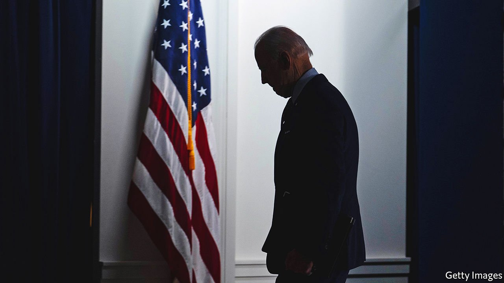
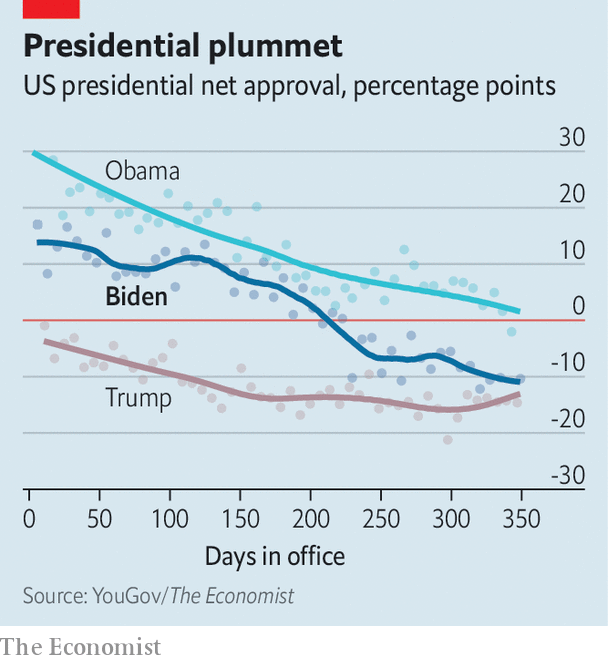

###### Biden’s burden

# The year ahead in American politics looks daunting for Democrats 

##### By the end of 2022, momentum will probably have shifted to Donald Trump’s Republicans 

 

> Jan 8th 2022 

IN 2021 JOE BIDEN’S presidency began with early success, not long after a violent insurrection at the Capitol by diehard supporters of Donald Trump. In 2022, a reversal of fortunes is likely. Whatever verve the Biden administration still has may be killed off after the mid-term elections in November—a date that will also mark the unofficial start of the next presidential contest, which at this point seems a prelude to .

 


Consider first the flagging fortunes of the son of Scranton. After success at passing a gargantuan stimulus package (in hindsight it was too big), Mr Biden’s presidency . The blows came one after the other: high inflation, fuelled partly by fiscal stimulus; an unrelenting pandemic; the chaotic withdrawal from Afghanistan; and the White House’s inability to whip Democratic majorities into voting for legislation. His approval rating  by 25 percentage points since the start of his term—leaving him nearly as unpopular as Mr Trump at this point of his presidency (see chart). Before Christmas, a pivotal senator dealt a deathblow to the , a package of climate-change mitigation and social benefits which was meant to be the signature legislation of his presidency.


Heightening the malaise are the elections looming in November, in which Mr Biden will probably lose what ability he still has to legislate. Presidents almost always suffer losses in their first mid-term elections, and the razor-thin majorities Democrats retain in both chambers of Congress are unlikely to hold. Republicans need to take just five seats in the House of Representatives to win a majority and an explicit veto over all Mr Biden’s desired legislation. In 2010 Barack Obama lost 63 seats in his self-described “shellacking”. In 2018 Mr Trump lost 35.

Were Mr Biden’s approval rating higher, he might have reason to hope to escape this eventuality. Unfortunately for him, it is not.  give Republicans an 82% chance of winning the House, and a 70% chance of retaking the Senate to boot.

The retirement announcements of longtime members of Congress, who prefer not to leave office by electoral rejection, are an omen of what probably lies ahead. So far 25 House Democrats have said they will not seek re-election, including some powerful committee chairmen, compared with 12 Republicans. Importantly, 17 of those Democrats are not leaving to seek another office or prominent position (“pure retirements”), as against four of the Republicans. In previous election years retirements have been leading indicators of losses for the party in power. Exogenous events, such as the Supreme Court’s curtailing of constitutional rights to abortion provoking a backlash in the suburbs, may help Democrats at the margin. But the end result is unlikely to remain full Democratic control of Washington.

That leaves just a few months for Democrats to make use of their unified control of Congress and the White House. Much of the ostensibly highest-priority legislation pledged to its partisans—to bolster voting rights, boost unions, reduce police brutality and reform the immigration system—is dead on arrival, because the filibuster in the Senate allows the Republican minority to deny it passage. The filibuster itself, which progressives had once hoped would be dispensed with, is set to stay.

Rather than waste too much time on signalling bills without much chance of passage, Democrats are instead likely to devote months to resuscitating a pale version of BBB (which itself is theoretically passable only because a special budgetary procedure can circumvent the filibuster). Strenuous negotiations with , the main Democratic holdout, are the only way forward for the president if he wishes to have something substantive to present to voters in November. They are likely to drag for months. The demands of the campaign season and the difficulty of actual passage may leave little time or inclination for anything else.

By year’s end, then, momentum will probably have shifted from Democrats to Republicans. Electoral victory will seem to validate the party’s failure to reckon with its leader’s serious attempts to subvert elections. In fact, it may be .

Few of the Republicans who voted to impeach Mr Trump for his actions after his electoral loss will remain in office. After purges in the party primaries, internal resistance to Mr Trump’s whims will be weaker. The former establishmentarians who made their peace with Trumpism will see rewards. Kevin McCarthy will probably ascend to the speakership of the House that he covets. All this will be achieved with no need for the Republican Party to come up with a policy agenda in response to the defeats in 2020.

The ambitious policy agenda of the Democrats, meanwhile, will probably languish as the usual forces of gridlock and partisanship come to dominate a divided Congress. Like Mr Obama before him, Mr Biden will then have to rely on transient executive actions and orders to get just about anything done.

In both parties, jockeying for the next presidential election is already well under way, though the contest may be a repeat of 2020. Both Mr Biden and Mr Trump are hubristic enough to refuse to relinquish power to younger politicians. Yet both are also old enough for their health to preclude them from running. Kamala Harris, the vice-president, will still be the Democrats’ heir apparent, despite her dismal campaign in 2020 and rocky first year as the second-in-command. If Mr Trump were not to run, a populist crafted in his image, such as Florida’s governor, Ron DeSantis, is his likely successor. Even if the elderly men were to stand aside, America is likely to be treated to a duel of seconds. ■

For exclusive insight and reading recommendations from our correspondents in America, , our weekly newsletter.

