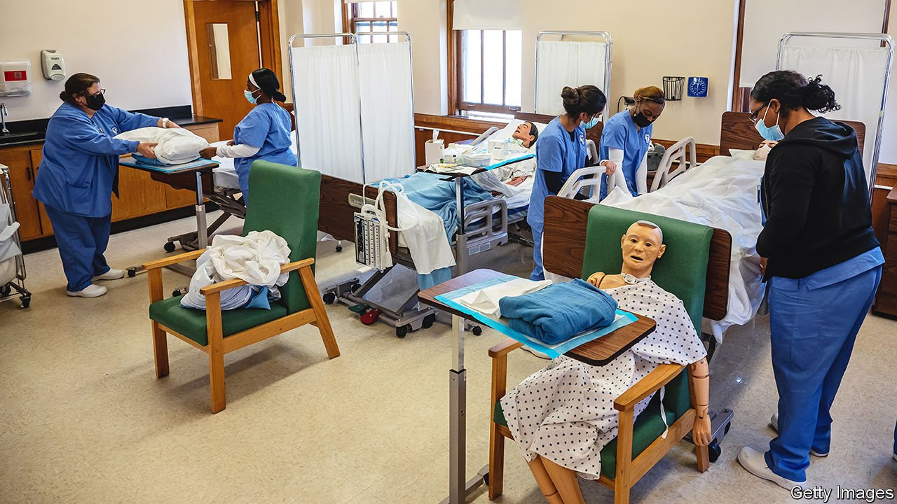

###### Medical schools and gender

# Trans ideology is distorting the training of America’s doctors 

##### Fear and ignorance are infecting medical education 

 

> Jan 8th 2022 

GENDER DYSPHORIA, the often agonising feeling that one has been born in the wrong body, is listed in the American Psychiatric Association’s “Diagnostic and Statistical Manual of Mental Disorders”. So Katherine (not her real name) was surprised, in her first week at Louisiana State University School of Medicine, when a lecturer told a class that gender dysphoria was not a mental illness. It suggested that gender-identity ideology, which holds that transgender women are women and trans men are men, had influenced some of those who were training her to be a doctor.

More evidence followed. An endocrinologist told a class that females on testosterone had a similar risk of heart attack to males (they have a much higher risk). Debate about all this was apparently off-limits. How has trans ideology made its way into medical schools?


Professional bodies, including the American Academy of Paediatrics, have endorsed “gender-affirmative” care, which accepts patients’ self-diagnosis that they are trans. This can mean the prescription of puberty blockers for children as young as nine. Trans medicine is not a core part of medical schools’ curriculums. But an academic paediatrician (who did not want her name, institution or state to appear in this story) says that all medical students understand that they are expected to follow the affirmation model “uncritically and unquestioningly”. For most doctors that will mean referring a patient to a gender clinic, some of which prescribe blockers or cross-sex hormones on a first visit. “We treat infections with antibiotics, no questions asked—it is just exactly like that,” she says.

Affirmative care has done irreversible harm to some young people’s bodies. This has become especially clear from the experience of “detransitioners” who regret taking hormones or having their breasts or genitals removed. Puberty blockers also prevent bones from developing properly; when combined with cross-sex hormones they can lead to infertility and inability to have an orgasm. A 26-year-old student at a medical school in Florida who plans to become a paediatrician is shocked by what she has not been taught about these treatments. “With other diseases and treatments we are taught in such depth about every possible side-effect,” she says.

Medical-school academics suggest two reasons for all this. One (reflected in the fact that none wanted their names published) is fear. Some trans-rights activists bully anyone who expresses concerns publicly. The other is ignorance. A paediatrician who teaches at a medical school in Florida says once doctors have finished their training, many pay scant attention to new medical research but rely on the media for information. In America there has been little coverage of the dangers of blockers or the woes of detransitioners.

Last year Marci Bowers, a surgeon (and trans woman) who performs vaginoplasties and phalloplasties, said she no longer approved of the use of puberty blockers because they left surgeons with too little genital material to work with and led to a loss of sexual function. This, extraordinarily, appeared to surprise some gender-clinic medics. Ignoring the difference between biological sex and gender at medical school has other risks. Several diseases present differently in men and women or are more common in one sex than the other. A doctor who treats a trans man, say, as a man might miss something important.

Katherine, the student in Louisiana, worries about the effects on female patients. As a black woman, she is acutely aware that “when physicians have an implicit bias against black people, it leads to poorer delivery of care”. Gender-identity ideology, with the use of such terms as “bodies with vaginas” in medical journals, has “increased bias against women by normalising dehumanising language and by ginning up hatred of women who assert their boundaries”. She is concerned that doctors who have absorbed these views during training may be less likely to deliver high-quality care to female patients.

She also worries that gender ideology is impeding the development of medical students’ critical judgment. “It’s a problem”, she says, “when doctors start believing that they can simply ignore medical evidence and scientific facts that they don’t like.” ■

For exclusive insight and reading recommendations from our correspondents in America, , our weekly newsletter.

