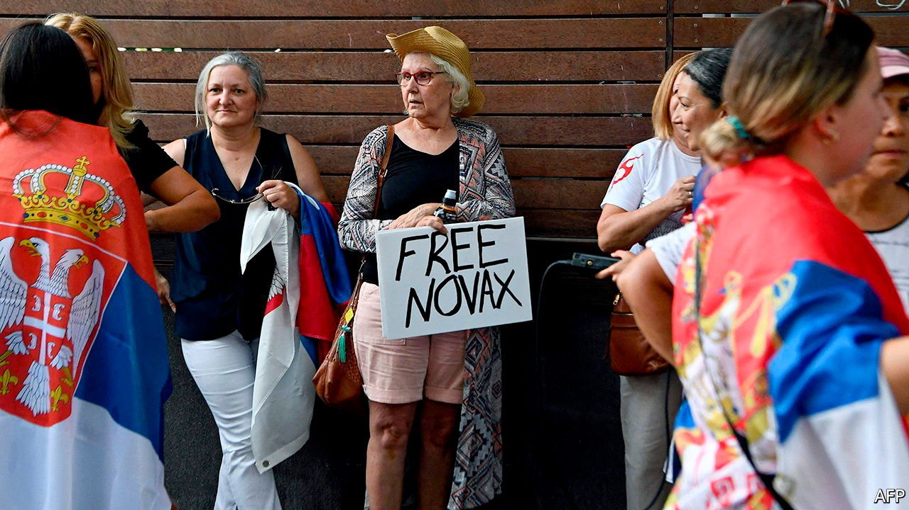

###### Djebacle

# Australia ties itself in knots over No-vax Djokovic 

##### The tennis star won in court but may yet be unable to play on court 

 

> Jan 15th 2022 

THE PARK HOTEL in Melbourne is not the kind of place where a gluten-free, vegan tennis star typically holes up. But Novak Djokovic, the world’s best player and perhaps its most famous anti-vaxxer, is not typical. For five days he enjoyed the hospitality of the Park, which is better known for housing asylum-seekers, after Australia’s government cancelled his visa. On January 10th a federal judge overturned that decision, released him from detention and ordered the government to pay his legal fees.

It is still up in the air whether he will compete in the Australian Open, the tournament which brought him to Melbourne and starts on January 17th. The immigration minister, Alex Hawke, was considering using discretionary powers to cancel Mr Djokovic’s visa a second time as The Economist went to press. The minister has vast authority to remove unwanted foreigners if he deems it to be in the public interest. If he uses those powers to deport Mr Djokovic, the 34-year-old could be banned from returning to Australia for three years.


The Serb would have had no such problems had he been fully jabbed, like 95% of other professional tennis players. Some 78% of Australians have had two shots, among the world’s highest rates. Sympathy for him has been inversely proportional to the country’s enthusiasm for vaccines.

The case against him has been spectacularly bungled. The state government of Victoria, where the tournament is held, approved his medical exemption from vaccination, thus allowing him to enter the country, on the grounds that he had recently recovered from covid-19. The country’s conservative prime minister, Scott Morrison, endorsed this decision. Then, after a public outcry, he changed his mind. When Mr Djokovic landed in Melbourne on January 5th he was detained for eight hours before officials cancelled his visa on the grounds that he is unvaccinated, and sent him to the Park Hotel to await deportation.

How did the government tie itself up in such knots? “One explanation for the stuff-up is political,” says Abul Rizvi, a former deputy secretary of the country’s department of immigration. Australians are proudly egalitarian. Their mantra is that everyone should get a “fair go”. Yet during the pandemic, governments have bent the rules for the rich and famous. After they slammed state and international borders shut, swarms of celebrities arrived from Hollywood, isolating in mansions instead of quarantine hotels. That infuriated locals who were separated from their families for months or years on end.

When Mr Djokovic announced that he had been granted permission to fly to Australia, many were incandescent. Why should an anti-vaxxing superstar get special treatment, they demanded. Some still want to send him packing. Mr Djokovic’s appeal revealed to rule-abiding Australians that he had flouted pandemic restrictions. He was caught out for conducting a face-to-face interview two days after he was diagnosed with covid on December 16th, and for making a false declaration in a legally binding Australian travel form. The second mistake, he says, was a “human error” by the agent who submitted the document.

For Australian politicians, talking tough about the border is usually a vote-winner. Mr Morrison, a former immigration minister responsible for sending asylum-seekers to offshore detention centres, takes a hard line on “illegal arrivals”. He has plenty of reason to play it up. A federal election is due by May and his government is trailing in the polls.

Yet detaining the world number one twice would send an odd signal to the world. The saga has already set off a diplomatic incident with Serbia. And it might suggest Australia’s government is overruling the courts. The ministerial powers bestowed on Mr Hawke were designed to turf out terrorists and criminals, says Mr Rizvi, who helped design them. Using them against a sportsman would be “entirely inappropriate”, he says. Mr Morrison’s government has left itself with no good options. Whatever it does, Australians are likely to find fault—and double-fault. ■

